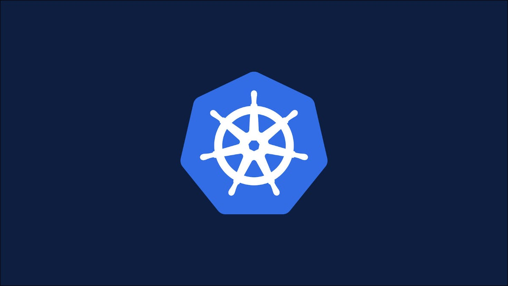
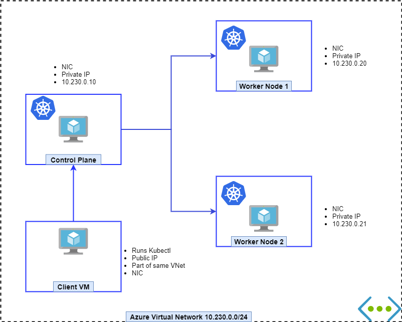

# Setting up Kubernetes in (not so) hard way

*Cluster Preparation Guide for CKA*

Using kubeadm




## 目录
- [Consideration](#consideration)
- [Steps](#steps)
  - [1-Create Azure Resources](#1-create-azure-resources)
  - [2-Prepare the Virtual Machines](#2-prepare-the-virtual-machines)
  - [3-Master Node](#3-master-node)
  - [4-Join Worker Node](#4-join-worker-node)
  - [5-Confirm the Setup](#5-confirm-the-setup)
  - [6-Create new Azure worker VM](#6-create-new-azure-worker-vm)
  - [7-Remove nodes](#7-remove-nodes)
  - [8-Some useful Azure CLI Commands](#8-some-useful-azure-cli-commands)
  - [9-Clean up Azure Resources](#9-clean-up-azure-resources)
- [Resources](#resources)

## Consideration

- Virtual Machines are created in Azure under Azure VNet
- One client machine has Public IP others are Private
- IP Range
- Docker
- Kubeadm
- One master VM
  - Weaver as Pod network plugin
- Two Worker VM
- One Client VM with Public IP



## Steps

### 1-Create Azure Resources

- Resource Group
- Storage Account (optional)
- Virtual Network
- Subnet
- NIC
- Public IP Address
- Three Virtual Machines (for Kubernetes)
- One Virtual machine as client to connect the K8s cluster

Azure resources Setup [Script](script/01-azure-cluster.sh)

Or maybe you don't want a client, the Setup [Script](script/01-azure-cluster-without-client.sh)

### 2-Prepare the Virtual Machines

Login to the Client VM using Public IP then connect to the other three Virtual Machines.

Install & Configure [as super user]

- IP tables
- Docker
- Kubectl, Kubeadm, Kubelet

Here is the [Master amd64 Script](script/02-all-node-setup-amd64.sh)

Here is the [Master arm64 Script](script/02-all-node-setup-arm64.sh)

Here is the [Worker amd64 Script](script/02-all-node-setup-amd64-worker.sh)

Here is the [Worker arm64 Script](script/02-all-node-setup-arm64-worker.sh)

### 3-Master Node

Here is the [Script](script/03-master-setup.sh)

***Post-setup for master***

Follow the instruction given in the outout of the successful setup,

- Copy kubeconfig to the folder
  
```sh

mkdir -p $HOME/.kube
sudo cp -i /etc/kubernetes/admin.conf $HOME/.kube/config
sudo chown $(id -u):$(id -g) $HOME/.kube/config
```

- Copy the `kubeadm join` command
- Install the pod network plugin
  `kubectl apply -f https://raw.githubusercontent.com/coreos/flannel/master/Documentation/kube-flannel.yml`

### 4-Join Worker Node

**In script of Step2 have include the work in this step!!!** 

Using the token generated from previous step connect this to the Kubernetes master.

> If you forget it then generate a new one by running `sudo kubeadm token create --print-join-command`

Worker node setup [Script](script/04-worker-setup.sh)

### 5-Confirm the Setup

Configure the client machine for kubectl

Client setup [Script](script/05-kubectl-client.sh)

>**Best Practices** It is not recommended to run `kubectl` in master or worker node. You should run it from outside of the K8s cluster.

In client machine create a folder `~/.kube` by

```bash

mkdir -p $HOME/.kube
```

Then copy the `~/.kube/config` from master node to client machine using `scp`

`scp cka@controller-vmIP:$HOME/.kube/config $HOME/.kube`

Then run this command in client machine

```bash

kubectl get nodes 
```

If the above shows list of nodes and in ready state then we are good to go.

Create a pod to test,

```bash

kubectl run nginx --image=nginx
```

Then check the list of pods

```bash

kubectl get pods
```

### 6-Create new Azure worker VM

Create a new worker VM with [script](./script/06-add-new-worker.sh)


### 7-Remove nodes

Remove a nodes can use this [Script](./script/07-remove-node.sh)

### 8-Some useful Azure CLI Commands

Get the list of running VMs in a Resource Group

```bash

resourceGroup='rg-cka2'
az vm list -d -g $resourceGroup --query "[].{name:name,powerState:powerState}" -o table
```

Start all the VMs in a Resrouce Group

```bash

resourceGroup='rg-cka2'
az vm start --ids $(az vm list -g $resourceGroup --query "[].id" -o tsv)
```

Stop (deallocate) all the VMs in a Resource Group

```bash

resourceGroup='rg-cka2'
az vm deallocate --ids $(az vm list -g $resourceGroup --query "[].id" -o tsv)
```

### 9-Clean up Azure Resources

If you delete the resource group it will delete all the resources inside

```bash

# Will ask for confirmation
az group delete -n rg-cka

# Anyc delete 
az group delete -n rg-cka --no-wait 

```

## Resources

- Kubeadm [Installation](https://kubernetes.io/docs/setup/production-environment/tools/kubeadm/install-kubeadm/)
- Docker [Installation](https://docs.docker.com/engine/install/#server)
- Weaver [Installation](https://www.weave.works/docs/net/latest/kubernetes/kube-addon/)
- CKA Exam [Curriculum](https://github.com/cncf/curriculum)
