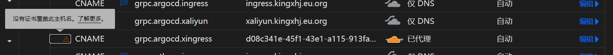

# Setup Cert Manager & Let's Encrypt

## 目录
- [Install Cert Manager & Let's Encrypt](#install-cert-manager--lets-encrypt)
- [Config TLS for ArgoCD](#config-tls-for-argocd)
- [注意](#注意)
- [实验](#实验)
    - [HTTP-01](#http-01)


## Install Cert Manager & Let's Encrypt
- [Install Cert Manager & Let's Encrypt](./script/01-lets-encrypt-cert-manager.sh)


## Config TLS for ArgoCD 
1. When ArgoCD has been [setup](../ArgoCD/ArgoCD-README.md), set issuer for ArgoCD
    ```sh
    
    kubectl apply -f 01-lets-encrypt-cert-manager-clusterissuer-http-01.yaml
    ```

1. When Nginx Ingress has been [setup](../Ingress-Nginx/Ingress-Nginx-README.md), set an ingress for ArgoCD
    ```sh

    kubectl apply -f 05-argocd-ingress-nginx-passthrough.yaml
    kubectl apply -f 05-argocd-ingress-nginx-termination-at-ingress-controller.yaml
    kubectl apply -f 05-argocd-ingress-nginx-le-termination-at-ingress-controller.yaml
    ```

1. [Check](./script/02-lets-encrypt-cert-manager-ingress-nginx-check.sh) wether let's encrypt and cert manager worked


## 注意
1. 如果绑定域名绑定的是 tailscale 的 IP，是没办法使用 Let's Encrypt 的，因为那是内网 IP
1. 如果使用 CloudFlare Zero Trust 或者 frp 内网穿透至一个有公网 IP 的云服务器上，只要使用的是 80 端口，那么 HTTP-01 Challenge 就能成功，但是不保证能通过域名访问罢了。采用此方法的 ingress.yaml 为 ```kubectl apply -f 05-argocd-ingress-nginx-termination-at-ingress-controller-aliyun-LE.yaml```


## 实验

### HTTP-01
1. *解决* frp 的方式暴露到阿里云上，出现以下问题：

    

    怀疑是国内域名无备案，禁止访问（但是无备案弹出的页面是另一种样式）

    - 原因：当时阿里云只开了为frp服务的端口和为let's encrypt认证的80端口，忘记开了https的443端口

    - 流程：
        1. 阿里云配置 frps，**并打开 frp 端口、http 的 80 端口、https 的 443 端口**
        1. ingress-nginx pod 所在的 node 配置 frpc
        1. kubernetes cluster 里部署 ```05-argocd-ingress-nginx-termination-at-ingress-controller-aliyun-LE.yaml```
            - 前提是 cert-manager 的 pod 已经起来了，而且 ```01-lets-encrypt-cert-manager-clusterissuer-http-01.yaml``` 已经部署

1. Cloudflare Zero Trust 的方式：
    1. 在 Cloudflare Zero Trust 的 Tunnel 中设置 let's encrypt HTTP-01 challenge

        

    1. 在 Kubernetes 中，监测到 challenge 完成后，重新设置 Cloudflare Zero Trust 的 Tunnel：
   
        

    1. 同时要设置浏览器（以 Edge 为例）：
        1. 控制面板
        1. 网络和Internet
        1. Internet选项
        1. Internet高级
        1. 勾选```使用TLS```和```使用SSL```的相关选项

        主要用于避免问题：
       
        
       
    1. 此时在浏览器中就能实现网页的浏览了，但是会显示不安全。同时在 aws lightsail 上也能正常访问了

        
       
    - 猜想：
        1. 怀疑开启了了 zero trust tunnel 的 TLS 设置中的 ```No TLS Verify```
        1. 无论是否开启 ```No TLS Verify```，由于没有升级付费的 Zero Trust，CF不会为域名分配证书，会在 DNS 记录中提出警告：
    
            
