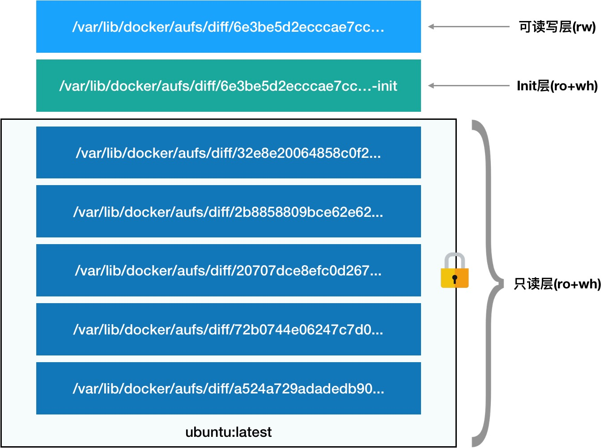
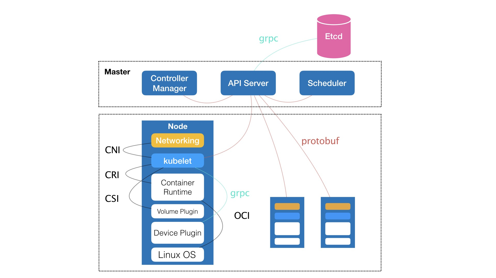
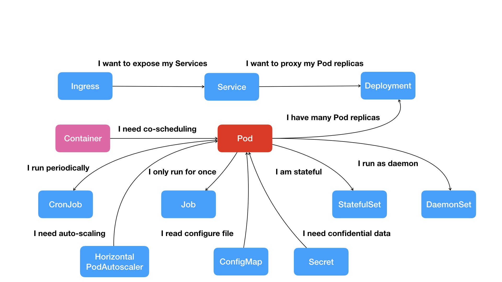

# Container Basic


## 目录
- [1 容器的组成方式](#1-容器的组成方式)
- [2 Dcoker 项目的创新](#2-dcoker-项目的创新)
- [3 Docker 项目的核心](#3-docker-项目的核心)
- [4 rootfs](#4-rootfs)
- [5 Docker 补充](#5-docker-补充)
- [6 容器编排](#6-容器编排)
- [7 Kubernetes 项目的突出性](#7-kubernetes-项目的突出性)


## 1 容器的组成方式
对于一个正在运行的容器，可以从"静态"和"动态"两个方面去认识：

1. 静态方面：
    - 一组联合挂载在 ```/var/lib/docker/aufs/mnt```上的 rootfs，这一部分称为"容器镜像"（Container Image），是容器的静态视图
1. 动态方面：
    - 一个由 Namespace + Cgroups 构成的隔离环境，这一部分称为"容器运行时"（Container Runtime），是容器的动态视图


## 2 Dcoker 项目的创新
1. docker image 解决应用的打包问题
    1. 包括应用程序的文件和目录
    1. 包括操作系统的文件和目录


## 3 Docker 项目的核心
最核心的原理实际上就是为待创建的用户进程：
1. 启用 Linux Namespace 的配置；
    - 隔离视图
1. 设置指定的 Cgroups 参数；
    - 限制资源
1. 切换进程的根目录（chroot / pivot_root）
    - rootfs：挂载在容器根目录上、用来为容器进程提供隔离后执行环境的文件系统，称之为"容器镜像"
    - ***不包括操作系统内核***


## 4 rootfs
1. rootfs只包括了操作系统的文件和目录，不包括操作系统的内核
1. 层级式：
    1. 采用UnionFS
    1. 分层：
        1. 可读写层（rw）
            - docker commit 提交的
            - 对rootfs的修改，先复制到可读可写层（Copy-on-Write），再修改（whiteout）
        1. init 层（ro + wh）
            - docker commit 不提交
            - 便于用户修改 /etc/hosts 文件所单立的层
        1. 只读层（ro + wh）
            - docker commit 不提交
    


## 5 Docker 补充
1. Dockerfile 原语
    - From：使用的基础镜像
    - WORKDIR：容器工作目录切换
    - ADD：将某路径下的文件复制到容器的某个路径下
    - RUN：在容器中执行的shell命令
    - EXPOSE：容器暴露的端口
    - ENV：容器的环境变量
    - ENTRYPOINT：/bin/sh -c
    - CMD：设置容器进程（完整执行格式是 ENTRYPOINT CMD）
    - 每个原语执行后都会生成一个对应的镜像层

1. exec进入容器
    - 原理：一个进程，可以选择加入到某个进程已有的 Namespace 当中，从而达到"进入"这个进程所在容器的目的
    - 实现：通过 ```setns()``` 系统调用

1. volume
    - 解决的问题：允许用户将宿主机上指定的目录或文件，挂载到容器里面进行读取和修改
    - 本质：目录项（dentry）对 inode 的替换过程
    - 注意：不会被 docker commit 提交（因为 docker commit 是发生在宿主机的）
    - 可见性：执行挂载操作时，"容器进程"已经创建了，意味着 Mount Namespace 已经开启了，挂载仅在容器中可见，对宿主机不可见

1. 容器进程
    - volume中提到的"容器进程"是 Docker 创建的一个容器初始化进程（dockerinit），而不是应用进程（ENTRYPOINT + CMD）
    - dockerinit 会负责完成根目录的准备、挂载设备和目录、配置 hostname 等一系列需要在容器内进行的初始化操作。最后，它通过 ```execv()``` 系统调用，让应用进程取代自己，成为容器里的 PID=1 的进程


## 6 容器编排
- 容器编排的作用：定义容器组织和管理规范的技术

## 7 Kubernetes 项目的突出性
1. Kubernetes 项目的特质：Kubernetes 项目在 Borg 体系的指导下，体现出一种独有的"先进性"和"完备性"，这些特质才是一个基础设施领域开源项目赖以生存的核心价值

1. Kubernetes 项目要解决的问题（相对于 Docker 公司的 Compose + Swarm。Swarm 封装微服务、调度单容器；Compose 处理简单依赖关系）
    1. 将指定的应用镜像在指定的集群上运行起来
    1. 提供：（经典 PaaS，eg. Cloud Foundry / Docker 公司的 Compose + Swarm）
        - 路由网关
        - 水平扩展
        - 监控
        - 备份
        - 灾难恢复
    - 上述都是 拉取用户镜像、运行容器，以及常见的运维功能，对比 经典PaaS 和 Docker Swarm 项目毫无竞争力
    - 核心区别：
        - 依托 Borg 项目在 ***定义核心功能*** 的过程中的理论优势，尤其是 ***控制节点（Master）***，用于 编排、管理、调度用户提交的作业
    - 核心观点：
        - 运行在大规模集群中的各种任务之间，实际上存在着各种各样的关系。这些关系的处理，才是作业编排和管理系统最困难的地方
    - 最主要的设计思想：
        - 从更宏观的角度，以统一的方式来定义任务之间的各种关系，并且为将来支持更多种类的关系留有余地

1. Kubernetes 的架构
    
    - 控制节点（Master）：
        1. kube-apiserver：负责 API 服务
            - Etcd：整个集群的持久化数据由 kube-apiserver 处理后保存在 Etcd 中
        1. kube-scheduler：负责调度
        1. kube-controller-manager：负责容器编排
    - 计算节点（Node）：
        1. kubelet：核心组件
        1. Container Runtime：kubelet 通过 CRI（Container Runtime Interface）这个 ***远程调用接口*** 进行交互，这个接口定义了容器运行时的各项核心操作。如 Docker，按照 OCI（Open Container Initiative）这个容器运行时规范同底层的 Linux 操作系统进行交互，即：把 CRI 请求翻译成对 Linux 操作系统的调用（操作 Linux Namespace 和 Cgroups 等）
        1. Device Plugin：kubelet 通过 gRPC 协议同 Device Plugin 的插件进行交互。这个插件是 Kubernetes 项目用于管理 GPU 等宿主机物理设备的主要组件
        1. Volume Plugin：kubelet 通过 CSI（Container Storage Interface）接口与存储插件进行交互
        1. Networking：kubelet 通过 CNI（Container Networking Interface）接口与网络插件进行交互

1. Kubernetes 和其他"容器云"项目的区别
    - 并不把 Docker 作为整个架构的核心，而仅仅把它作为最底层的一个容器运行时实现

1. Kubernetes 的构建逻辑
    
    1. Pod（容器间的紧密协作关系）
        - Kubernetes 项目中最基础的对象
        - Pod IP 会随着 Pod 变化而变化
        - Pod 里的容器共享同一个 Network Namespace、同一组数据卷，从而达到高效率交换信息的目的
    1. Deployment（多实例管理器）
        - 一次启动多个应用的实例
    1. Service（为 Pod 提供固定的 IP 和 端口）
        - Cluster IP终身不变，作为 Pod 的代理入口，代替 Pod 对外暴露一个固定的网络地址
        - 提供负载均衡
        - Kubernetes 项目来维护 Service 后端代理的 Pod IP、端口等信息的自动更新和维护
    1. Secret（认证、授权信息）
        - 保存认证和授权信息，如 用户名、密码等
        - Credential 信息以 Secret 方式存在 Etcd 中，Kubernetes 在指定的 Pod 启动时，自动把 Secret 里的数据以 Volume 的方式挂载到容器里
    1. Job（一次性 Pod）
        - 描述一次性运行的 Pod
    1. DaemonSet（守护进程服务）
        - 描述每个宿主机上 ***必须且只能运行一个*** 的守护进程服务
    1. CronJob（定时任务）
        - 描述定时任务

1. 声明式 API
    - "编排对象"和"服务对象"
    1. 编排对象
        - 如：Pod、Job、CronJob等，用来描述用户试图管理的应用
    1. 服务对象
        - 如：Service、Secret、Horizontal Pod Autoscaler等，用来负责具体的平台级功能