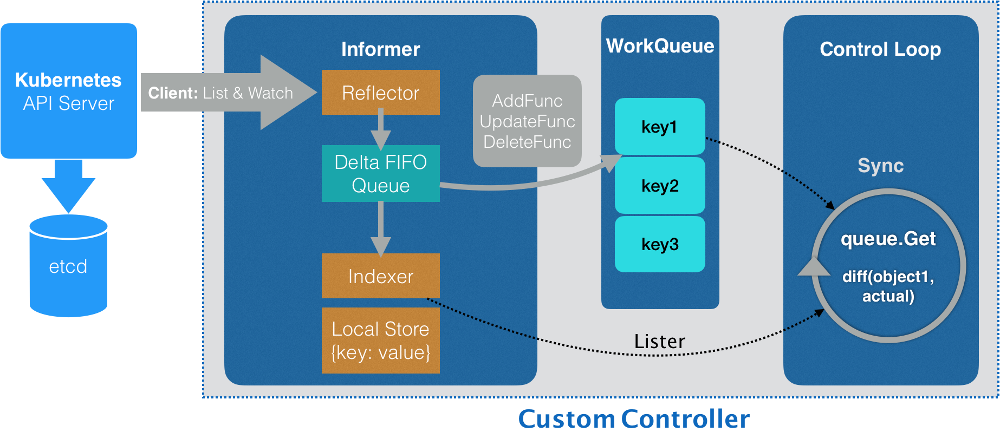

# Container Layout and Kubernetes Job Management


## 目录
- [1 为什么我们需要Pod？](#1-为什么我们需要pod)
- [2 深入解析Pod对象（一）：基本概念](#2-深入解析pod对象一基本概念)
- [3 深入解析Pod对象（二）：使用进阶](#3-深入解析pod对象二使用进阶)
- [4 编排其实很简单：谈谈“控制器”模型](#4-编排其实很简单谈谈控制器模型)
- [5 经典PaaS的记忆：作业副本与水平扩展](#5-经典paas的记忆作业副本与水平扩展)
- [6 深入理解StatefulSet（一）：拓扑状态](#6-深入理解statefulset一拓扑状态)
- [7 深入理解StatefulSet（二）：存储状态](#7-深入理解statefulset二存储状态)
- [8 深入理解StatefulSet（三）：有状态应用实践](#8-深入理解statefulset三有状态应用实践)
- [9 容器化守护进程的意义：DaemonSet](#9-容器化守护进程的意义daemonset)
- [10 撬动离线业务：Job与CronJob](#10-撬动离线业务job与cronjob)
- [11 声明式API与Kubernetes编程范式](#11-声明式api与kubernetes编程范式)
- [12 深入解析声明式API（一）：API对象的奥秘](#12-深入解析声明式api一api对象的奥秘)
- [13 深入解析声明式API（二）：编写自定义控制器](#13-深入解析声明式api二编写自定义控制器)
- [14 基于角色的权限控制：RBAC](#14-基于角色的权限控制rbac)
- [15 聪明的微创新：Operator工作原理解读](#15-聪明的微创新operator工作原理解读)


## 1 为什么我们需要Pod？
1. Pod在Kubernetes中的地位
    - Pod，是 Kubernetes 项目中最小的 API 对象
    - Pod，是 Kubernetes 项目的原子调度单位
    - Pod，实际上是在扮演传统基础设施里“虚拟机”的角色；而容器，则是这个虚拟机里运行的用户程序
    - Kubernetes 项目的调度器，是统一按照 Pod 而非容器的资源需求进行计算的
    - 像 imklog、imuxsock 和 main 函数主进程这样的三个容器，正是一个典型的由三个容器组成的 Pod
    - 这样容器间的紧密协作，我们可以称为“超亲密关系”。这些具有“超亲密关系”容器的典型特征包括但不限于：互相之间会发生直接的文件交换、使用 localhost 或者 Socket 文件进行本地通信、会发生非常频繁的远程调用、需要共享某些 Linux Namespace（比如，一个容器要加入另一个容器的 Network Namespace）等等
1. Docker容器的本质
    - Namespace 做隔离
    - Cgroups 做限制
    - rootfs 做文件系统
1. 容器的本质是什么？
    - 容器的本质是进程
1. Kubernetes的本质是什么？
    - Kubernetes 的本质是操作系统
1. Pod在Kubernetes中的意义：容器设计模式
    1. 首先，关于 Pod 最重要的一个事实是：它只是一个逻辑概念
        - 也就是说，Kubernetes 真正处理的，还是宿主机操作系统上 Linux 容器的 Namespace 和 Cgroups，而并不存在一个所谓的 Pod 的边界或者隔离环境
        - Pod，其实是一组共享了某些资源的容器。具体的说：Pod 里的所有容器，共享的是同一个 Network Namespace，并且可以声明共享同一个 Volume。
        - docker命令能实现类似的功能，但是需要其中一个容器比另一个容器先启动，这就引入了“拓扑关系”，而不是Kubernetes所要的“对等关系”
    1. Pod的实现原理
        - 在 Kubernetes 项目里，Pod 的实现需要使用一个中间容器，这个容器叫作 Infra 容器。在这个 Pod 中，Infra 容器永远都是第一个被创建的容器，而其他用户定义的容器，则通过 Join Network Namespace 的方式，与 Infra 容器关联在一起。这样的组织关系，可以用下面这样一个示意图来表达：

        

        - 在 Kubernetes 项目里，Infra 容器一定要占用极少的资源，所以它使用的是一个非常特殊的镜像，叫作：k8s.gcr.io/pause。这个镜像是一个用汇编语言编写的、永远处于“暂停”状态的容器，解压后的大小也只有 100~200 KB 左右。
        - 而在 Infra 容器“Hold 住”Network Namespace 后，用户容器就可以加入到 Infra 容器的 Network Namespace 当中了。所以，如果你查看这些容器在宿主机上的 Namespace 文件（这个 Namespace 文件的路径，我已经在前面的内容中介绍过），它们指向的值一定是完全一样的。
        - 这也就意味着，对于 Pod 里的容器 A 和容器 B 来说：
            - 它们可以直接使用 localhost 进行通信；
            - 它们看到的网络设备跟 Infra 容器看到的完全一样；
            - 一个 Pod 只有一个 IP 地址，也就是这个 Pod 的 Network Namespace 对应的 IP 地址；
            - 当然，其他的所有网络资源，都是一个 Pod 一份，并且被该 Pod 中的所有容器共享；
            - Pod 的生命周期只跟 Infra 容器一致，而与容器 A 和 B 无关。
        - 而对于同一个 Pod 里面的所有用户容器来说，它们的进出流量，也可以认为都是通过 Infra 容器完成的。这一点很重要，因为将来如果你要为 Kubernetes 开发一个网络插件时，应该重点考虑的是如何配置这个 Pod 的 Network Namespace，而不是每一个用户容器如何使用你的网络配置，这是没有意义的。
        - 这就意味着，如果你的网络插件需要在容器里安装某些包或者配置才能完成的话，是不可取的：Infra 容器镜像的 rootfs 里几乎什么都没有，没有你随意发挥的空间。当然，这同时也意味着你的网络插件完全不必关心用户容器的启动与否，而只需要关注如何配置 Pod，也就是 Infra 容器的 Network Namespace 即可。
        - 有了这个设计之后，共享 Volume 就简单多了：Kubernetes 项目只要把所有 Volume 的定义都设计在 Pod 层级即可。
        - 这样，一个 Volume 对应的宿主机目录对于 Pod 来说就只有一个，Pod 里的容器只要声明挂载这个 Volume，就一定可以共享这个 Volume 对应的宿主机目录
    1. 容器设计模式
        - Pod 这种“超亲密关系”容器的设计思想，实际上就是希望，当用户想在一个容器里跑多个功能并不相关的应用时，应该优先考虑它们是不是更应该被描述成一个 Pod 里的多个容器
        1. 第一个最典型的例子是：WAR 包与 Web 服务器
            - 在 Pod 中，所有 Init Container 定义的容器，都会比 spec.containers 定义的用户容器先启动。并且，Init Container 容器会按顺序逐一启动，而直到它们都启动并且退出了，用户容器才会启动。
            - 顾名思义，sidecar 指的就是我们可以在一个 Pod 中，启动一个辅助容器，来完成一些独立于主进程（主容器）之外的工作
        1. 第二个例子，则是容器的日志收集
            - 跟第一个例子一样，这个例子中的 sidecar 的主要工作也是使用共享的 Volume 来完成对文件的操作。
            - 但不要忘记，Pod 的另一个重要特性是，它的所有容器都共享同一个 Network Namespace。这就使得很多与 Pod 网络相关的配置和管理，也都可以交给 sidecar 完成，而完全无须干涉用户容器。这里最典型的例子莫过于 Istio 这个微服务治理项目了
1. 在 Kubernetes 中，Pod 中的容器可以共享以下的 Namespace： 
    1. Network Namespace：Pod 中的容器默认共享同一个 Network Namespace，这意味着它们可以通过 localhost 相互通信，共享同一个网络栈。这使得容器可以通过 IP 地址和端口相互访问。 
    1. UTS Namespace：Pod 中的容器默认共享同一个 UTS (Unix Timesharing System) Namespace，这意味着它们共享同一个主机名和域名。 
    1. IPC Namespace：Pod 中的容器默认共享同一个 IPC (Inter-Process Communication) Namespace，这意味着它们可以通过共享的 System V IPC 和 POSIX message queues 进行进程间通信。 
    1. PID Namespace：Pod 中的容器默认共享同一个 PID (Process ID) Namespace，这意味着它们可以看到同一个进程树，并且可以通过进程 ID 进行相互访问。 
    1. Mount Namespace：Pod 中的容器默认不共享 Mount Namespace，每个容器都有自己独立的文件系统挂载点。这使得每个容器可以有自己的文件系统视图。 
    - 请注意，Pod 中的容器默认共享上述的 Namespace，但是也可以通过 Kubernetes 的配置来进行定制化。例如，可以配置容器使用独立的 Network Namespace，以实现容器之间的网络隔离。


## 2 深入解析Pod对象（一）：基本概念
- Pod 和 Container 的关系
- 到底哪些属性属于 Pod 对象，而又有哪些属性属于 Container 呢？
    - 如果能把 Pod 看成传统环境里的“机器”、把容器看作是运行在这个“机器”里的“用户程序”，那么很多关于 Pod 对象的设计就非常容易理解了
    - 属于 Pod 对象的属性：
        1. 凡是调度、网络、存储，以及安全相关的属性，基本上是 Pod 级别的；
        1. 凡是跟容器的 Linux Namespace 相关的属性，也一定是 Pod 级别的；
        1. 凡是 Pod 中的容器要共享宿主机的 Namespace，也一定是 Pod 级别的定义
    - 这些属性的共同特征是，它们描述的是“机器”这个整体，而不是里面运行的“程序”。比如，配置这个“机器”的网卡（即：Pod 的网络定义），配置这个“机器”的磁盘（即：Pod 的存储定义），配置这个“机器”的防火墙（即：Pod 的安全定义）。更不用说，这台“机器”运行在哪个服务器之上（即：Pod 的调度）
- Pod的一些属性：
    1. NodeSelector：是一个供用户将 Pod 与 Node 进行绑定的字段
    1. NodeName：一旦 Pod 的这个字段被赋值，Kubernetes 项目就会被认为这个 Pod 已经经过了调度，调度的结果就是赋值的节点名字。所以，这个字段一般由调度器负责设置，但用户也可以设置它来“骗过”调度器，当然这个做法一般是在测试或者调试的时候才会用到
    1. HostAliases：定义了 Pod 的 hosts 文件（比如 /etc/hosts）里的内容
        - 需要指出的是，在 Kubernetes 项目中，如果要设置 hosts 文件里的内容，一定要通过这种方法。否则，如果直接修改了 hosts 文件的话，在 Pod 被删除重建之后，kubelet 会自动覆盖掉被修改的内容
- Pod 里最重要的字段当属“Containers”了
    - Image（镜像）、Command（启动命令）、workingDir（容器的工作目录）、Ports（容器要开发的端口），以及 volumeMounts（容器要挂载的 Volume）都是构成 Kubernetes 项目中 Container 的主要字段
    1. 首先，是 ImagePullPolicy 字段。它定义了镜像拉取的策略。而它之所以是一个 Container 级别的属性，是因为容器镜像本来就是 Container 定义中的一部分。
        - ImagePullPolicy 的值默认是 Always，即每次创建 Pod 都重新拉取一次镜像。另外，当容器的镜像是类似于 nginx 或者 nginx:latest 这样的名字时，ImagePullPolicy 也会被认为 Always。
        - 而如果它的值被定义为 Never 或者 IfNotPresent，则意味着 Pod 永远不会主动拉取这个镜像，或者只在宿主机上不存在这个镜像时才拉取
    1. 其次，是 Lifecycle 字段。它定义的是 Container Lifecycle Hooks。顾名思义，Container Lifecycle Hooks 的作用，是在容器状态发生变化时触发一系列“钩子”
- Pod 对象在 Kubernetes 中的生命周期
    - Pod 生命周期的变化，主要体现在 Pod API 对象的 **Status 部分**，这是它除了 **Metadata** 和 **Spec** 之外的第三个重要字段。其中，pod.status.phase，就是 Pod 的当前状态，它有如下几种可能的情况：
    1. Pending。这个状态意味着，Pod 的 YAML 文件已经提交给了 Kubernetes，API 对象已经被创建并保存在 Etcd 当中。但是，这个 Pod 里有些容器因为某种原因而不能被顺利创建。比如，调度不成功。
    1. Running。这个状态下，Pod 已经调度成功，跟一个具体的节点绑定。它包含的容器都已经创建成功，并且至少有一个正在运行中
    1. Succeeded。这个状态意味着，Pod 里的所有容器都正常运行完毕，并且已经退出了。这种情况在运行一次性任务时最为常见
    1. Failed。这个状态下，Pod 里至少有一个容器以不正常的状态（非 0 的返回码）退出。这个状态的出现，意味着你得想办法 Debug 这个容器的应用，比如查看 Pod 的 Events 和日志
    1. Unknown。这是一个异常状态，意味着 Pod 的状态不能持续地被 kubelet 汇报给 kube-apiserver，这很有可能是主从节点（Master 和 Kubelet）间的通信出现了问题
    - 更进一步地，Pod 对象的 Status 字段，还可以再细分出一组 Conditions。这些细分状态的值包括：PodScheduled、Ready、Initialized，以及 Unschedulable。它们主要用于描述造成当前 Status 的具体原因是什么。


## 3 深入解析Pod对象（二）：使用进阶
1. Volume中的Projected Volume
    - 在 Kubernetes 中，有几种特殊的 Volume，它们存在的意义不是为了存放容器里的数据，也不是用来进行容器和宿主机之间的数据交换。这些特殊 Volume 的作用，是为容器提供预先定义好的数据。所以，从容器的角度来看，这些 Volume 里的信息就是仿佛是被 Kubernetes“投射”（Project）进入容器当中的。这正是 Projected Volume 的含义
    - 到目前为止，Kubernetes 支持的 Projected Volume 一共有四种：
        1. Secret；
        1. ConfigMap；
        1. Downward API；
        1. ServiceAccountToken。
    1. Secret
        - 它的作用，是帮你把 Pod 想要访问的加密数据，存放到 Etcd 中。然后，你就可以通过在 Pod 的容器里挂载 Volume 的方式，访问到这些 Secret 里保存的信息了。
        - 通过编写 YAML 文件创建出来的 Secret 对象只有一个。但它的 data 字段，却以 Key-Value 的格式保存了两份 Secret 数据。其中，“user”就是第一份数据的 Key，“pass”是第二份数据的 Key。
        - 需要注意的是，Secret 对象要求这些数据必须是经过 Base64 转码的，以免出现明文密码的安全隐患。
        - 这里需要注意的是，像这样创建的 Secret 对象，它里面的内容仅仅是经过了转码，而并没有被加密。在真正的生产环境中，你需要在 Kubernetes 中开启 Secret 的加密插件，增强数据的安全性
        - 更重要的是，像这样通过挂载方式进入到容器里的 Secret，一旦其对应的 Etcd 里的数据被更新，这些 Volume 里的文件内容，同样也会被更新。其实，这是 kubelet 组件在定时维护这些 Volume。
        - 需要注意的是，这个更新可能会有一定的延时。所以在编写应用程序时，在发起数据库连接的代码处写好重试和超时的逻辑，绝对是个好习惯。
    1. ConfigMap
        - 与 Secret 类似的是 ConfigMap，它与 Secret 的区别在于，ConfigMap 保存的是不需要加密的、应用所需的配置信息。而 ConfigMap 的用法几乎与 Secret 完全相同：你可以使用 kubectl create configmap 从文件或者目录创建 ConfigMap，也可以直接编写 ConfigMap 对象的 YAML 文件
    1. Downward API
        - 它的作用是：让 Pod 里的容器能够直接获取到这个 Pod API 对象本身的信息。
        ```

        1. 使用fieldRef可以声明使用:
        spec.nodeName - 宿主机名字
        status.hostIP - 宿主机IP
        metadata.name - Pod的名字
        metadata.namespace - Pod的Namespace
        status.podIP - Pod的IP
        spec.serviceAccountName - Pod的Service Account的名字
        metadata.uid - Pod的UID
        metadata.labels['<KEY>'] - 指定<KEY>的Label值
        metadata.annotations['<KEY>'] - 指定<KEY>的Annotation值
        metadata.labels - Pod的所有Label
        metadata.annotations - Pod的所有Annotation

        2. 使用resourceFieldRef可以声明使用:
        容器的CPU limit
        容器的CPU request
        容器的memory limit
        容器的memory request
        ```
        - 不过，需要注意的是，Downward API 能够获取到的信息，一定是 Pod 里的容器进程启动之前就能够确定下来的信息。而如果你想要获取 Pod 容器运行后才会出现的信息，比如，容器进程的 PID，那就肯定不能使用 Downward API 了，而应该考虑在 Pod 里定义一个 sidecar 容器
    - 其实，Secret、ConfigMap，以及 Downward API 这三种 Projected Volume 定义的信息，大多还可以通过环境变量的方式出现在容器里。但是，通过环境变量获取这些信息的方式，不具备自动更新的能力。所以，一般情况下，我都建议你使用 Volume 文件的方式获取这些信息。
    1. Service Account
        - Service Account 对象的作用，就是 Kubernetes 系统内置的一种“服务账户”，它是 Kubernetes 进行权限分配的对象。比如，Service Account A，可以只被允许对 Kubernetes API 进行 GET 操作，而 Service Account B，则可以有 Kubernetes API 的所有操作权限。
        - 像这样的 Service Account 的授权信息和文件，实际上保存在它所绑定的一个特殊的 Secret 对象里的。这个特殊的 Secret 对象，就叫作 ServiceAccountToken。任何运行在 Kubernetes 集群上的应用，都必须使用这个 ServiceAccountToken 里保存的授权信息，也就是 Token，才可以合法地访问 API Server。
        - 所以说，Kubernetes 项目的 Projected Volume 其实只有三种，因为第四种 ServiceAccountToken，只是一种特殊的 Secret 而已。
        - 另外，为了方便使用，Kubernetes 已经为你提供了一个默认“服务账户”（default Service Account）。并且，任何一个运行在 Kubernetes 里的 Pod，都可以直接使用这个默认的 Service Account，而无需显示地声明挂载它。
        - **这种把 Kubernetes 客户端以容器的方式运行在集群里，然后使用 default Service Account 自动授权的方式，被称作“InClusterConfig”，也是我最推荐的进行 Kubernetes API 编程的授权方式。**
1. 容器健康检查和恢复机制
    - 在 Kubernetes 中，你可以为 Pod 里的容器定义一个健康检查“探针”（Probe）。这样，kubelet 就会根据这个 Probe 的返回值决定这个容器的状态，而不是直接以容器镜像是否运行（来自 Docker 返回的信息）作为依据。这种机制，是生产环境中保证应用健康存活的重要手段
    - 需要注意的是：Kubernetes 中并没有 Docker 的 Stop 语义。所以虽然是 Restart（重启），但实际却是重新创建了容器。
    - 这个功能就是 Kubernetes 里的 Pod 恢复机制，也叫 restartPolicy。它是 Pod 的 Spec 部分的一个标准字段（pod.spec.restartPolicy），默认值是 Always，即：任何时候这个容器发生了异常，它一定会被重新创建。
    - **但一定要强调的是，Pod 的恢复过程，永远都是发生在当前节点上，而不会跑到别的节点上去。事实上，一旦一个 Pod 与一个节点（Node）绑定，除非这个绑定发生了变化（pod.spec.node 字段被修改），否则它永远都不会离开这个节点。这也就意味着，如果这个宿主机宕机了，这个 Pod 也不会主动迁移到其他节点上去。而如果你想让 Pod 出现在其他的可用节点上，就必须使用 Deployment 这样的“控制器”来管理 Pod，哪怕你只需要一个 Pod 副本**
    - Pod 的恢复策略
        1. Always：在任何情况下，只要容器不在运行状态，就自动重启容器；
        1. OnFailure: 只在容器 异常时才自动重启容器；
        1. Never: 从来不重启容器。
    - 只要记住如下两个基本的设计原理即可
        1. 只要 Pod 的 restartPolicy 指定的策略允许重启异常的容器（比如：Always），那么这个 Pod 就会保持 Running 状态，并进行容器重启。否则，Pod 就会进入 Failed 状态 。
        1. 对于包含多个容器的 Pod，只有它里面所有的容器都进入异常状态后，Pod 才会进入 Failed 状态。在此之前，Pod 都是 Running 状态。
    1. livenessProbe
        1. 在容器中执行命令
        1. livenessProbe 也可以定义为发起 HTTP 或者 TCP 请求的方式
            - 所以，你的 Pod 其实可以暴露一个健康检查 URL（比如 /healthz），或者直接让健康检查去检测应用的监听端口。这两种配置方法，在 Web 服务类的应用中非常常用。
    1. readinessProbe
        - 用法与 livenessProbe 类似，但作用却大不一样
        - readinessProbe 检查结果的成功与否，决定的这个 Pod 是不是能被通过 Service 的方式访问到，而并不影响 Pod 的生命周期。
    1. PodPreset（Pod 预设置）
        - Kubernetes 可以自动给对应的 Pod 对象加上其他必要的信息，比如 labels，annotations，volumes 等等。而这些信息，可以是运维人员事先定义好的。
        - 需要说明的是，**PodPreset 里定义的内容，只会在 Pod API 对象被创建之前追加在这个对象本身上，而不会影响任何 Pod 的控制器的定义**
            - 比如，我们现在提交的是一个 nginx-deployment，那么这个 Deployment 对象本身是永远不会被 PodPreset 改变的，被修改的只是这个 Deployment 创建出来的所有 Pod。这一点请务必区分清楚。
        - 如果你定义了同时作用于一个 Pod 对象的多个 PodPreset，会发生什么呢？
            - 实际上，Kubernetes 项目会帮你合并（Merge）这两个 PodPreset 要做的修改。而如果它们要做的修改有冲突的话，这些冲突字段就不会被修改。


## 4 编排其实很简单：谈谈“控制器”模型
- Pod 这个看似复杂的 API 对象，实际上就是对容器的进一步抽象和封装而已。
    - “容器”镜像虽然好用，但是容器这样一个“沙盒”的概念，对于描述应用来说，还是太过简单了。这就好比，集装箱固然好用，但是如果它四面都光秃秃的，吊车还怎么把这个集装箱吊起来并摆放好呢？
    - 所以，Pod 对象，其实就是容器的升级版。它对容器进行了组合，添加了更多的属性和字段。这就好比给集装箱四面安装了吊环，使得 Kubernetes 这架“吊车”，可以更轻松地操作它。
1. kube-controller-manager
    - 实际上，这个组件，就是一系列控制器的集合
    - `Kubernetes/pkg/controller` 目录下面的每一个控制器，都以独有的方式负责某种编排功能
    - 实际上，这些控制器之所以被统一放在 pkg/controller 目录下，就是因为它们都遵循 Kubernetes 项目中的一个通用编排模式，即：控制循环（control loop）
        ```go
        
        for {
            实际状态 := 获取集群中对象X的实际状态（Actual State）
            期望状态 := 获取集群中对象X的期望状态（Desired State）
            if 实际状态 == 期望状态{
                什么都不做
            } else {
                执行编排动作，将实际状态调整为期望状态
            }
        }
        ```
    - 在具体实现中，实际状态往往来自于 Kubernetes 集群本身。而期望状态，一般来自于用户提交的 YAML 文件
    - Deployment 控制器模型的实现
        1. Deployment 控制器从 Etcd 中获取到所有携带了“app: nginx”标签的 Pod，然后统计它们的数量，这就是实际状态；
        1. Deployment 对象的 Replicas 字段的值就是期望状态；
        1. Deployment 控制器将两个状态做比较，然后根据比较结果，确定是创建 Pod，还是删除已有的 Pod（具体如何操作 Pod 对象，我会在下一篇文章详细介绍）。
        - 可以看到，一个 Kubernetes 对象的主要编排逻辑，实际上是在第三步的“对比”阶段完成的。
        - **这个操作，通常被叫作调谐（Reconcile）。**这个调谐的过程，则被称作“Reconcile Loop”（调谐循环）或者“Sync Loop”（同步循环）。
        - 所以，如果你以后在文档或者社区中碰到这些词，都不要担心，它们其实指的都是同一个东西：控制循环。
        - 而调谐的最终结果，往往都是对被控制对象的某种写操作。
        - 比如，增加 Pod，删除已有的 Pod，或者更新 Pod 的某个字段。这也是 Kubernetes 项目“面向 API 对象编程”的一个直观体现。
        - **类似 Deployment 这样的一个控制器，实际上都是由上半部分的控制器定义（包括期望状态），加上下半部分的被控制对象的模板组成的。**
1. Kubernetes 使用的这个“控制器模式”，跟我们平常所说的“事件驱动”，有什么区别和联系吗？
    - “事件驱动”：相当于Pod主动汇报自己的情况
    - “控制器模式”：是Kubernetes主动去查看Pod的情况


## 5 经典PaaS的记忆：作业副本与水平扩展
- Kubernetes 里第一个控制器模式的完整实现：Deployment
- Deployment 看似简单，但实际上，它实现了 Kubernetes 项目中一个非常重要的功能：Pod 的“水平扩展 / 收缩”（horizontal scaling out/in）。这个功能，是从 PaaS 时代开始，一个平台级项目就必须具备的编排能力。
- Deployment 遵循一种叫作“滚动更新”（rolling update）的方式，来升级现有的容器。而这个能力的实现，依赖的是 Kubernetes 项目中的一个非常重要的概念（API 对象）：**ReplicaSet**
    - 对于一个 Deployment 所管理的 Pod，它的 ownerReference 是谁？答案就是：ReplicaSet
    - 一个 ReplicaSet 对象，其实就是由副本数目的定义和一个 Pod 模板组成的。不难发现，它的定义其实是 Deployment 的一个子集

    

    - 其中，ReplicaSet 负责通过“控制器模式”，保证系统中 Pod 的个数永远等于指定的个数（比如，3 个）。这也正是 Deployment 只允许容器的 restartPolicy=Always 的主要原因：只有在容器能保证自己始终是 Running 状态的前提下，ReplicaSet 调整 Pod 的个数才有意义。
- 滚动更新”又是什么意思，是如何实现的呢？
    - **将一个集群中正在运行的多个 Pod 版本，交替地逐一升级的过程，就是“滚动更新”**
    - 四个状态字段，它们的含义如下所示
        1. DESIRED：用户期望的 Pod 副本个数（spec.replicas 的值）；
        1. CURRENT：当前处于 Running 状态的 Pod 的个数；
        1. UP-TO-DATE：当前处于最新版本的 Pod 的个数，所谓最新版本指的是 Pod 的 Spec 部分与 Deployment 里 Pod 模板里定义的完全一致；
        1. AVAILABLE：当前已经可用的 Pod 的个数，即：既是 Running 状态，又是最新版本，并且已经处于 Ready（健康检查正确）状态的 Pod 的个数。
        - 只有这个 AVAILABLE 字段，描述的才是用户所期望的最终状态
    - **相比之下，Deployment 只是在 ReplicaSet 的基础上，添加了 UP-TO-DATE 这个跟版本有关的状态字段。**
    - 滚动升级的优势
        1. 新版本 Pod 有问题启动不起来，那么“滚动更新”就会停止，从而允许开发和运维人员介入。而在这个过程中，由于应用本身还有两个旧版本的 Pod 在线，所以服务并不会受到太大的影响。
        1. 当然，这也就要求你一定要使用 Pod 的 Health Check 机制检查应用的运行状态，而不是简单地依赖于容器的 Running 状态。要不然的话，虽然容器已经变成 Running 了，但服务很有可能尚未启动，“滚动更新”的效果也就达不到了。
        1. 而为了进一步保证服务的连续性，Deployment Controller 还会确保，在任何时间窗口内，只有指定比例的 Pod 处于离线状态。同时，它也会确保，在任何时间窗口内，只有指定比例的新 Pod 被创建出来。这两个比例的值都是可以配置的，默认都是 DESIRED 值的 25%。

        
        
        - 通过这样的多个 ReplicaSet 对象，Kubernetes 项目就实现了对多个“应用版本”的描述。
    - 更进一步地，如果我想回滚到更早之前的版本，要怎么办呢？
        1. 首先，我需要使用 kubectl rollout history 命令，查看每次 Deployment 变更对应的版本
        1. 然后，我们就可以在 kubectl rollout undo 命令行最后，加上要回滚到的指定版本的版本号，就可以回滚到指定版本了
    - 问题：我们对 Deployment 进行的每一次更新操作，都会生成一个新的 ReplicaSet 对象，是不是有些多余，甚至浪费资源呢？
        - Kubernetes 项目还提供了一个指令，使得我们对 Deployment 的多次更新操作，最后 只生成一个 ReplicaSet。
        - 具体的做法是，在更新 Deployment 前，你要先执行一条 kubectl rollout pause 指令。它的用法如下所示：
            ```sh

            $ kubectl rollout pause deployment/nginx-deployment
            deployment.extensions/nginx-deployment paused
            ```
        - 这个 kubectl rollout pause 的作用，是让这个 Deployment 进入了一个“暂停”状态。
        - 所以接下来，你就可以随意使用 kubectl edit 或者 kubectl set image 指令，修改这个 Deployment 的内容了。
        - 由于此时 Deployment 正处于“暂停”状态，所以我们对 Deployment 的所有修改，都不会触发新的“滚动更新”，也不会创建新的 ReplicaSet。
        - 而等到我们对 Deployment 修改操作都完成之后，只需要再执行一条 kubectl rollout resume 指令，就可以把这个 Deployment“恢复”回来，如下所示：
            ```sh
            
            $ kubectl rollout resume deployment/nginx-deployment
            deployment.extensions/nginx-deployment resumed
            ```
        - 而在这个 kubectl rollout resume 指令执行之前，在 kubectl rollout pause 指令之后的这段时间里，我们对 Deployment 进行的所有修改，最后只会触发一次“滚动更新”。
    - 那么，我们又该如何控制这些“历史”ReplicaSet 的数量呢？
        - 很简单，Deployment 对象有一个字段，叫作 spec.revisionHistoryLimit，就是 Kubernetes 为 Deployment 保留的“历史版本”个数。所以，如果把它设置为 0，你就再也不能做回滚操作了。


## 6 深入理解StatefulSet（一）：拓扑状态
- StatefulSet 其实就是一种特殊的 Deployment，而其独特之处在于，它的每个 Pod 都被编号了。而且，这个编号会体现在 Pod 的名字和 hostname 等标识信息上，这不仅代表了 Pod 的创建顺序，也是 Pod 的重要网络标识（即：在整个集群里唯一的、可被访问的身份）。
- 为什么要引入StatefulSet
    - 造成这个问题的根本原因，在于 Deployment 对应用做了一个简单化假设。它认为，一个应用的所有 Pod，是完全一样的。所以，它们互相之间没有顺序，也无所谓运行在哪台宿主机上。需要的时候，Deployment 就可以通过 Pod 模板创建新的 Pod；不需要的时候，Deployment 就可以“杀掉”任意一个 Pod。
    - 但是，在实际的场景中，并不是所有的应用都可以满足这样的要求。尤其是分布式应用，它的多个实例之间，往往有依赖关系，比如：主从关系、主备关系。
- 得益于“控制器模式”的设计思想，Kubernetes 项目很早就在 Deployment 的基础上，扩展出了对“有状态应用”的初步支持。这个编排功能，就是：StatefulSet。
- StatefulSet 的设计其实非常容易理解。它把真实世界里的应用状态，抽象为了两种情况：
    1. 拓扑状态。这种情况意味着，应用的多个实例之间不是完全对等的关系。这些应用实例，必须按照某些顺序启动，比如应用的主节点 A 要先于从节点 B 启动。而如果你把 A 和 B 两个 Pod 删除掉，它们再次被创建出来时也必须严格按照这个顺序才行。并且，新创建出来的 Pod，必须和原来 Pod 的网络标识一样，这样原先的访问者才能使用同样的方法，访问到这个新 Pod。
    1. 存储状态。这种情况意味着，应用的多个实例分别绑定了不同的存储数据。对于这些应用实例来说，Pod A 第一次读取到的数据，和隔了十分钟之后再次读取到的数据，应该是同一份，哪怕在此期间 Pod A 被重新创建过。这种情况最典型的例子，就是一个数据库应用的多个存储实例。
- **StatefulSet 的核心功能，就是通过某种方式记录这些状态，然后在 Pod 被重新创建时，能够为新 Pod 恢复这些状态。** 
- 前置知识：Headless Service
    - 用户只要能访问到这个 Service，它就能访问到某个具体的 Pod。那么，这个 Service 又是如何被访问的呢？
        1. 第一种方式，是以 Service 的 VIP（Virtual IP，即：虚拟 IP）方式。比如：当我访问 10.0.23.1 这个 Service 的 IP 地址时，10.0.23.1 其实就是一个 VIP，它会把请求转发到该 Service 所代理的某一个 Pod 上。
        1. 第二种方式，就是以 Service 的 DNS 方式。比如：这时候，只要我访问“my-svc.my-namespace.svc.cluster.local”这条 DNS 记录，就可以访问到名叫 my-svc 的 Service 所代理的某一个 Pod。
            1. 第一种处理方法，是 Normal Service。这种情况下，你访问“my-svc.my-namespace.svc.cluster.local”解析到的，正是 my-svc 这个 Service 的 VIP，后面的流程就跟 VIP 方式一致了。
            1. 而第二种处理方法，正是 Headless Service。这种情况下，你访问“my-svc.my-namespace.svc.cluster.local”解析到的，直接就是 my-svc 代理的某一个 Pod 的 IP 地址。可以看到，这里的区别在于，**Headless Service 不需要分配一个 VIP**，而是可以直接以 DNS 记录的方式解析出被代理 Pod 的 IP 地址。
    - 那么，Headless Service这样的设计又有什么作用呢？
        - 可以看到，所谓的 Headless Service，其实仍是一个标准 Service 的 YAML 文件。只不过，它的 clusterIP 字段的值是：None，即：这个 Service，没有一个 VIP 作为“头”。这也就是 Headless 的含义。所以，这个 Service 被创建后并不会被分配一个 VIP，而是会以 DNS 记录的方式暴露出它所代理的 Pod。
        - 它所代理的所有 Pod 的 IP 地址，都会被绑定一个这样格式的 DNS 记录，如下所示：
            ```sh

            <pod-name>.<svc-name>.<namespace>.svc.cluster.local
            ```
        - 这个 DNS 记录，正是 Kubernetes 项目为 Pod 分配的唯一的“可解析身份”（Resolvable Identity）。
        - 有了这个“可解析身份”，只要你知道了一个 Pod 的名字，以及它对应的 Service 的名字，你就可以非常确定地通过这条 DNS 记录访问到 Pod 的 IP 地址。
- StatefulSet 又是如何使用这个 DNS 记录来维持 Pod 的拓扑状态的呢？
    - StatefulSet YAML 文件，和我们在前面文章中用到的 nginx-deployment 的唯一区别，就是多了一个 serviceName=nginx 字段。
    - 这个字段的作用，就是告诉 StatefulSet 控制器，在执行控制循环（Control Loop）的时候，请使用 nginx 这个 Headless Service 来保证 Pod 的“可解析身份”。
    - StatefulSet 给它所管理的所有 Pod 的名字，进行了编号，编号规则是：```<statefulset name>-<ordinal index>```。而且这些编号都是从 0 开始累加，与 StatefulSet 的每个 Pod 实例一一对应，绝不重复。**更重要的是，这些 Pod 的创建，也是严格按照编号顺序进行的**
    - 通过这种严格的对应规则，**StatefulSet 就保证了 Pod 网络标识的稳定性。Kubernetes 就成功地将 Pod 的拓扑状态（比如：哪个节点先启动，哪个节点后启动），按照 Pod 的“名字 + 编号”的方式固定了下来。此外，Kubernetes 还为每一个 Pod 提供了一个固定并且唯一的访问入口，即：这个 Pod 对应的 DNS 记录。**
    - 这些状态，在 StatefulSet 的整个生命周期里都会保持不变，绝不会因为对应 Pod 的删除或者重新创建而失效。
    - 不过，相信你也已经注意到了，尽管 web-0.nginx 这条记录本身不会变，但它解析到的 Pod 的 IP 地址，并不是固定的。这就意味着，对于“有状态应用”实例的访问，你必须使用 DNS 记录或者 hostname 的方式，而绝不应该直接访问这些 Pod 的 IP 地址。


## 7 深入理解StatefulSet（二）：存储状态
- 持久化存储
- 问题：如果你并不知道有哪些 Volume 类型可以用，要怎么办呢？
    - 所谓“术业有专攻”，这些关于 Volume 的管理和远程持久化存储的知识，不仅超越了开发者的知识储备，还会有暴露公司基础设施秘密的风险。
    - 让专业的人来做
    - 这也是为什么，在后来的演化中，**Kubernetes 项目引入了一组叫作 Persistent Volume Claim（PVC）和 Persistent Volume（PV）的 API 对象，大大降低了用户声明和使用持久化 Volume 的门槛**
- 开发人员想要使用一个 Volume 的步骤
    1. 第一步：定义一个 PVC，声明想要的 Volume 的属性
        - 在 PVC 对象里，不需要任何关于 Volume 细节的字段，只有描述性的属性和定义。
    1. 第二步：在应用的 Pod 中，声明使用这个 PVC
        - 可以看到，在这个 Pod 的 Volumes 定义中，我们只需要声明它的类型是 persistentVolumeClaim，然后指定 PVC 的名字，而完全不必关心 Volume 本身的定义
- 问题：这时候，只要我们创建这个 PVC 对象，Kubernetes 就会自动为它绑定一个符合条件的 Volume。可是，这些符合条件的 Volume 又是从哪里来的呢？
    - 答案是，它们来自于由运维人员维护的 PV（Persistent Volume）对象
- 所以，Kubernetes 中 PVC 和 PV 的设计，实际上类似于“接口”和“实现”的思想。开发者只要知道并会使用“接口”，即：PVC；而运维人员则负责给“接口”绑定具体的实现，即：PV。这种解耦，就避免了因为向开发者暴露过多的存储系统细节而带来的隐患。此外，这种职责的分离，往往也意味着出现事故时可以更容易定位问题和明确责任，从而避免“扯皮”现象的出现。
- **更重要的是，StatefulSet中的 PVC 的名字，会被分配一个与这个 Pod 完全一致的编号。以```<PVC名字>-<StatefulSet名字>-< 编号 >```方式命名**
- Stateful怎么做到容灾恢复的呢？
    - StatefulSet 控制器发现，一个名叫 web-0 的 Pod 消失了。所以，控制器就会重新创建一个新的、名字还是叫作 web-0 的 Pod 来，“纠正”这个不一致的情况。
    - 需要注意的是，在这个新的 Pod 对象的定义里，它声明使用的 PVC 的名字，还是叫作：www-web-0。这个 PVC 的定义，还是来自于 PVC 模板（volumeClaimTemplates），这是 StatefulSet 创建 Pod 的标准流程。
    - 所以，在这个新的 web-0 Pod 被创建出来之后，Kubernetes 为它查找名叫 www-web-0 的 PVC 时，就会直接找到旧 Pod 遗留下来的同名的 PVC，进而找到跟这个 PVC 绑定在一起的 PV。
    - 这样，新的 Pod 就可以挂载到旧 Pod 对应的那个 Volume，并且获取到保存在 Volume 里的数据。
- 梳理StatefulSet的流程：
    1. 首先，StatefulSet 的控制器直接管理的是 Pod。这是因为，StatefulSet 里的不同 Pod 实例，不再像 ReplicaSet 中那样都是完全一样的，而是有了细微区别的。比如，每个 Pod 的 hostname、名字等都是不同的、携带了编号的。而 StatefulSet 区分这些实例的方式，就是通过在 Pod 的名字里加上事先约定好的编号。
    1. 其次，Kubernetes 通过 Headless Service，为这些有编号的 Pod，在 DNS 服务器中生成带有同样编号的 DNS 记录。只要 StatefulSet 能够保证这些 Pod 名字里的编号不变，那么 Service 里类似于 web-0.nginx.default.svc.cluster.local 这样的 DNS 记录也就不会变，而这条记录解析出来的 Pod 的 IP 地址，则会随着后端 Pod 的删除和再创建而自动更新。这当然是 Service 机制本身的能力，不需要 StatefulSet 操心。
    1. 最后，StatefulSet 还为每一个 Pod 分配并创建一个同样编号的 PVC。这样，Kubernetes 就可以通过 Persistent Volume 机制为这个 PVC 绑定上对应的 PV，从而保证了每一个 Pod 都拥有一个独立的 Volume。
    - 在这种情况下，即使 Pod 被删除，它所对应的 PVC 和 PV 依然会保留下来。所以当这个 Pod 被重新创建出来之后，Kubernetes 会为它找到同样编号的 PVC，挂载这个 PVC 对应的 Volume，从而获取到以前保存在 Volume 里的数据。
- StatefulSet滚动更新过程
    - StatefulSet Controller 就会按照与 Pod 编号相反的顺序，从最后一个 Pod 开始，逐一更新这个 StatefulSet 管理的每个 Pod。而如果更新发生了错误，这次“滚动更新”就会停止。此外，StatefulSet 的“滚动更新”还允许我们进行更精细的控制，比如金丝雀发布（Canary Deploy）或者灰度发布，**这意味着应用的多个实例中被指定的一部分不会被更新到最新的版本。**


## 8 深入理解StatefulSet（三）：有状态应用实践
- 综述
    - 在这个过程中，有以下几个关键点（坑）特别值得你注意和体会。
        1. “人格分裂”：在解决需求的过程中，一定要记得思考，该 Pod 在扮演不同角色时的不同操作。
        1. “阅后即焚”：很多“有状态应用”的节点，只是在第一次启动的时候才需要做额外处理。所以，在编写 YAML 文件时，你一定要考虑“容器重启”的情况，不要让这一次的操作干扰到下一次的容器启动。
        1. “容器之间平等无序”：除非是 InitContainer，否则一个 Pod 里的多个容器之间，是完全平等的。所以，你精心设计的 sidecar，绝不能对容器的顺序做出假设，否则就需要进行前置检查。
    - 最后，相信你也已经能够理解，StatefulSet 其实是一种特殊的 Deployment，只不过这个“Deployment”的每个 Pod 实例的名字里，都携带了一个唯一并且固定的编号。这个编号的顺序，固定了 Pod 的拓扑关系；这个编号对应的 DNS 记录，固定了 Pod 的访问方式；这个编号对应的 PV，绑定了 Pod 与持久化存储的关系。所以，当 Pod 被删除重建时，这些“状态”都会保持不变。
    - 而一旦你的应用没办法通过上述方式进行状态的管理，那就代表了 StatefulSet 已经不能解决它的部署问题了。这时候，我后面讲到的 Operator，可能才是一个更好的选择。
- 首先，用自然语言来描述一下我们想要部署的“有状态应用”。
    1. 是一个“主从复制”（Maser-Slave Replication）的 MySQL 集群；
    1. 有 1 个主节点（Master）；
    1. 有多个从节点（Slave）；
    1. 从节点需要能水平扩展；
    1. 所有的写操作，只能在主节点上执行；
    1. 读操作可以在所有节点上执行。
- 以MySQL集群举例
    
    

    - 在常规环境里，部署这样一个主从模式的 MySQL 集群的主要难点在于：如何让从节点能够拥有主节点的数据，即：如何配置主（Master）从（Slave）节点的复制与同步。
    1. 所以，在安装好 MySQL 的 Master 节点之后，你需要做的第一步工作，就是通过 XtraBackup 将 Master 节点的数据备份到指定目录。备注：XtraBackup 是业界主要使用的开源 MySQL 备份和恢复工具。
    1. 第二步：配置 Slave 节点
    1. 第三步，启动 Slave 节点
    1. 第四步，在这个集群中添加更多的 Slave 节点
- 通过上面的叙述，我们不难看到，将部署 MySQL 集群的流程迁移到 Kubernetes 项目上，需要能够“容器化”地解决下面的“三座大山”：
    1. Master 节点和 Slave 节点需要有不同的配置文件（即：不同的 my.cnf）；
    1. Master 节点和 Slave 节点需要能够传输备份信息文件；
    1. 在 Slave 节点第一次启动之前，需要执行一些初始化 SQL 操作；
- 翻越三座大山的具体实现步骤
    1. 其中，“第一座大山：Master 节点和 Slave 节点需要有不同的配置文件”，很容易处理：我们只需要给主从节点分别准备两份不同的 MySQL 配置文件，然后根据 Pod 的序号（Index）挂载进去即可。
    1. 翻越“第二座大山：Master 节点和 Slave 节点需要能够传输备份文件”的思路，我比较推荐的做法是：先搭建框架，再完善细节。其中，Pod 部分如何定义，是完善细节时的重点。
        - 所以首先，我们先为 StatefulSet 对象规划一个大致的框架
        - 然后，我们来重点设计一下这个 StatefulSet 的 Pod 模板，也就是 template 字段
            1. 第一步：从 ConfigMap 中，获取 MySQL 的 Pod 对应的配置文件。
            1. 第二步：在 Slave Pod 启动前，从 Master 或者其他 Slave Pod 里拷贝数据库数据到自己的目录下。
    1. 翻越“第三座大山：在 Slave 节点第一次启动之前，需要执行一些初始化 SQL 操作”，解决“一个 Slave 角色的 MySQL 容器启动之前，谁能负责给它执行初始化的 SQL 语句呢？”问题
        1. 第一部分工作，当然是 MySQL 节点的初始化工作
        1. 在完成 MySQL 节点的初始化后，这个 sidecar 容器的第二个工作，则是启动一个数据传输服务。
- 完成定义后，运行StatefulSet
    1. 首先，我们需要在 Kubernetes 集群里创建满足条件的 PV
    1. 然后，我们就可以创建这个 StatefulSet 了
    1. 接下来，我们可以尝试向这个 MySQL 集群发起请求，执行一些 SQL 操作来验证它是否正常


## 9 容器化守护进程的意义：DaemonSet
- 顾名思义，DaemonSet 的主要作用，是让你在 Kubernetes 集群里，运行一个 Daemon Pod。 所以，这个 Pod 有如下三个特征：
    1. 这个 Pod 运行在 Kubernetes 集群里的每一个节点（Node）上；
    1. 每个节点上只有一个这样的 Pod 实例；
    1. 当有新的节点加入 Kubernetes 集群后，该 Pod 会自动地在新节点上被创建出来；而当旧节点被删除后，它上面的 Pod 也相应地会被回收掉。
- 这个机制听起来很简单，但 Daemon Pod 的意义确实是非常重要的。我随便给你列举几个例子：
    1. 各种网络插件的 Agent 组件，都必须运行在每一个节点上，用来处理这个节点上的容器网络；
    1. 各种存储插件的 Agent 组件，也必须运行在每一个节点上，用来在这个节点上挂载远程存储目录，操作容器的 Volume 目录；
    1. 各种监控组件和日志组件，也必须运行在每一个节点上，负责这个节点上的监控信息和日志搜集。
- 更重要的是，跟其他编排对象不一样，DaemonSet 开始运行的时机，很多时候比整个 Kubernetes 集群出现的时机都要早。
- 问题：DaemonSet 又是如何保证每个 Node 上有且只有一个被管理的 Pod 呢？
    - 显然，这是一个典型的“控制器模型”能够处理的问题。
    - DaemonSet Controller，首先从 Etcd 里获取所有的 Node 列表，然后遍历所有的 Node。这时，它就可以很容易地去检查，当前这个 Node 上是不是有一个携带了 name=fluentd-elasticsearch 标签的 Pod 在运行。
    - 而检查的结果，可能有这么三种情况：
        1. 没有这种 Pod，那么就意味着要在这个 Node 上创建这样一个 Pod；
        1. 有这种 Pod，但是数量大于 1，那就说明要把多余的 Pod 从这个 Node 上删除掉；
        1. 正好只有一个这种 Pod，那说明这个节点是正常的。
    - 其中，删除节点（Node）上多余的 Pod 非常简单，直接调用 Kubernetes API 就可以了。
- 问题：如何在指定的 Node 上创建新 Pod 呢？
    - 用 nodeSelector，选择 Node 的名字即可
    - 不过，在 Kubernetes 项目里，nodeSelector 其实已经是一个将要被废弃的字段了。因为，现在有了一个新的、功能更完善的字段可以代替它，即：nodeAffinity
    - 所以，我们的 DaemonSet Controller 会在创建 Pod 的时候，自动在这个 Pod 的 API 对象里，加上这样一个 nodeAffinity 定义。其中，需要绑定的节点名字，正是当前正在遍历的这个 Node。
    - 此外，DaemonSet 还会给这个 Pod 自动加上另外一个与调度相关的字段，叫作 tolerations。这个字段意味着这个 Pod，会“容忍”（Toleration）某些 Node 的“污点”（Taint）。
    - DaemonSet 的“过人之处”，其实就是依靠 Toleration 实现的
        - 而通过这样一个 Toleration，调度器在调度这个 Pod 的时候，就会忽略当前节点上的“污点”，从而成功地将网络插件的 Agent 组件调度到这台机器上启动起来。
    - 至此，通过上面这些内容，你应该能够明白，DaemonSet 其实是一个非常简单的控制器。在它的控制循环中，只需要遍历所有节点，然后根据节点上是否有被管理 Pod 的情况，来决定是否要创建或者删除一个 Pod。
    - 只不过，在创建每个 Pod 的时候，DaemonSet 会自动给这个 Pod 加上一个 nodeAffinity，从而保证这个 Pod 只会在指定节点上启动。同时，它还会自动给这个 Pod 加上一个 Toleration，从而忽略节点的 unschedulable“污点”。
- 问题：可是，DaemonSet 控制器操作的直接就是 Pod，不可能有 ReplicaSet 这样的对象参与其中。那么，它的这些版本又是如何维护的呢？
    - **在 Kubernetes 项目里，ControllerRevision 其实是一个通用的版本管理对象。这样，Kubernetes 项目就巧妙地避免了每种控制器都要维护一套冗余的代码和逻辑的问题。**
- 问题：在 Kubernetes v1.11 之前，DaemonSet 所管理的 Pod 的调度过程，实际上都是由 DaemonSet Controller 自己而不是由调度器完成的。你能说出这其中有哪些原因吗？
    - scheduler关于affinity谓词的性能大大提高了。
    - 之前的做法是：controller判断调度谓词，符合的话直接在controller中直接设置spec.hostName去调度。
    - 目前的做法是：controller不再判断调度条件，给每个pode设置NodeAffinity。控制器根据NodeAffinity去检查每个node上是否启动了相应的Pod。并且可以利用调度优先级去优先调度关键的ds pods。


## 10 撬动离线业务：Job与CronJob
- 早在 Borg 项目中，Google 就已经对作业进行了分类处理，提出了 LRS（Long Running Service）和 Batch Jobs 两种作业形态，对它们进行“分别管理”和“混合调度”。
- Deployment、StatefulSet，以及 DaemonSet这三个控制器模式，它们主要编排的对象，都是“在线业务”，即：Long Running Task（长作业）。这些应用一旦运行起来，除非出错或者停止，它的容器进程会一直保持在 Running 状态。
1. Job
    - Job，一个用来描述离线业务的 API 对象。就是“离线业务”，或者叫作 Batch Job（计算业务）。这种业务在计算完成后就直接退出了，而此时如果你依然用 Deployment 来管理这种业务的话，就会发现 Pod 会在计算结束后退出，然后被 Deployment Controller 不断地重启；而像“滚动更新”这样的编排功能，更无从谈起了。
    - Job 对象在创建后，它的 Pod 模板，被自动加上了一个 ```controller-uid=<一个随机字符串>```这样的 Label。而这个 Job 对象本身，则被自动加上了这个 Label 对应的 Selector，从而 保证了 Job 与它所管理的 Pod 之间的匹配关系
    - 而 Job Controller 之所以要使用这种携带了 UID 的 Label，就是为了避免不同 Job 对象所管理的 Pod 发生重合。需要注意的是，**这种自动生成的 Label 对用户来说并不友好，所以不太适合推广到 Deployment 等长作业编排对象上。**
    - **事实上，restartPolicy 在 Job 对象里只允许被设置为 Never 和 OnFailure；而在 Deployment 对象里，restartPolicy 则只允许被设置为 Always。**
    - 问题：如果这个离线作业失败了要怎么办？
        - **定义了 restartPolicy=Never，那么离线作业失败后 Job Controller 就会不断地尝试创建一个新 Pod**
        - 当然，这个尝试肯定不能无限进行下去。所以，我们就在 Job 对象的 spec.backoffLimit 字段里定义了重试次数为 4（即，backoffLimit=4），而这个字段的默认值是 6。
        - 需要注意的是，Job Controller 重新创建 Pod 的间隔是呈指数增加的，即下一次重新创建 Pod 的动作会分别发生在 10 s、20 s、40 s ... 后。
        - 而如果你**定义的 restartPolicy=OnFailure，那么离线作业失败后，Job Controller 就不会去尝试创建新的 Pod。但是，它会不断地尝试重启 Pod 里的容器**
    - 在 Job 的 API 对象里，有一个 spec.activeDeadlineSeconds 字段可以设置最长运行时间，比如：
        ```yaml
        
        spec:
            backoffLimit: 5
            activeDeadlineSeconds: 100
        ```
        一旦运行超过了 100 s，这个 Job 的所有 Pod 都会被终止。并且，你可以在 Pod 的状态里看到终止的原因是 reason: DeadlineExceeded。
1. Job Controller 对并行作业的控制方法
    - 在 Job 对象中，负责并行控制的参数有两个：
        1. spec.parallelism，它定义的是一个 Job 在任意时间最多可以启动多少个 Pod 同时运行；
        1. spec.completions，它定义的是 Job 至少要完成的 Pod 数目，即 Job 的最小完成数。
    - Job Controller 的工作原理
        1. 首先，Job Controller 控制的对象，直接就是 Pod
        1. 其次，Job Controller 在控制循环中进行的调谐（Reconcile）操作，是根据实际在 Running 状态 Pod 的数目、已经成功退出的 Pod 的数目，以及 parallelism、completions 参数的值共同计算出在这个周期里，应该创建或者删除的 Pod 数目，然后调用 Kubernetes API 来执行这个操作。
            ```

            需要创建的 Pod 数目 = 最终需要的 Pod 数目 - 实际在 Running 状态 Pod 数目 - 已经成功退出的 Pod 数目
            ```
        - 综上所述，Job Controller 实际上控制了，作业执行的并行度，以及总共需要完成的任务数这两个重要参数。而在实际使用时，你需要根据作业的特性，来决定并行度（parallelism）和任务数（completions）的合理取值
1. 三种常用的、使用 Job 对象的方法
    1. 第一种用法，也是最简单粗暴的用法：外部管理器 +Job 模板
    1. 第二种用法：拥有固定任务数目的并行 Job
    1. 第三种用法，也是很常用的一个用法：指定并行度（parallelism），但不设置固定的 completions 的值
1. 非常有用的 Job 对象：CronJob
    - 顾名思义，CronJob 描述的，正是定时任务
    - 在 YAML 文件中，最重要的关键词就是 jobTemplate。看到它，你一定恍然大悟，原来 CronJob 是一个 Job 对象的控制器（Controller）！
    - 没错，CronJob 与 Job 的关系，正如同 Deployment 与 ReplicaSet 的关系一样。CronJob 是一个专门用来管理 Job 对象的控制器。只不过，它创建和删除 Job 的依据，是 schedule 字段定义的、一个标准的Unix Cron格式的表达式
    - 需要注意的是，由于定时任务的特殊性，很可能某个 Job 还没有执行完，另外一个新 Job 就产生了。这时候，你可以通过 spec.concurrencyPolicy 字段来定义具体的处理策略。比如：
        1. concurrencyPolicy=Allow，这也是默认情况，这意味着这些 Job 可以同时存在；
        1. concurrencyPolicy=Forbid，这意味着不会创建新的 Pod，该创建周期被跳过；
        1. concurrencyPolicy=Replace，这意味着新产生的 Job 会替换旧的、没有执行完的 Job。
    - 而如果某一次 Job 创建失败，这次创建就会被标记为“miss”。当在指定的时间窗口内，miss 的数目达到 100 时，那么 CronJob 会停止再创建这个 Job。
    - 这个时间窗口，可以由 spec.startingDeadlineSeconds 字段指定。比如 startingDeadlineSeconds=200，意味着在过去 200 s 里，如果 miss 的数目达到了 100 次，那么这个 Job 就不会被创建执行了。


## 11 声明式API与Kubernetes编程范式
- 问题：什么是声明式API变成？
    1. 问题：是不是只要用 YAML 文件代替了命令行操作，就是声明式 API 了呢？
        - 举个例子。我们知道，Docker Swarm 的编排操作都是基于命令行的，比如：
            ```sh
            
            $ docker service create --name nginx --replicas 2  nginx
            $ docker service update --image nginx:1.7.9 nginx
            ```
            像这样的两条命令，就是用 Docker Swarm 启动了两个 Nginx 容器实例。其中，第一条 create 命令创建了这两个容器，而第二条 update 命令则把它们“滚动更新”成了一个新的镜像。**对于这种使用方式，我们称为命令式命令行操作。**
    1. 问题：编写一个 Deployment 的 YAML 文件、使用 kubectl set image 和 kubectl edit 命令来直接修改 Kubernetes 里的 API 对象、通过修改本地 YAML 文件，这种基于 YAML 文件的操作方式，是“声明式 API”吗？
        - 并不是。对于上面这种先 kubectl create，再 replace 的操作，我们称为**命令式配置文件操作**
        - 也就是说，它的处理方式，其实跟前面 Docker Swarm 的两句命令，没什么本质上的区别。只不过，它是把 Docker 命令行里的参数，写在了配置文件里而已。
    1. 那么，到底什么才是“声明式 API”呢？
        - 答案是，kubectl apply 命令。
        - 现在，我就使用 kubectl apply 命令来创建这个 Deployment。然后，我再修改一下 nginx.yaml 里定义的镜像
        - 这时候，关键来了。在修改完这个 YAML 文件之后，我不再使用 kubectl replace 命令进行更新，而是继续执行一条 kubectl apply 命令。这时，Kubernetes 就会立即触发这个 Deployment 的“滚动更新”。
    1. 问题：可是，它跟 kubectl replace 命令有什么本质区别吗？
        - 实际上，你可以简单地理解为，kubectl replace 的执行过程，是使用新的 YAML 文件中的 API 对象，替换原有的 API 对象；而 kubectl apply，则是执行了一个对原有 API 对象的 PATCH 操作。
        - 更进一步地，这意味着 kube-apiserver 在响应命令式请求（比如，kubectl replace）的时候，**一次只能处理一个写请求**，否则会有产生冲突的可能。而对于声明式请求（比如，kubectl apply），**一次能处理多个写操作，并且具备 Merge 能力。**
        - 这种区别，可能乍一听起来没那么重要。而且，正是由于要照顾到这样的 API 设计，做同样一件事情，Kubernetes 需要的步骤往往要比其他项目多不少。
- 以 Istio 项目为例，来为你讲解一下声明式 API 在实际使用时的重要意义。
    - 在 2017 年 5 月，Google、IBM 和 Lyft 公司，共同宣布了 Istio 开源项目的诞生。很快，这个项目就在技术圈儿里，掀起了一阵名叫“微服务”的热潮，把 Service Mesh 这个新的编排概念推到了风口浪尖。
    - 而 Istio 项目，实际上就是一个基于 Kubernetes 项目的微服务治理框架。它的架构非常清晰，如下所示：
        
        

        在上面这个架构图中，我们不难看到 Istio 项目架构的核心所在。Istio 最根本的组件，是运行在每一个应用 Pod 里的 Envoy 容器。
        
        这个 Envoy 项目是 Lyft 公司推出的一个高性能 C++ 网络代理，也是 Lyft 公司对 Istio 项目的唯一贡献。
        
        而 Istio 项目，则把这个代理服务以 sidecar 容器的方式，运行在了每一个被治理的应用 Pod 中。我们知道，Pod 里的所有容器都共享同一个 Network Namespace。所以，Envoy 容器就能够通过配置 Pod 里的 iptables 规则，把整个 Pod 的进出流量接管下来。
        
        这时候，Istio 的控制层（Control Plane）里的 Pilot 组件，就能够通过调用每个 Envoy 容器的 API，对这个 Envoy 代理进行配置，从而实现微服务治理。
    - 看一个例子
        - 假设这个 Istio 架构图左边的 Pod 是已经在运行的应用，而右边的 Pod 则是我们刚刚上线的应用的新版本。这时候，Pilot 通过调节这两 Pod 里的 Envoy 容器的配置，从而将 90% 的流量分配给旧版本的应用，将 10% 的流量分配给新版本应用，并且，还可以在后续的过程中随时调整。这样，一个典型的“灰度发布”的场景就完成了。比如，Istio 可以调节这个流量从 90%-10%，改到 80%-20%，再到 50%-50%，最后到 0%-100%，就完成了这个灰度发布的过程。
        - 更重要的是，在整个微服务治理的过程中，无论是对 Envoy 容器的部署，还是像上面这样对 Envoy 代理的配置，用户和应用都是完全“无感”的。
        - 问题：这时候，你可能会有所疑惑：Istio 项目明明需要在每个 Pod 里安装一个 Envoy 容器，又怎么能做到“无感”的呢？
            - 实际上，Istio 项目使用的，是 Kubernetes 中的一个非常重要的功能，叫作 Dynamic Admission Control。
            - 在 Kubernetes 项目中，当一个 Pod 或者任何一个 API 对象被提交给 APIServer 之后，总有一些“初始化”性质的工作需要在它们被 Kubernetes 项目正式处理之前进行。比如，自动为所有 Pod 加上某些标签（Labels）。
            - 而这个“初始化”操作的实现，借助的是一个叫作 Admission 的功能。它其实是 Kubernetes 项目里一组被称为 Admission Controller 的代码，可以选择性地被编译进 APIServer 中，在 API 对象创建之后会被立刻调用到。
            - 但这就意味着，如果你现在想要添加一些自己的规则到 Admission Controller，就会比较困难。因为，这要求重新编译并重启 APIServer。显然，这种使用方法对 Istio 来说，影响太大了。
            - 所以，Kubernetes 项目为我们额外提供了一种“热插拔”式的 Admission 机制，它就是 Dynamic Admission Control，也叫作：Initializer。
        - 问题：Istio 又是如何在用户完全不知情的前提下完成自动向用户的YAML中注入envoy容器的API呢？
            - Istio 要做的，就是编写一个用来为 Pod“自动注入”Envoy 容器的 Initializer。
            1. 首先，Istio 会将这个 Envoy 容器本身的定义，以 ConfigMap 的方式保存在 Kubernetes 当中。
            1. 接下来，Istio 将一个编写好的 Initializer，作为一个 Pod 部署在 Kubernetes 中。就是一个事先编写好的“自定义控制器”（Custom Controller）
                - 现在，关键来了。Kubernetes 的 API 库，为我们提供了一个方法，使得我们可以直接使用新旧两个 Pod 对象，生成一个 TwoWayMergePatch。**有了这个 TwoWayMergePatch 之后，Initializer 的代码就可以使用这个 patch 的数据，调用 Kubernetes 的 Client，发起一个 PATCH 请求。**这样，一个用户提交的 Pod 对象里，就会被自动加上 Envoy 容器相关的字段。
            1. 当你在 Initializer 里完成了要做的操作后，一定要记得将这个 metadata.initializers.pending 标志清除掉。这一点，你在编写 Initializer 代码的时候一定要非常注意。
    - Istio 项目的核心，就是由无数个运行在应用 Pod 中的 Envoy 容器组成的服务代理网格
- 而这个机制得以实现的原理，正是借助了 Kubernetes 能够对 API 对象进行在线更新的能力，这也正是 Kubernetes“声明式 API”的独特之处：
    1. 首先，所谓“声明式”，指的就是我只需要提交一个定义好的 API 对象来“声明”，我所期望的状态是什么样子。
    1. 其次，“声明式 API”允许有多个 API 写端，以 PATCH 的方式对 API 对象进行修改，而无需关心本地原始 YAML 文件的内容。
    1. 最后，也是最重要的，有了上述两个能力，Kubernetes 项目才可以基于对 API 对象的增、删、改、查，在完全无需外界干预的情况下，完成对“实际状态”和“期望状态”的调谐（Reconcile）过程。
    - 所以说，声明式 API，才是 Kubernetes 项目编排能力“赖以生存”的核心所在


## 12 深入解析声明式API（一）：API对象的奥秘
- 讲解Kubernetes 声明式 API 的工作原理，以及如何利用这套 API 机制，在 Kubernetes 里添加自定义的 API 对象。
- 问题：当我把一个 YAML 文件提交给 Kubernetes 之后，它究竟是如何创建出一个 API 对象的呢？
    - 这得从声明式 API 的设计谈起了。
    - 在 Kubernetes 项目中，一个 API 对象在 Etcd 里的完整资源路径，是由：**Group（API 组）、Version（API 版本）和 Resource（API 资源类型）**三个部分组成的。
    - 通过这样的结构，整个 Kubernetes 里的所有 API 对象，实际上就可以用如下的树形结构表示出来：
        
        在这幅图中，你可以很清楚地看到 **Kubernetes 里 API 对象的组织方式，其实是层层递进的。**
- 问题：Kubernetes 是如何对 Resource、Group 和 Version 进行解析，从而在 Kubernetes 项目里找到 CronJob 对象的定义呢？
    1. 首先，Kubernetes 会匹配 API 对象的组。
    1. 然后，Kubernetes 会进一步匹配到 API 对象的版本号。
    1. 最后，Kubernetes 会匹配 API 对象的资源类型。
- 创建对象

    

    1. 首先，当我们发起了创建 CronJob 的 POST 请求之后，我们编写的 YAML 的信息就被提交给了 APIServer。而 APIServer 的第一个功能，就是过滤这个请求，并完成一些前置性的工作，比如授权、超时处理、审计等。
    1. 然后，请求会进入 MUX 和 Routes 流程。如果你编写过 Web Server 的话就会知道，MUX 和 Routes 是 APIServer 完成 URL 和 Handler 绑定的场所。而 APIServer 的 Handler 要做的事情，就是按照我刚刚介绍的匹配过程，找到对应的 CronJob 类型定义。
    1. 接着，APIServer 最重要的职责就来了：根据这个 CronJob 类型定义，使用用户提交的 YAML 文件里的字段，创建一个 CronJob 对象。而在这个过程中，APIServer 会进行一个 Convert 工作，即：把用户提交的 YAML 文件，转换成一个叫作 Super Version 的对象，它正是该 API 资源类型所有版本的字段全集。这样用户提交的不同版本的 YAML 文件，就都可以用这个 Super Version 对象来进行处理了。
    1. 接下来，APIServer 会先后进行 Admission() 和 Validation() 操作。比如，我在上一篇文章中提到的 Admission Controller 和 Initializer，就都属于 Admission 的内容。而 Validation，则负责验证这个对象里的各个字段是否合法。这个被验证过的 API 对象，都保存在了 APIServer 里一个叫作 Registry 的数据结构中。也就是说，只要一个 API 对象的定义能在 Registry 里查到，它就是一个有效的 Kubernetes API 对象。
    1. 最后，APIServer 会把验证过的 API 对象转换成用户最初提交的版本，进行序列化操作，并调用 Etcd 的 API 把它保存起来。
    - 由此可见，声明式 API 对于 Kubernetes 来说非常重要。所以，APIServer 这样一个在其他项目里“平淡无奇”的组件，却成了 Kubernetes 项目的重中之重。它不仅是 Google Borg 设计思想的集中体现，也是 Kubernetes 项目里唯一一个被 Google 公司和 RedHat 公司双重控制、其他势力根本无法参与其中的组件。

- 全新的 API 插件机制：CRD
    - CRD 的全称是 Custom Resource Definition。顾名思义，它指的就是，允许用户在 Kubernetes 中添加一个跟 Pod、Node 类似的、新的 API 资源类型，即：自定义 API 资源。
    - 它的作用是，一旦用户创建一个 Network 对象，那么 Kubernetes 就应该使用这个对象定义的网络参数，调用真实的网络插件，比如 Neutron 项目，为用户创建一个真正的“网络”。这样，将来用户创建的 Pod，就可以声明使用这个“网络”了。
    - 问题：Kubernetes 又该如何知道这个 API（samplecrd.k8s.io/v1/network）的存在呢？
        - 而为了能够让 Kubernetes 认识用户编写的 CR 的 YAML，你就需要让 Kubernetes 明白这个 CR 的宏观定义是什么，也就是 CRD（Custom Resource Definition）。
        1. 先编写一个 CRD 的 YAML 文件
            - 这就是一个 Network API 资源类型的 API 部分的宏观定义了。这就等同于告诉了计算机：“兔子是哺乳动物”。所以这时候，Kubernetes 就能够认识和处理所有声明了 API 类型是“samplecrd.k8s.io/v1/network”的 YAML 文件了。
        1. 接下来，我还需要让 Kubernetes“认识”这种 YAML 文件里描述的“网络”部分，比如“cidr”（网段），“gateway”（网关）这些字段的含义。这就相当于我要告诉计算机：“兔子有长耳朵和三瓣嘴”。
            1. 首先，我要在 GOPATH 下，创建一个结构如下的项目
                ```sh

                $ tree $GOPATH/src/github.com/<your-name>/k8s-controller-custom-resource
                .
                ├── controller.go
                ├── crd
                │   └── network.yaml
                ├── example
                │   └── example-network.yaml
                ├── main.go
                └── pkg
                    └── apis
                        └── samplecrd
                            ├── register.go
                            └── v1
                                ├── doc.go
                                ├── register.go
                                └── types.go
                ```
            1. 然后，我在 pkg/apis/samplecrd 目录下创建了一个 register.go 文件，用来放置后面要用到的全局变量
            1. 接着，我需要在 pkg/apis/samplecrd 目录下添加一个 doc.go 文件（Golang 的文档源文件）
            1. 接下来，我需要添加 types.go 文件
            1. 此外，除了定义 Network 类型，你还需要定义一个 NetworkList 类型，用来描述一组 Network 对象应该包括哪些字段。之所以需要这样一个类型，是因为在 Kubernetes 中，获取所有 X 对象的 List() 方法，返回值都是List 类型，而不是 X 类型的数组。这是不一样的。
            1. 最后，我需要再编写一个 pkg/apis/samplecrd/v1/register.go 文件
            - 像上面这种 register.go 文件里的内容其实是非常固定的，你以后可以直接使用我提供的这部分代码做模板，然后把其中的资源类型、GroupName 和 Version 替换成你自己的定义即可。
        - 这样，Network 对象的定义工作就全部完成了。可以看到，它其实定义了两部分内容：
            1. 第一部分是，自定义资源类型的 API 描述，包括：组（Group）、版本（Version）、资源类型（Resource）等。这相当于告诉了计算机：兔子是哺乳动物。
            1. 第二部分是，自定义资源类型的对象描述，包括：Spec、Status 等。这相当于告诉了计算机：兔子有长耳朵和三瓣嘴。
        - 接下来，我就要使用 Kubernetes 提供的代码生成工具，为上面定义的 Network 资源类型自动生成 clientset、informer 和 lister。其中，clientset 就是操作 Network 对象所需要使用的客户端，而 informer 和 lister 这两个包的主要功能。这个代码生成工具名叫k8s.io/code-generator
            ```sh

            $ tree
            .
            ├── controller.go
            ├── crd
            │   └── network.yaml
            ├── example
            │   └── example-network.yaml
            ├── main.go
            └── pkg
                ├── apis
                │   └── samplecrd
                │       ├── constants.go
                │       └── v1
                │           ├── doc.go
                │           ├── register.go
                │           ├── types.go
                │           └── zz_generated.deepcopy.go
                └── client
                    ├── clientset
                    ├── informers
                    └── listers
            ```
        - 而有了这些内容，现在你就可以在 Kubernetes 集群里创建一个 Network 类型的 API 对象了
            1. 首先，使用 network.yaml 文件，在 Kubernetes 中创建 Network 对象的 CRD（Custom Resource Definition）
            1. 然后，我们就可以创建一个 Network 对象了，这里用到的是 example-network.yaml

- 小结：
    - 不过，创建出这样一个自定义 API 对象，我们只是完成了 Kubernetes 声明式 API 的一半工作。
    - 接下来的另一半工作是：为这个 API 对象编写一个自定义控制器（Custom Controller）。这样， Kubernetes 才能根据 Network API 对象的“增、删、改”操作，在真实环境中做出相应的响应。比如，“创建、删除、修改”真正的 Neutron 网络。
    - 而这，正是 Network 这个 API 对象所关注的“业务逻辑”。


## 13 深入解析声明式API（二）：编写自定义控制器
- “声明式 API”并不像“命令式 API”那样有着明显的执行逻辑。这就使得基于声明式 API 的业务功能实现，往往需要通过控制器模式来“监视”API 对象的变化（比如，创建或者删除 Network），然后以此来决定实际要执行的具体工作。
- 编写自定义控制器代码的过程包括：
    1. 编写 main 函数
    1. 编写自定义控制器的定义
    1. 编写控制器里的业务逻辑三个部分
1. 首先，我们来编写这个自定义控制器的 main 函数
    - main 函数的主要工作就是，定义并初始化一个自定义控制器（Custom Controller），然后启动它。main 函数主要通过三步完成了初始化并启动一个自定义控制器的工作。
        1. 第一步：main 函数根据我提供的 Master 配置（APIServer 的地址端口和 kubeconfig 的路径），创建一个 Kubernetes 的 client（kubeClient）和 Network 对象的 client（networkClient）。
            - 问题：如果我没有提供 Master 配置呢？
                - 这时，main 函数会直接使用一种名叫 InClusterConfig 的方式来创建这个 client。这个方式，会假设你的自定义控制器是以 Pod 的方式运行在 Kubernetes 集群里的。
                - Kubernetes 里所有的 Pod 都会以 Volume 的方式自动挂载 Kubernetes 的默认 ServiceAccount。所以，这个控制器就会直接使用默认 ServiceAccount 数据卷里的授权信息，来访问 APIServer。
        1. 第二步：main 函数为 Network 对象创建一个叫作 InformerFactory（即：networkInformerFactory）的工厂，并使用它生成一个 Network 对象的 Informer，传递给控制器。
        1. 第三步：main 函数启动上述的 Informer，然后执行 controller.Run，启动自定义控制器。
        - 至此，main 函数就结束了。
1. 自定义控制器的工作原理
    
    

    1. 这个控制器要做的第一件事，是从 Kubernetes 的 APIServer 里获取它所关心的对象，也就是我定义的 Network 对象。
        - 这个操作，依靠的是一个叫作 Informer（可以翻译为：通知器）的代码库完成的。Informer 与 API 对象是一一对应的，所以我传递给自定义控制器的，正是一个 Network 对象的 Informer（Network Informer）。
        - 不知你是否已经注意到，我在创建这个 Informer 工厂的时候，需要给它传递一个 networkClient。
        - 事实上，Network Informer 正是使用这个 networkClient，跟 APIServer 建立了连接。不过，真正负责维护这个连接的，则是 Informer 所使用的 Reflector 包。
        - 更具体地说，Reflector 使用的是一种叫作 ListAndWatch 的方法，来“获取”并“监听”这些 Network 对象实例的变化。
        - 在 ListAndWatch 机制下，一旦 APIServer 端有新的 Network 实例被创建、删除或者更新，Reflector 都会收到“事件通知”。这时，该事件及它对应的 API 对象这个组合，就被称为增量（Delta），它会被放进一个 Delta FIFO Queue（即：增量先进先出队列）中。
        - 而另一方面，Informer 会不断地从这个 Delta FIFO Queue 里读取（Pop）增量。每拿到一个增量，Informer 就会判断这个增量里的事件类型，然后创建或者更新本地对象的缓存。这个缓存，在 Kubernetes 里一般被叫作 Store。
        - 比如，如果事件类型是 Added（添加对象），那么 Informer 就会通过一个叫作 Indexer 的库把这个增量里的 API 对象保存在本地缓存中，并为它创建索引。相反，如果增量的事件类型是 Deleted（删除对象），那么 Informer 就会从本地缓存中删除这个对象。
        - 这个同步本地缓存的工作，是 Informer 的第一个职责，也是它最重要的职责。
        - **而 Informer 的第二个职责，则是根据这些事件的类型，触发事先注册好的 ResourceEventHandler。这些 Handler，需要在创建控制器的时候注册给它对应的 Informer。**
        - **我前面在 main 函数里创建了两个 client（kubeclientset 和 networkclientset），然后在这段代码里，使用这两个 client 和前面创建的 Informer，初始化了自定义控制器。**
        - 值得注意的是，在这个自定义控制器里，我还设置了一个工作队列（work queue），它正是处于示意图中间位置的 WorkQueue。这个工作队列的作用是，负责同步 Informer 和控制循环之间的数据。实际上，Kubernetes 项目为我们提供了很多个工作队列的实现，你可以根据需要选择合适的库直接使用。
        - **然后，我为 networkInformer 注册了三个 Handler（AddFunc、UpdateFunc 和 DeleteFunc），分别对应 API 对象的“添加”“更新”和“删除”事件。而具体的处理操作，都是将该事件对应的 API 对象加入到工作队列中。**
        - 需要注意的是，实际入队的并不是 API 对象本身，而是它们的 Key，即：该 API 对象的```<namespace>/<name>```。
        - 而我们后面即将编写的控制循环，则会不断地从这个工作队列里拿到这些 Key，然后开始执行真正的控制逻辑。
        - 综合上面的讲述，你现在应该就能明白，**所谓 Informer，其实就是一个带有本地缓存和索引机制的、可以注册 EventHandler 的 client。它是自定义控制器跟 APIServer 进行数据同步的重要组件。**
        - 更具体地说，Informer 通过一种叫作 ListAndWatch 的方法，把 APIServer 中的 API 对象缓存在了本地，并负责更新和维护这个缓存。
        - 其中，ListAndWatch 方法的含义是：首先，通过 APIServer 的 LIST API“获取”所有最新版本的 API 对象；然后，再通过 WATCH API 来“监听”所有这些 API 对象的变化。
        - 而通过监听到的事件变化，Informer 就可以实时地更新本地缓存，并且调用这些事件对应的 EventHandler 了。
        - 此外，在这个过程中，每经过 resyncPeriod 指定的时间，Informer 维护的本地缓存，都会使用最近一次 LIST 返回的结果强制更新一次，从而保证缓存的有效性。在 Kubernetes 中，这个缓存强制更新的操作就叫作：resync。
        - 需要注意的是，这个定时 resync 操作，也会触发 Informer 注册的“更新”事件。但此时，这个“更新”事件对应的 Network 对象实际上并没有发生变化，即：新、旧两个 Network 对象的 ResourceVersion 是一样的。在这种情况下，Informer 就不需要对这个更新事件再做进一步的处理了。
        - 这也是为什么我在上面的 UpdateFunc 方法里，先判断了一下新、旧两个 Network 对象的版本（ResourceVersion）是否发生了变化，然后才开始进行的入队操作。
        - 以上，就是 Kubernetes 中的 Informer 库的工作原理了。
    1. 接下来，我们就来到了示意图中最后面的控制循环（Control Loop）部分，也正是我在 main 函数最后调用 controller.Run() 启动的“控制循环”
        - 可以看到，启动控制循环的逻辑非常简单：
            1. 首先，等待 Informer 完成一次本地缓存的数据同步操作；
            1. 然后，直接通过 goroutine 启动一个（或者并发启动多个）“无限循环”的任务。
        - 而这个“无限循环”任务的每一个循环周期，执行的正是我们真正关心的业务逻辑。
        - 在这个执行周期里（processNextWorkItem），我们首先从工作队列里出队（workqueue.Get）了一个成员，也就是一个 Key（Network 对象的：namespace/name）。
        - 然后，在 syncHandler 方法中，我使用这个 Key，尝试从 Informer 维护的缓存中拿到了它所对应的 Network 对象。
        - 可以看到，在这里，我使用了 networksLister 来尝试获取这个 Key 对应的 Network 对象。这个操作，其实就是在访问本地缓存的索引。实际上，在 Kubernetes 的源码中，你会经常看到控制器从各种 Lister 里获取对象，比如：podLister、nodeLister 等等，它们使用的都是 Informer 和缓存机制。
        - 而如果控制循环从缓存中拿不到这个对象（即：networkLister 返回了 IsNotFound 错误），那就意味着这个 Network 对象的 Key 是通过前面的“删除”事件添加进工作队列的。所以，尽管队列里有这个 Key，但是对应的 Network 对象已经被删除了。
        - 这时候，我就需要调用 Neutron 的 API，把这个 Key 对应的 Neutron 网络从真实的集群里删除掉。
        - 而如果能够获取到对应的 Network 对象，我就可以执行控制器模式里的对比“期望状态”和“实际状态”的逻辑了。
        - 其中，自定义控制器“千辛万苦”拿到的这个 Network 对象，正是 APIServer 里保存的“期望状态”，即：用户通过 YAML 文件提交到 APIServer 里的信息。当然，在我们的例子里，它已经被 Informer 缓存在了本地。
            - 问题：“实际状态”又从哪里来呢？
                - 当然是来自于实际的集群了。
                - 所以，我们的控制循环需要通过 Neutron API 来查询实际的网络情况
                - 比如，我可以先通过 Neutron 来查询这个 Network 对象对应的真实网络是否存在。
                    1. 如果不存在，这就是一个典型的“期望状态”与“实际状态”不一致的情形。这时，我就需要使用这个 Network 对象里的信息（比如：CIDR 和 Gateway），调用 Neutron API 来创建真实的网络。
                    1. 如果存在，那么，我就要读取这个真实网络的信息，判断它是否跟 Network 对象里的信息一致，从而决定我是否要通过 Neutron 来更新这个已经存在的真实网络。
                - 这样，我就通过对比“期望状态”和“实际状态”的差异，完成了一次调协（Reconcile）的过程。
        - 至此，一个完整的自定义 API 对象和它所对应的自定义控制器，就编写完毕了。
- 实际上，这套流程不仅可以用在自定义 API 资源上，也完全可以用在 Kubernetes 原生的默认 API 对象上。

- 小结：
    - 所谓的 Informer，就是一个自带缓存和索引机制，可以触发 Handler 的客户端库。这个本地缓存在 Kubernetes 中一般被称为 Store，索引一般被称为 Index。
    - Informer 使用了 Reflector 包，它是一个可以通过 ListAndWatch 机制获取并监视 API 对象变化的客户端封装。
    - 在实际应用中，除了控制循环之外的所有代码，实际上都是 Kubernetes 为你自动生成的，即：pkg/client/{informers, listers, clientset}里的内容。
    - 而这些自动生成的代码，就为我们提供了一个可靠而高效地获取 API 对象“期望状态”的编程库。
    - 所以，接下来，作为开发者，你就只需要关注如何拿到“实际状态”，然后如何拿它去跟“期望状态”做对比，从而决定接下来要做的业务逻辑即可。
    - 以上内容，就是 Kubernetes API 编程范式的核心思想。


## 14 基于角色的权限控制：RBAC
- 在 Kubernetes 里新增和操作 API 对象，那么就必须先了解一个非常重要的知识：RBAC。
- Kubernetes 中所有的 API 对象，都保存在 Etcd 里。可是，对这些 API 对象的操作，却一定都是通过访问 kube-apiserver 实现的。其中一个非常重要的原因，就是你需要 APIServer 来帮助你做授权工作。而在 Kubernetes 项目中，负责完成授权（Authorization）工作的机制，就是 RBAC：基于角色的访问控制（Role-Based Access Control）。
- 而在这里，明确三个最基本的概念:
    1. Role：角色，它其实是一组规则，定义了一组对 Kubernetes API 对象的操作权限。
    1. Subject：被作用者，既可以是“人”，也可以是“机器”，也可以是你在 Kubernetes 里定义的“用户”。
    1. RoleBinding：定义了“被作用者”和“角色”的绑定关系。
    - 而这三个概念，其实就是整个 RBAC 体系的核心所在
- 实际上，Role 本身就是一个 Kubernetes 的 API 对象
    - 首先，这个 Role 对象指定了它能产生作用的 Namepace 是：mynamespace。
    - Namespace 是 Kubernetes 项目里的一个逻辑管理单位。不同 Namespace 的 API 对象，在通过 kubectl 命令进行操作的时候，是互相隔离开的。
    - 比如，kubectl get pods -n mynamespace。
    - 当然，这仅限于逻辑上的“隔离”，**Namespace 并不会提供任何实际的隔离或者多租户能力。**而在前面文章中用到的大多数例子里，我都没有指定 Namespace，那就是使用的是默认 Namespace：default。
    - 然后，这个 Role 对象的 rules 字段，就是它所定义的权限规则。在上面的例子里，这条规则的含义就是：允许“被作用者”，对 mynamespace 下面的 Pod 对象，进行 GET、WATCH 和 LIST 操作。
    - 问题：这个具体的“被作用者”又是如何指定的呢？
        - 这就需要通过 RoleBinding 来实现了
- 当然，RoleBinding 本身也是一个 Kubernetes 的 API 对象
    - 可以看到，这个 RoleBinding 对象里定义了一个 subjects 字段，即“被作用者”。它的类型是 User，即 Kubernetes 里的用户。这个用户的名字是 example-user。
    - 可是，在 Kubernetes 中，其实并没有一个叫作“User”的 API 对象。而且，我们在前面和部署使用 Kubernetes 的流程里，既不需要 User，也没有创建过 User。
    - 问题：这个 User 到底是从哪里来的呢？
        - 实际上，Kubernetes 里的“User”，也就是“用户”，只是一个授权系统里的逻辑概念。它需要通过外部认证服务，比如 Keystone，来提供。或者，你也可以直接给 APIServer 指定一个用户名、密码文件。那么 Kubernetes 的授权系统，就能够从这个文件里找到对应的“用户”了。当然，在大多数私有的使用环境中，我们只要使用 Kubernetes 提供的内置“用户”，就足够了。
        - 接下来，我们会看到一个 roleRef 字段。正是通过这个字段，**RoleBinding 对象就可以直接通过名字，来引用我们前面定义的 Role 对象（example-role），从而定义了“被作用者（Subject）”和“角色（Role）”之间的绑定关系。**
        - 需要再次提醒的是，Role 和 RoleBinding 对象都是 Namespaced 对象（Namespaced Object），它们对权限的限制规则仅在它们自己的 Namespace 内有效，roleRef 也只能引用当前 Namespace 里的 Role 对象。
        - 那么，对于非 Namespaced（Non-namespaced）对象（比如：Node），或者，某一个 Role 想要作用于所有的 Namespace 的时候，我们又该如何去做授权呢？
        - 这时候，我们就必须要使用 ClusterRole 和 ClusterRoleBinding 这两个组合了。这两个 API 对象的用法跟 Role 和 RoleBinding 完全一样。只不过，它们的定义里，没有了 Namespace 字段
- 这个由 Kubernetes 负责管理的“内置用户”，正是我们前面曾经提到过的：ServiceAccount
    1. 首先，我们要定义一个 ServiceAccount
    1. 然后，我们通过编写 RoleBinding 的 YAML 文件，来为这个 ServiceAccount 分配权限
    1. 接着，我们用 kubectl 命令创建这三个对象
        - 可以看到，Kubernetes 会为一个 ServiceAccount 自动创建并分配一个 Secret 对象，即：上述 ServiceAcount 定义里最下面的 secrets 字段。
        - 这个 Secret，就是这个 ServiceAccount 对应的、用来跟 APIServer 进行交互的授权文件，我们一般称它为：Token。Token 文件的内容一般是证书或者密码，它以一个 Secret 对象的方式保存在 Etcd 当中。
        - 这时候，用户的 Pod，就可以声明使用这个 ServiceAccount 了
        - 等这个 Pod 运行起来之后，我们就可以看到，该 ServiceAccount 的 token，也就是一个 Secret 对象，被 Kubernetes 自动挂载到了容器的 /var/run/secrets/kubernetes.io/serviceaccount 目录下
    - 如果一个 Pod 没有声明 serviceAccountName，Kubernetes 会自动在它的 Namespace 下创建一个名叫 default 的默认 ServiceAccount，然后分配给这个 Pod。但在这种情况下，这个默认 ServiceAccount 并没有关联任何 Role。也就是说，此时它有访问 APIServer 的绝大多数权限。当然，这个访问所需要的 Token，还是默认 ServiceAccount 对应的 Secret 对象为它提供的
- 除了前面使用的“用户”（User），Kubernetes 还拥有“用户组”（Group）的概念，也就是一组“用户”的意思。如果你为 Kubernetes 配置了外部认证服务的话，这个“用户组”的概念就会由外部认证服务提供。
    - 实际上，一个 ServiceAccount，在 Kubernetes 里对应的“用户”的名字是：
        ```

        system:serviceaccount:<Namespace名字>:<ServiceAccount名字>
        ```
    - 而它对应的内置“用户组”的名字，就是：
        ```
        
        system:serviceaccounts:<Namespace名字>
        ```
- 最后，值得一提的是，在 Kubernetes 中已经内置了很多个为系统保留的 ClusterRole，它们的名字都以 system: 开头。你可以通过 kubectl get clusterroles 查看到它们。一般来说，这些系统 ClusterRole，是绑定给 Kubernetes 系统组件对应的 ServiceAccount 使用的。
- 除此之外，Kubernetes 还提供了四个预先定义好的 ClusterRole 来供用户直接使用：
    1. cluster-admin；
    1. admin；
    1. edit；
    1. view。

- 小结：
    - 所谓角色（Role），其实就是一组权限规则列表。而我们分配这些权限的方式，就是通过创建 RoleBinding 对象，将被作用者（subject）和权限列表进行绑定。
    - 另外，与之对应的 ClusterRole 和 ClusterRoleBinding，则是 Kubernetes 集群级别的 Role 和 RoleBinding，它们的作用范围不受 Namespace 限制。
    - 而尽管权限的被作用者可以有很多种（比如，User、Group 等），但在我们平常的使用中，最普遍的用法还是 ServiceAccount。所以，Role + RoleBinding + ServiceAccount 的权限分配方式是你要重点掌握的内容。我们在后面编写和安装各种插件的时候，会经常用到这个组合。


## 15 聪明的微创新：Operator工作原理解读
- 在 Kubernetes 中，管理“有状态应用”是一个比较复杂的过程，尤其是编写 Pod 模板的时候，总有一种“在 YAML 文件里编程序”的感觉，让人很不舒服。而在 Kubernetes 生态中，还有一个相对更加灵活和编程友好的管理“有状态应用”的解决方案，它就是：Operator。接下来，以 Etcd Operator 为例，讲解一下 Operator 的工作原理和编写方法。
- Etcd Operator 的使用方法非常简单，只需要两步即可完成：
    1. 第一步，将这个 Operator 的代码 Clone 到本地
    1. 第二步，将这个 Etcd Operator 部署在 Kubernetes 集群里
    - 在部署 Etcd Operator 的 Pod 之前，你需要先执行为 Etcd Operator 创建 RBAC 规则的脚本。这是因为，Etcd Operator 需要访问 Kubernetes 的 APIServer 来创建对象。
    - 更具体地说，上述脚本为 Etcd Operator 定义了如下所示的权限：
        1. 对 Pod、Service、PVC、Deployment、Secret 等 API 对象，有所有权限；
        1. 对 CRD 对象，有所有权限；
        1. 对属于 etcd.database.coreos.com 这个 API Group 的 CR（Custom Resource）对象，有所有权限。
    - 所以说，通过上述两步操作，你实际上是在 Kubernetes 里添加了一个名叫 EtcdCluster 的自定义资源类型。而 Etcd Operator 本身，就是这个自定义资源类型对应的自定义控制器。
    - 而当 Etcd Operator 部署好之后，接下来在这个 Kubernetes 里创建一个 Etcd 集群的工作就非常简单了。你只需要编写一个 EtcdCluster 的 YAML 文件，然后把它提交给 Kubernetes 即可
- 问题：那么，究竟发生了什么，让创建一个 Etcd 集群的工作如此简单呢？
    1. 从这个 example-etcd-cluster.yaml 文件开始说起
        - 不难想到，这个文件里定义的，正是 EtcdCluster 这个 CRD 的一个具体实例，也就是一个 Custom Resource（CR）
        - 而真正把这样一个 Etcd 集群创建出来的逻辑，就是 Etcd Operator 要实现的主要工作了。
        - 看到这里，相信你应该已经对 Operator 有了一个初步的认知：**Operator 的工作原理，实际上是利用了 Kubernetes 的自定义 API 资源（CRD），来描述我们想要部署的“有状态应用”；然后在自定义控制器里，根据自定义 API 对象的变化，来完成具体的部署和运维工作。**所以，编写一个 Etcd Operator，与我们前面编写一个自定义控制器的过程，没什么不同。
    1. Etcd 集群的组建方式
        - Etcd Operator 部署 Etcd 集群，采用的是静态集群（Static）的方式。
        - 静态集群的好处是，它不必依赖于一个额外的服务发现机制来组建集群，非常适合本地容器化部署。而它的难点，则在于你必须在部署的时候，就规划好这个集群的拓扑结构，并且能够知道这些节点固定的 IP 地址。
        - 其中，这些节点启动参数里的–initial-cluster 参数，非常值得你关注。它的含义，正是**当前节点启动时集群的拓扑结构。说得更详细一点，就是当前这个节点启动时，需要跟哪些节点通信来组成集群。**
        - 可以看到，–initial-cluster 参数是由 ```< 节点名字 >=< 节点地址 >``` 格式组成的一个数组。
        - 同时，这些 Etcd 节点，需要通过 2380 端口进行通信以便组成集群，这也正是上述配置中–listen-peer-urls 字段的含义。
        - 此外，一个 Etcd 集群还需要用–initial-cluster-token 字段，来声明一个该集群独一无二的 Token 名字。
        - 像上述这样为每一个 Ectd 节点配置好它对应的启动参数之后把它们启动起来，一个 Etcd 集群就可以自动组建起来了。
        - 而我们要编写的 Etcd Operator，就是要把上述过程自动化。这其实等同于：用代码来生成每个 Etcd 节点 Pod 的启动命令，然后把它们启动起来。
    1. 流程实践
        1. 当然，在编写自定义控制器之前，我们首先需要完成 EtcdCluster 这个 CRD 的定义，它对应的 types.go 文件的主要内容
            - 可以看到，EtcdCluster 是一个有 Status 字段的 CRD。在这里，我们可以不必关心 ClusterSpec 里的其他字段，只关注 Size（即：Etcd 集群的大小）字段即可。
            - Size 字段的存在，就意味着将来如果我们想要调整集群大小的话，应该直接修改 YAML 文件里 size 的值，并执行 kubectl apply -f。
            - 这样，Operator 就会帮我们完成 Etcd 节点的增删操作。这种“scale”能力，也是 Etcd Operator 自动化运维 Etcd 集群需要实现的主要功能。
            - 而为了能够支持这个功能，我们就不再像前面那样在–initial-cluster 参数里把拓扑结构固定死。
            - 所以，Etcd Operator 的实现，虽然选择的也是静态集群，但这个集群具体的组建过程，是逐个节点动态添加的方式，即：
                1. 首先，Etcd Operator 会创建一个“种子节点”；
                1. 然后，Etcd Operator 会不断创建新的 Etcd 节点，然后将它们逐一加入到这个集群当中，直到集群的节点数等于 size。
        1. 这就意味着，在生成不同角色的 Etcd Pod 时，Operator 需要能够区分种子节点与普通节点。而这两种节点的不同之处，就在于一个名叫–initial-cluster-state 的启动参数： 
            1. 当这个参数值设为 new 时，就代表了该节点是种子节点。而我们前面提到过，种子节点还必须通过–initial-cluster-token 声明一个独一无二的 Token。
            1. 而如果这个参数值设为 existing，那就是说明这个节点是一个普通节点，Etcd Operator 需要把它加入到已有集群里。
        - 问题：那么接下来的问题就是，每个 Etcd 节点的–initial-cluster 字段的值又是怎么生成的呢？
            - 由于这个方案要求种子节点先启动，所以对于种子节点 infra0 来说，它启动后的集群只有它自己，即：–initial-cluster=infra0=http://10.0.1.10:2380。
            - 而对于接下来要加入的节点，比如 infra1 来说，它启动后的集群就有两个节点了，所以它的–initial-cluster 参数的值应该是：infra0=http://10.0.1.10:2380,infra1=http://10.0.1.11:2380。
            - 其他节点，都以此类推
        1. 三节点 Etcd 集群的部署过程
            1. 首先，只要用户提交 YAML 文件时声明创建一个 EtcdCluster 对象（一个 Etcd 集群），那么 Etcd Operator 都应该先创建一个单节点的种子集群（Seed Member），并启动这个种子节点。我们可以把这个创建种子节点（集群）的阶段称为：**Bootstrap**
            1. 接下来，对于其他每一个节点，Operator 只需要执行如下两个操作即可
                1. 第一步：通过 Etcd 命令行添加一个新成员
                1. 第二步：为这个成员节点生成对应的启动参数，并启动它
    1. Etcd Operator 的工作原理
        1. 跟所有的自定义控制器一样，Etcd Operator 的启动流程也是围绕着 Informer 展开的
            - 可以看到，Etcd Operator 启动要做的第一件事（ c.initResource），是创建 EtcdCluster 对象所需要的 CRD，即：前面提到的etcdclusters.etcd.database.coreos.com。这样 Kubernetes 就能够“认识”EtcdCluster 这个自定义 API 资源了。
        1. 接下来，Etcd Operator 会定义一个 EtcdCluster 对象的 Informer
        - 问题：为什么 Informer 和你编写的控制循环之间，一定要使用一个工作队列来进行协作呢？
            - 具体来讲，我们在控制循环里执行的业务逻辑，往往是比较耗时间的。比如，创建一个真实的 Etcd 集群。而 Informer 的 WATCH 机制对 API 对象变化的响应，则非常迅速。所以，控制器里的业务逻辑就很可能会拖慢 Informer 的执行周期，甚至可能 Block 它。而要协调这样两个快、慢任务的一个典型解决方法，就是引入一个工作队列。
        - 由于 Etcd Operator 里没有工作队列，那么在它的 EventHandler 部分，就不会有什么入队操作，而直接就是每种事件对应的具体的业务逻辑了。
        - 不过，Etcd Operator 在业务逻辑的实现方式上，与常规的自定义控制器略有不同。我把在这一部分的工作原理，提炼成了一个详细的流程图，如下所示：
            
            

            可以看到，Etcd Operator 的特殊之处在于，它为每一个 EtcdCluster 对象，都启动了一个控制循环，“并发”地响应这些对象的变化。显然，这种做法不仅可以简化 Etcd Operator 的代码实现，还有助于提高它的响应速度。
        - 流程，以文章一开始的 example-etcd-cluster 的 YAML 文件为例：
            1. 当这个 YAML 文件第一次被提交到 Kubernetes 之后，Etcd Operator 的 Informer，就会立刻“感知”到一个新的 EtcdCluster 对象被创建了出来。所以，EventHandler 里的“添加”事件会被触发。而这个 Handler 要做的操作也很简单，即：在 Etcd Operator 内部创建一个对应的 Cluster 对象（cluster.New），比如流程图里的 Cluster1。这个 Cluster 对象，就是一个 Etcd 集群在 Operator 内部的描述，所以它与真实的 Etcd 集群的生命周期是一致的。而一个 Cluster 对象需要具体负责的，其实有两个工作
                1. 其中，第一个工作只在该 Cluster 对象第一次被创建的时候才会执行。这个工作，就是我们前面提到过的 Bootstrap，即：创建一个单节点的种子集群。
                1. Cluster 对象的第二个工作，则是启动该集群所对应的控制循环。以 addOneMember 方法为例，它执行的流程如下所示：
                    1. 生成一个新节点的 Pod 的名字，比如：example-etcd-cluster-v6v6s6stxd；
                    1. 调用 Etcd Client，执行前面提到过的 etcdctl member add example-etcd-cluster-v6v6s6stxd 命令；
                    1. 使用这个 Pod 名字，和已经存在的所有节点列表，组合成一个新的 initial-cluster 字段的值；
                    1. 使用这个 initial-cluster 的值，生成这个 Pod 里 Etcd 容器的启动命令
            1. 这样，当这个容器启动之后，一个新的 Etcd 成员节点就被加入到了集群当中。控制循环会重复这个过程，直到正在运行的 Pod 数量与 EtcdCluster 指定的 size 一致。
            1. 在有了这样一个与 EtcdCluster 对象一一对应的控制循环之后，你后续对这个 EtcdCluster 的任何修改，比如：修改 size 或者 Etcd 的 version，它们对应的更新事件都会由这个 Cluster 对象的控制循环进行处理。
            - 以上，就是一个 Etcd Operator 的工作原理了。
- 如果对比一下 Etcd Operator 与 StatefulSet（三）：有状态应用实践 中讲解过的 MySQL StatefulSet 的话，你可能会有两个问题
    1. 第一个问题是，在 StatefulSet 里，它为 Pod 创建的名字是带编号的，这样就把整个集群的拓扑状态固定了下来（比如：一个三节点的集群一定是由名叫 web-0、web-1 和 web-2 的三个 Pod 组成）。可是，在 Etcd Operator 里，为什么我们使用随机名字就可以了呢？
        - 这是因为，Etcd Operator 在每次添加 Etcd 节点的时候，都会先执行 ```etcdctl member add <Pod名字>```；每次删除节点的时候，则会执行 ```etcdctl member remove <Pod名字>```。这些操作，其实就会更新 Etcd 内部维护的拓扑信息，所以 Etcd Operator 无需在集群外部通过编号来固定这个拓扑关系。
    1. 第二个问题是，为什么我没有在 EtcdCluster 对象里声明 Persistent Volume？难道，我们不担心节点宕机之后 Etcd 的数据会丢失吗？
        - 我们知道，Etcd 是一个基于 Raft 协议实现的高可用 Key-Value 存储。根据 Raft 协议的设计原则，当 Etcd 集群里只有半数以下（在我们的例子里，小于等于一个）的节点失效时，当前集群依然可以正常工作。此时，Etcd Operator 只需要通过控制循环创建出新的 Pod，然后将它们加入到现有集群里，就完成了“期望状态”与“实际状态”的调谐工作。这个集群，是一直可用的 。
        - 但是，当这个 Etcd 集群里有半数以上（在我们的例子里，大于等于两个）的节点失效的时候，这个集群就会丧失数据写入的能力，从而进入“不可用”状态。此时，即使 Etcd Operator 创建出新的 Pod 出来，Etcd 集群本身也无法自动恢复起来。
        - 这个时候，我们就必须使用 Etcd 本身的备份数据来对集群进行恢复操作。
        - 在有了 Operator 机制之后，上述 Etcd 的备份操作，是由一个单独的 Etcd Backup Operator 负责完成的。
        - 创建和使用这个 Operator 的流程
            - 要注意的是，每当你创建一个 EtcdBackup 对象（backup_cr.yaml），就相当于为它所指定的 Etcd 集群做了一次备份。EtcdBackup 对象的 etcdEndpoints 字段，会指定它要备份的 Etcd 集群的访问地址。
            - 所以，在实际的环境里，我建议你把最后这个备份操作，编写成一个 Kubernetes 的 CronJob 以便定时运行。
            - 而当 Etcd 集群发生了故障之后，你就可以通过创建一个 EtcdRestore 对象来完成恢复操作。当然，这就意味着你也需要事先启动 Etcd Restore Operator
            - 而当一个 EtcdRestore 对象成功创建后，Etcd Restore Operator 就会通过上述信息，恢复出一个全新的 Etcd 集群。然后，Etcd Operator 会把这个新集群直接接管过来，从而重新进入可用的状态。
            - EtcdBackup 和 EtcdRestore 这两个 Operator 的工作原理，与 Etcd Operator 的实现方式非常类似。
- 小结：
    - 可以看到，Etcd 集群本身就拥有良好的分布式设计和一定的高可用能力。在这种情况下，StatefulSet“为 Pod 编号”和“将 Pod 同 PV 绑定”这两个主要的特性，就不太有用武之地了。
    - 而相比之下，Etcd Operator 把一个 Etcd 集群，抽象成了一个具有一定“自治能力”的整体。而当这个“自治能力”本身不足以解决问题的时候，我们可以通过两个专门负责备份和恢复的 Operator 进行修正。这种实现方式，不仅更加贴近 Etcd 的设计思想，也更加编程友好。
    - 不过，如果我现在要部署的应用，既需要用 StatefulSet 的方式维持拓扑状态和存储状态，又有大量的编程工作要做，那我到底该如何选择呢？
    - 其实，Operator 和 StatefulSet 并不是竞争关系。你完全可以编写一个 Operator，然后在 Operator 的控制循环里创建和控制 StatefulSet 而不是 Pod。比如，业界知名的Prometheus 项目的 Operator，正是这么实现的。
    - 此外，CoreOS 公司在被 RedHat 公司收购之后，已经把 Operator 的编写过程封装成了一个叫作Operator SDK的工具（整个项目叫作 Operator Framework），它可以帮助你生成 Operator 的框架代码。感兴趣的话，你可以试用一下。


[04 Kubernetes Container Persistent Storage](./04%20Kubernetes%20Container%20Persistent%20Storage.md)