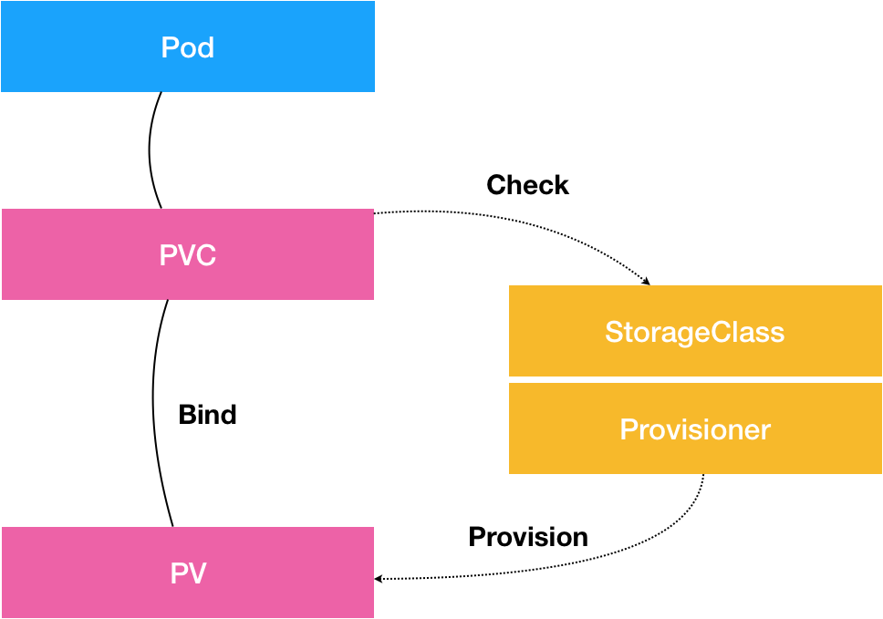

# Kubernetes Container Persistent Storage


## 目录
- [1 PV、PVC、StorageClass，这些到底在说啥？](#1-pvpvcstorageclass这些到底在说啥)
- [2 PV、PVC体系是不是多此一举？从本地持久化卷谈起](#2-pvpvc体系是不是多此一举从本地持久化卷谈起)
- [3 编写自己的存储插件：FlexVolume与CSI](#3-编写自己的存储插件flexvolume与csi)
- [4 容器存储实践：CSI插件编写指南](#4-容器存储实践csi插件编写指南)


## 1 PV、PVC、StorageClass，这些到底在说啥？
- 为什么有持久化存储？
    - 容器化一个应用比较麻烦的地方，莫过于对其“状态”的管理。而最常见的“状态”，又莫过于存储状态了
- 概念：
    1. PV 描述的，是持久化存储数据卷
    1. PVC 描述的，则是 Pod 所希望使用的持久化存储的属性
        - 用户创建的 PVC 要真正被容器使用起来，就必须先和某个符合条件的 PV 进行绑定。这里要检查的条件，包括两部分：
            1. 第一个条件，当然是 PV 和 PVC 的 spec 字段。比如，PV 的存储（storage）大小，就必须满足 PVC 的要求。
            1. 第二个条件，则是 PV 和 PVC 的 storageClassName 字段必须一样。
    1. StorageClass 对象的作用，其实就是创建 PV 的模板
    - PVC 和 PV 的设计，其实跟“面向对象”的思想完全一致
- 问题：如果某一时刻没有合适的PV和PVC绑定，过了一段时间，出现了适合该PVC的PV，还会被成功绑定吗？
    - 在 Kubernetes 中，实际上存在着一个专门处理持久化存储的控制器，叫作 Volume Controller。这个 Volume Controller 维护着多个控制循环，其中有一个循环，扮演的就是撮合 PV 和 PVC 的“红娘”的角色。它的名字叫作 PersistentVolumeController
    - PersistentVolumeController 会不断地查看当前每一个 PVC，是不是已经处于 Bound（已绑定）状态。如果不是，那它就会遍历所有的、可用的 PV，并尝试将其与这个“单身”的 PVC 进行绑定。这样，Kubernetes 就可以保证用户提交的每一个 PVC，只要有合适的 PV 出现，它就能够很快进入绑定状态，从而结束“单身”之旅
    - 而所谓将一个 PV 与 PVC 进行“绑定”，其实就是将这个 PV 对象的名字，填在了 PVC 对象的 spec.volumeName 字段上。所以，接下来 Kubernetes 只要获取到这个 PVC 对象，就一定能够找到它所绑定的 PV
- 问题：这个 PV 对象，又是如何变成容器里的一个持久化存储的呢？
    - 所谓容器的 Volume，其实就是将一个宿主机上的目录，跟一个容器里的目录绑定挂载在了一起
    - **而所谓的“持久化 Volume”，指的就是这个宿主机上的目录，具备“持久性”。**即：这个目录里面的内容，既不会因为容器的删除而被清理掉，也不会跟当前的宿主机绑定。这样，当容器被重启或者在其他节点上重建出来之后，它仍然能够通过挂载这个 Volume，访问到这些内容。
    - 显然，前面使用的 hostPath 和 emptyDir 类型的 Volume 并不具备这个特征：它们既有可能被 kubelet 清理掉，也不能被“迁移”到其他节点上。
    - 所以，大多数情况下，持久化 Volume 的实现，往往依赖于一个远程存储服务，比如：远程文件存储（比如，NFS、GlusterFS）、远程块存储（比如，公有云提供的远程磁盘）等等。
- 准备“持久化”宿主机目录的过程，我们可以形象地称为“两阶段处理”。
     - 当一个 Pod 调度到一个节点上之后，kubelet 就要负责为这个 Pod 创建它的 Volume 目录。默认情况下，kubelet 为 Volume 创建的目录是如下所示的一个宿主机上的路径：
        ```sh

        /var/lib/kubelet/pods/<Pod的ID>/volumes/kubernetes.io~<Volume类型>/<Volume名字>
        ```
        接下来，kubelet 要做的操作就取决于你的 Volume 类型了。
    - 如果你的 Volume 类型是远程块存储，比如 Google Cloud 的 Persistent Disk（GCE 提供的远程磁盘服务），那么 kubelet 就需要先调用 Goolge Cloud 的 API，将它所提供的 Persistent Disk 挂载到 Pod 所在的宿主机上。这相当于执行：
        ```sh

        $ gcloud compute instances attach-disk <虚拟机名字> --disk <远程磁盘名字>
        ```
    1. 这一步为虚拟机挂载远程磁盘的操作，对应的正是“两阶段处理”的第一阶段。在 Kubernetes 中，我们把这个阶段称为 Attach。
        - Attach 阶段完成后，为了能够使用这个远程磁盘，kubelet 还要进行第二个操作，即：格式化这个磁盘设备，然后将它挂载到宿主机指定的挂载点上。不难理解，这个挂载点，正是我在前面反复提到的 Volume 的宿主机目录。
            ```sh

            # 通过lsblk命令获取磁盘设备ID
            $ sudo lsblk
            # 格式化成ext4格式
            $ sudo mkfs.ext4 -m 0 -F -E lazy_itable_init=0,lazy_journal_init=0,discard /dev/<磁盘设备ID>
            # 挂载到挂载点
            $ sudo mkdir -p /var/lib/kubelet/pods/<Pod的ID>/volumes/kubernetes.io~<Volume类型>/<Volume名字>
            ```
    1. 这个将磁盘设备格式化并挂载到 Volume 宿主机目录的操作，对应的正是“两阶段处理”的第二个阶段，我们一般称为：Mount。
        ```sh

        $ mount -t nfs <NFS服务器地址>:/ /var/lib/kubelet/pods/<Pod的ID>/volumes/kubernetes.io~<Volume类型>/<Volume名字> 
        ```
-  问题：Kubernetes 又是如何定义和区分这两个阶段的呢？
    - 其实很简单，在具体的 Volume 插件的实现接口上，Kubernetes 分别给这两个阶段提供了两种不同的参数列表：
        1. 对于“第一阶段”（Attach），Kubernetes 提供的可用参数是 nodeName，即宿主机的名字。
        1. 而对于“第二阶段”（Mount），Kubernetes 提供的可用参数是 dir，即 Volume 的宿主机目录。
    - 而经过了“两阶段处理”，我们就得到了一个“持久化”的 Volume 宿主机目录。所以，接下来，kubelet 只要把这个 Volume 目录通过 CRI 里的 Mounts 参数，传递给 Docker，然后就可以为 Pod 里的容器挂载这个“持久化”的 Volume 了
    - 备注：对应地，在删除一个 PV 的时候，Kubernetes 也需要 Unmount 和 Dettach 两个阶段来处理。这个过程我就不再详细介绍了，执行“反向操作”即可。
- 问题：PV 的处理流程似乎跟 Pod 以及容器的启动流程没有太多的耦合，只要 kubelet 在向 Docker 发起 CRI 请求之前，确保“持久化”的宿主机目录已经处理完毕即可
    - 在 Kubernetes 中，上述关于 PV 的“两阶段处理”流程，是靠独立于 kubelet 主控制循环（Kubelet Sync Loop）之外的两个控制循环来实现的。
    1. 第一阶段”的 Attach（以及 Dettach）操作，是由 Volume Controller 负责维护的，这个控制循环的名字叫作：AttachDetachController。而它的作用，就是不断地检查每一个 Pod 对应的 PV，和这个 Pod 所在宿主机之间挂载情况。从而决定，是否需要对这个 PV 进行 Attach（或者 Dettach）操作。
        - 需要注意，作为一个 Kubernetes 内置的控制器，Volume Controller 自然是 kube-controller-manager 的一部分。所以，AttachDetachController 也一定是运行在 Master 节点上的。当然，Attach 操作只需要调用公有云或者具体存储项目的 API，并不需要在具体的宿主机上执行操作，所以这个设计没有任何问题。
    1. “第二阶段”的 Mount（以及 Unmount）操作，必须发生在 Pod 对应的宿主机上，所以它必须是 kubelet 组件的一部分。这个控制循环的名字，叫作：VolumeManagerReconciler，它运行起来之后，是一个独立于 kubelet 主循环的 Goroutine。
        - 通过这样将 Volume 的处理同 kubelet 的主循环解耦，Kubernetes 就避免了这些耗时的远程挂载操作拖慢 kubelet 的主控制循环，进而导致 Pod 的创建效率大幅下降的问题。实际上，kubelet 的一个主要设计原则，就是它的主控制循环绝对不可以被 block。
- 问题：PV 这个对象的创建，是由运维人员完成的。但是，在大规模的生产环境里，这其实是一个非常麻烦的工作。
    - Kubernetes 为我们提供了一套可以自动创建 PV 的机制，即：Dynamic Provisioning。相比之下，前面人工管理 PV 的方式就叫作 Static Provisioning。
    - Dynamic Provisioning 机制工作的核心，在于一个名叫 StorageClass 的 API 对象。而 StorageClass 对象的作用，其实就是创建 PV 的模板。
    - 具体地说，StorageClass 对象会定义如下两个部分内容：
        1. 第一，PV 的属性。比如，存储类型、Volume 的大小等等。
        1. 第二，创建这种 PV 需要用到的存储插件。比如，Ceph 等等。
        - 有了这样两个信息之后，Kubernetes 就能够根据用户提交的 PVC，找到一个对应的 StorageClass 了。然后，Kubernetes 就会调用该 StorageClass 声明的存储插件，创建出需要的 PV。
        - **需要注意的是，StorageClass 并不是专门为了 Dynamic Provisioning 而设计的。**
        - 实际上，如果你的集群已经开启了名叫 DefaultStorageClass 的 Admission Plugin，它就会为 PVC 和 PV 自动添加一个默认的 StorageClass；否则，PVC 的 storageClassName 的值就是“”，这也意味着它只能够跟 storageClassName 也是“”的 PV 进行绑定。

- 小结：

    

    1. PVC 描述的，是 Pod 想要使用的持久化存储的属性，比如存储的大小、读写权限等。
    1. PV 描述的，则是一个具体的 Volume 的属性，比如 Volume 的类型、挂载目录、远程存储服务器地址等。
    1. 而 StorageClass 的作用，则是充当 PV 的模板。并且，只有同属于一个 StorageClass 的 PV 和 PVC，才可以绑定在一起。
        - 当然，StorageClass 的另一个重要作用，是指定 PV 的 Provisioner（存储插件）。这时候，如果你的存储插件支持 Dynamic Provisioning 的话，Kubernetes 就可以自动为你创建 PV 了。


## 2 PV、PVC体系是不是多此一举？从本地持久化卷谈起
- 问题：像 PV、PVC 这样的用法，是不是有“过度设计”的嫌疑？
    - 实际上，如果只是为了职责划分，PV、PVC 体系确实不见得比直接在 Pod 里声明 Volumes 字段有什么优势。
    - 落地开源基础设施项目的三大常态
        1. 不能用
        1. 不好用
        1. 需要定制开发
    - 问题：如果Kubernetes 内置的 20 种持久化数据卷实现，都没办法满足你的容器存储需求时，该怎么办？
        - 而在持久化存储领域，用户呼声最高的定制化需求，莫过于支持“本地”持久化存储了。
        - 也就是说，用户希望 Kubernetes 能够直接使用宿主机上的本地磁盘目录，而不依赖于远程存储服务，来提供“持久化”的容器 Volume。
        - 这样做的好处很明显，由于这个 Volume 直接使用的是本地磁盘，尤其是 SSD 盘，它的读写性能相比于大多数远程存储来说，要好得多。这个需求对本地物理服务器部署的私有 Kubernetes 集群来说，非常常见。
    - 其实，Kubernetes 很多看起来比较“繁琐”的设计（比如“声明式 API”，以及我今天讲解的“PV、PVC 体系”）的主要目的，都是希望为开发者提供更多的“可扩展性”，给使用者带来更多的“稳定性”和“安全感”。这两个能力的高低，是衡量开源基础设施项目水平的重要标准。
- Local Persistent Volume
    1. 不过，首先需要明确的是，Local Persistent Volume 并不适用于所有应用。事实上，它的适用范围非常固定，比如：高优先级的系统应用，需要在多个不同节点上存储数据，并且对 I/O 较为敏感。典型的应用包括：分布式数据存储比如 MongoDB、Cassandra 等，分布式文件系统比如 GlusterFS、Ceph 等，以及需要在本地磁盘上进行大量数据缓存的分布式应用。
    1. 其次，相比于正常的 PV，一旦这些节点宕机且不能恢复时，Local Persistent Volume 的数据就可能丢失。这就要求使用 Local Persistent Volume 的应用必须具备数据备份和恢复的能力，允许你把这些数据定时备份在其他位置。
- Local Persistent Volume 的设计，主要面临两个难点
    1. 第一个难点在于：如何把本地磁盘抽象成 PV。
        - 问题：可能你会说，Local Persistent Volume，不就等同于 hostPath 加 NodeAffinity 吗？
            - 事实上，你绝不应该把一个宿主机上的目录当作 PV 使用。这是因为，这种本地目录的存储行为完全不可控，它所在的磁盘随时都可能被应用写满，甚至造成整个宿主机宕机。而且，不同的本地目录之间也缺乏哪怕最基础的 I/O 隔离机制。
            - 所以，一个 Local Persistent Volume 对应的存储介质，一定是一块额外挂载在宿主机的磁盘或者块设备（“额外”的意思是，它不应该是宿主机根目录所使用的主硬盘）。这个原则，我们可以称为“一个 PV 一块盘”。
    1. 第二个难点在于：调度器如何保证 Pod 始终能被正确地调度到它所请求的 Local Persistent Volume 所在的节点上呢？
        - 造成这个问题的原因在于，对于常规的 PV 来说，Kubernetes 都是先调度 Pod 到某个节点上，然后，再通过“两阶段处理”来“持久化”这台机器上的 Volume 目录，进而完成 Volume 目录与容器的绑定挂载。
        - 所以，这时候，调度器就必须能够知道所有节点与 Local Persistent Volume 对应的磁盘的关联关系，然后根据这个信息来调度 Pod。
        - 这个原则，我们可以称为“在调度的时候考虑 Volume 分布”。在 Kubernetes 的调度器里，有一个叫作 VolumeBindingChecker 的过滤条件专门负责这个事情。
- 实践调度方法
    1. 定义PV
    1. 在 PV 的定义里，需要有一个 nodeAffinity 字段指定 node-1 这个节点的名字。这样，调度器在调度 Pod 的时候，就能够知道一个 PV 与节点的对应关系，从而做出正确的选择。**这正是 Kubernetes 实现“在调度的时候就考虑 Volume 分布”的主要方法。**
    1. 接下来，使用 kubect create 来创建这个 PV
    1. 使用 PV 和 PVC 的最佳实践，是你要创建一个 StorageClass 来描述这个 PV
        - 这个 StorageClass 的名字，叫作 local-storage。需要注意的是，在它的 provisioner 字段，我们指定的是 no-provisioner。这是因为 Local Persistent Volume 目前尚不支持 Dynamic Provisioning，所以它没办法在用户创建 PVC 的时候，就自动创建出对应的 PV。也就是说，我们前面创建 PV 的操作，是不可以省略的。
        - 与此同时，这个 StorageClass 还定义了一个 volumeBindingMode=WaitForFirstConsumer 的属性。**它是 Local Persistent Volume 里一个非常重要的特性，即：延迟绑定。**
        - 问题：当你提交了 PV 和 PVC 的 YAML 文件之后，Kubernetes 就会根据它们俩的属性，以及它们指定的 StorageClass 来进行绑定。只有绑定成功后，Pod 才能通过声明这个 PVC 来使用对应的 PV。可是，如果你使用的是 Local Persistent Volume 的话，就会发现，这个流程根本行不通。
            - 在调度中，调度器首先检查到了能够捆绑的PVC和PV，但是如果拥有这个PV的node，不符合声明这个PVC的Pod要求，就出了问题。这就是为什么，在使用 Local Persistent Volume 的时候，我们必须想办法推迟这个“绑定”操作。
        - 问题：那么，具体推迟到什么时候呢？
            - 答案是：推迟到调度的时候。
            - 所以说，StorageClass 里的 volumeBindingMode=WaitForFirstConsumer 的含义，就是告诉 Kubernetes 里的 Volume 控制循环（“红娘”）：虽然你已经发现这个 StorageClass 关联的 PVC 与 PV 可以绑定在一起，但请不要现在就执行绑定操作（即：设置 PVC 的 VolumeName 字段）。
            - 而要等到第一个声明使用该 PVC 的 Pod 出现在调度器之后，调度器再综合考虑所有的调度规则，当然也包括每个 PV 所在的节点位置，来统一决定，这个 Pod 声明的 PVC，到底应该跟哪个 PV 进行绑定。
            - 所以，通过这个延迟绑定机制，原本实时发生的 PVC 和 PV 的绑定过程，就被延迟到了 Pod 第一次调度的时候在调度器中进行，从而保证了这个 **绑定结果不会影响 Pod 的正常调度。**
    1. 接下来，我们只需要定义一个非常普通的 PVC，就可以让 Pod 使用到上面定义好的 Local Persistent Volume 了
    1. 然后，我们编写一个 Pod 来声明使用这个 PVC
- 需要注意的是，我们上面手动创建 PV 的方式，即 Static 的 PV 管理方式，在删除 PV 时需要按如下流程执行操作：
    1. 删除使用这个 PV 的 Pod；
    1. 从宿主机移除本地磁盘（比如，umount 它）；
    1. 删除 PVC；
    1. 删除 PV。
    - 当然，由于上面这些创建 PV 和删除 PV 的操作比较繁琐，Kubernetes 其实提供了一个 Static Provisioner 来帮助你管理这些 PV。
        - 比如，现在的所有磁盘，都挂载在宿主机的 /mnt/disks 目录下。那么，当 Static Provisioner 启动后，它就会通过 DaemonSet，自动检查每个宿主机的 /mnt/disks 目录。然后，调用 Kubernetes API，为这些目录下面的每一个挂载，创建一个对应的 PV 对象出来。


## 3 编写自己的存储插件：FlexVolume与CSI
- 在 Kubernetes 中，存储插件的开发有两种方式：FlexVolume 和 CSI。
1. FlexVolume
    1. PV 定义的 Volume 类型是 flexVolume。并且，我们 **指定了这个 Volume 的 driver 叫作 k8s/nfs。** 这个名字很重要
    1. 像这样的一个 PV 被创建后，一旦和某个 PVC 绑定起来，这个 FlexVolume 类型的 Volume 就会进入到我们前面讲解过的 Volume 处理流程。
    - **当你编写完了 FlexVolume 的实现之后，一定要把它的可执行文件放在每个节点的插件目录下。**
    - 问题：
        - 不过，像这样的 FlexVolume 实现方式，虽然简单，但局限性却很大。
        - 比如，跟 Kubernetes 内置的 NFS 插件类似，这个 NFS FlexVolume 插件，也不能支持 Dynamic Provisioning（即：为每个 PVC 自动创建 PV 和对应的 Volume）。除非你再为它编写一个专门的 External Provisioner。
        - 再比如，我的插件在执行 mount 操作的时候，可能会生成一些挂载信息。这些信息，在后面执行 unmount 操作的时候会被用到。可是，在上述 FlexVolume 的实现里，你没办法把这些信息保存在一个变量里，等到 unmount 的时候直接使用。
        - 这个原因也很容易理解：**FlexVolume 每一次对插件可执行文件的调用，都是一次完全独立的操作。**所以，我们只能把这些信息写在一个宿主机上的临时文件里，等到 unmount 的时候再去读取。
        - 这也是为什么，我们需要有 Container Storage Interface（CSI）这样更完善、更编程友好的插件方式。
1. CSI 插件体系的设计原理
    
    

    - 可以看到，在上述体系下，无论是 FlexVolume，还是 Kubernetes 内置的其他存储插件，它们实际上担任的角色，仅仅是 Volume 管理中的“Attach 阶段”和“Mount 阶段”的具体执行者。而像 Dynamic Provisioning 这样的功能，就不是存储插件的责任，而是 Kubernetes 本身存储管理功能的一部分。
    - 相比之下，CSI 插件体系的设计思想，就是把这个 Provision 阶段，以及 Kubernetes 里的一部分存储管理功能，从主干代码里剥离出来，做成了几个单独的组件。这些组件会通过 Watch API 监听 Kubernetes 里与存储相关的事件变化，比如 PVC 的创建，来执行具体的存储管理动作。
    - 这种设计思路，我可以用如下所示的一幅示意图来表示：

        

        - 可以看到，这套存储插件体系多了三个独立的外部组件（External Components），即：Driver Registrar、External Provisioner 和 External Attacher，对应的正是从 Kubernetes 项目里面剥离出来的那部分存储管理功能。
        - 而图中最右侧的部分，就是需要我们编写代码来实现的 CSI 插件。一个 CSI 插件只有一个二进制文件，但它会以 gRPC 的方式对外提供三个服务（gRPC Service），分别叫作：CSI Identity、CSI Controller 和 CSI Node。
    1. External Components
        1. Driver Registrar 组件，负责将插件注册到 kubelet 里面（这可以类比为，将可执行文件放在插件目录下）。而在具体实现上，Driver Registrar 需要请求 CSI 插件的 Identity 服务来获取插件信息。
        1. External Provisioner 组件，负责的正是 Provision 阶段。在具体实现上，External Provisioner 监听（Watch）了 APIServer 里的 PVC 对象。当一个 PVC 被创建时，它就会调用 CSI Controller 的 CreateVolume 方法，为你创建对应 PV。
            - 不过，由于 CSI 插件是独立于 Kubernetes 之外的，所以在 CSI 的 API 里不会直接使用 Kubernetes 定义的 PV 类型，而是会自己定义一个单独的 Volume 类型。
            - **为了方便叙述，在本专栏里，我会把 Kubernetes 里的持久化卷类型叫作 PV，把 CSI 里的持久化卷类型叫作 CSI Volume，请你务必区分清楚。**
        1. External Attacher 组件，负责的正是“Attach 阶段”。在具体实现上，它监听了 APIServer 里 VolumeAttachment 对象的变化。VolumeAttachment 对象是 Kubernetes 确认一个 Volume 可以进入“Attach 阶段”的重要标志
        - 而 Volume 的“Mount 阶段”，并不属于 External Components 的职责。当 kubelet 的 VolumeManagerReconciler 控制循环检查到它需要执行 Mount 操作的时候，会通过 pkg/volume/csi 包，直接调用 CSI Node 服务完成 Volume 的“Mount 阶段”。
        - 在实际使用 CSI 插件的时候，我们会将这三个 External Components 作为 sidecar 容器和 CSI 插件放置在同一个 Pod 中。由于 External Components 对 CSI 插件的调用非常频繁，所以这种 sidecar 的部署方式非常高效。
    1. CSI 插件
        1. CSI 插件的 CSI Identity 服务，负责对外暴露这个插件本身的信息
        1. CSI Controller 服务，定义的则是对 CSI Volume（对应 Kubernetes 里的 PV）的管理接口，比如：创建和删除 CSI Volume、对 CSI Volume 进行 Attach/Dettach（在 CSI 里，这个操作被叫作 Publish/Unpublish），以及对 CSI Volume 进行 Snapshot 等
            - 不难发现，CSI Controller 服务里定义的这些操作有个共同特点，那就是它们都无需在宿主机上进行，而是属于 Kubernetes 里 Volume Controller 的逻辑，也就是属于 Master 节点的一部分。
            - 需要注意的是，正如我在前面提到的那样，CSI Controller 服务的实际调用者，并不是 Kubernetes（即：通过 pkg/volume/csi 发起 CSI 请求），而是 External Provisioner 和 External Attacher。这两个 External Components，分别通过监听 PVC 和 VolumeAttachement 对象，来跟 Kubernetes 进行协作。
        1. CSI Node 服务里面定义了 CSI Volume 需要在宿主机上执行的操作
            - 需要注意的是，“Mount 阶段”在 CSI Node 里的接口，是由 NodeStageVolume 和 NodePublishVolume 两个接口共同实现的。

- 小结：
    1. 相比于 FlexVolume，CSI 的设计思想，把插件的职责从“两阶段处理”，扩展成了 Provision、Attach 和 Mount 三个阶段。其中：
        - Provision 等价于“创建磁盘”
        - Attach 等价于“挂载磁盘到虚拟机”
        - Mount 等价于“将该磁盘格式化后，挂载在 Volume 的宿主机目录上”
    1. 在有了 CSI 插件之后，唯一区别在于：
        - 当 AttachDetachController 需要进行“Attach”操作时（“Attach 阶段”），它实际上会执行到 pkg/volume/csi 目录中，创建一个 VolumeAttachment 对象，从而触发 External Attacher 调用 CSI Controller 服务的 ControllerPublishVolume 方法。
        - 当 VolumeManagerReconciler 需要进行“Mount”操作时（“Mount 阶段”），它实际上也会执行到 pkg/volume/csi 目录中，直接向 CSI Node 服务发起调用 NodePublishVolume 方法的请求。


## 4 容器存储实践：CSI插件编写指南
- 创建流程
    1. 先有一个Kubernetes集群
    1. 而有了 CSI 插件之后，持久化存储的用法就非常简单了，你只需要创建一个如下所示的 StorageClass 对象
    1. 有了这个 StorageClass，External Provisoner 就会为集群中新出现的 PVC 自动创建出 PV，然后调用 CSI 插件创建出这个 PV 对应的 Volume，这正是 CSI 体系中 Dynamic Provisioning 的实现方式。
        - 备注：storageclass.kubernetes.io/is-default-class: "true"的意思，是使用这个 StorageClass 作为默认的持久化存储提供者。
        - 不难看到，这个 StorageClass 里唯一引人注意的，是 provisioner=com.digitalocean.csi.dobs 这个字段。显然，这个字段告诉了 Kubernetes，请使用名叫 com.digitalocean.csi.dobs 的 CSI 插件来为我处理这个 StorageClass 相关的所有操作。
        - 问题：Kubernetes 又是如何知道一个 CSI 插件的名字的呢？
            - **这就需要从 CSI 插件的第一个服务 CSI Identity 说起了。**
- 其实，一个 CSI 插件的代码结构非常简单，如下所示：
    ```sh
    
    tree $GOPATH/src/github.com/digitalocean/csi-digitalocean/driver  
    $GOPATH/src/github.com/digitalocean/csi-digitalocean/driver 
    ├── controller.go
    ├── driver.go
    ├── identity.go
    ├── mounter.go
    └── node.go
    ```
1. CSI Identity
    - 其中，CSI Identity 服务的实现，就定义在了 driver 目录下的 identity.go 文件里。
    - 当然，为了能够让 Kubernetes 访问到 CSI Identity 服务，我们需要先在 driver.go 文件里，定义一个标准的 gRPC Server
    - 可以看到，只要把编写好的 gRPC Server 注册给 CSI，它就可以响应来自 External Components 的 CSI 请求了
    - CSI Identity 接口
        - CSI Identity 服务中，最重要的接口是 GetPluginInfo，它返回的就是这个插件的名字和版本号。其中，driverName 的值，正是"com.digitalocean.csi.dobs"。所以说，Kubernetes 正是通过 GetPluginInfo 的返回值，来找到你在 StorageClass 里声明要使用的 CSI 插件的。
        - 其中，driverName 的值，正是"com.digitalocean.csi.dobs"。所以说，Kubernetes 正是通过 GetPluginInfo 的返回值，来找到你在 StorageClass 里声明要使用的 CSI 插件的。
        - 最后，CSI Identity 服务还提供了一个 Probe 接口。Kubernetes 会调用它来检查这个 CSI 插件是否正常工作。
1. CSI Controller
    - 然后，我们要开始编写 CSI 插件的第二个服务，即 CSI Controller 服务了。它的代码实现，在 controller.go 文件里。这个服务主要实现的就是 Volume 管理流程中的“Provision 阶段”和“Attach 阶段”。
    - “Provision 阶段”对应的接口，是 CreateVolume 和 DeleteVolume，它们的调用者是 External Provisoner
    - “Attach 阶段”对应的接口是 ControllerPublishVolume 和 ControllerUnpublishVolume，它们的调用者是 External Attacher
1. CSI Node
    - CSI Node 服务对应的，是 Volume 管理流程里的“Mount 阶段”。它的代码实现，在 node.go 文件里。
    - kubelet 的 VolumeManagerReconciler 控制循环会直接调用 CSI Node 服务来完成 Volume 的“Mount 阶段”。
    - 不过，在具体的实现中，这个“Mount 阶段”的处理其实被细分成了 NodeStageVolume 和 NodePublishVolume 这两个接口。在 kubelet 的 VolumeManagerReconciler 控制循环中，这两步操作分别叫作 MountDevice 和 SetUp。
        - 这里的原因其实也很容易理解：对于磁盘以及块设备来说，它们被 Attach 到宿主机上之后，就成为了宿主机上的一个待用存储设备。而到了“Mount 阶段”，我们首先需要格式化这个设备，然后才能把它挂载到 Volume 对应的宿主机目录上。
        1. MountDevice 操作，就是直接调用了 CSI Node 服务里的 NodeStageVolume 接口。顾名思义，这个接口的作用，就是格式化 Volume 在宿主机上对应的存储设备，然后挂载到一个临时目录（Staging 目录）上。
        1. SetUp 操作则会调用 CSI Node 服务的 NodePublishVolume 接口，将 Staging 目录，绑定挂载到 Volume 对应的宿主机目录上。
- 在编写完了 CSI 插件之后，我们就可以把这个插件和 External Components 一起部署起来。
    1. 首先，我们需要创建一个 DigitalOcean client 授权需要使用的 Secret 对象
    1. 接下来，我们通过一句```kubectl apply```指令就可以将 CSI 插件部署起来
- 部署 CSI 插件的常用原则是：
    1. 第一，通过 DaemonSet 在每个节点上都启动一个 CSI 插件，来为 kubelet 提供 CSI Node 服务。这是因为，CSI Node 服务需要被 kubelet 直接调用，所以它要和 kubelet“一对一”地部署起来。
    1. 第二，通过 StatefulSet 在任意一个节点上再启动一个 CSI 插件，为 External Components 提供 CSI Controller 服务。所以，作为 CSI Controller 服务的调用者，External Provisioner 和 External Attacher 这两个外部组件，就需要以 sidecar 的方式和这次部署的 CSI 插件定义在同一个 Pod 里。
        - 问题：为什么我们会用 StatefulSet 而不是 Deployment 来运行这个 CSI 插件呢？
            - 这是因为，由于 StatefulSet 需要确保应用拓扑状态的稳定性，所以它对 Pod 的更新，是严格保证顺序的，即：只有在前一个 Pod 停止并删除之后，它才会创建并启动下一个 Pod。
- 对于一个部署了 CSI 存储插件的 Kubernetes 集群的流程总结
    1. 当用户创建了一个 PVC 之后，你前面部署的 StatefulSet 里的 External Provisioner 容器，就会监听到这个 PVC 的诞生，然后调用同一个 Pod 里的 CSI 插件的 CSI Controller 服务的 CreateVolume 方法，为你创建出对应的 PV。
    1. 这时候，运行在 Kubernetes Master 节点上的 Volume Controller，就会通过 PersistentVolumeController 控制循环，发现这对新创建出来的 PV 和 PVC，并且看到它们声明的是同一个 StorageClass。所以，它会把这一对 PV 和 PVC 绑定起来，使 PVC 进入 Bound 状态。
    1. 然后，用户创建了一个声明使用上述 PVC 的 Pod，并且这个 Pod 被调度器调度到了宿主机 A 上。这时候，Volume Controller 的 AttachDetachController 控制循环就会发现，上述 PVC 对应的 Volume，需要被 Attach 到宿主机 A 上。所以，AttachDetachController 会创建一个 VolumeAttachment 对象，这个对象携带了宿主机 A 和待处理的 Volume 的名字。
    1. 这样，StatefulSet 里的 External Attacher 容器，就会监听到这个 VolumeAttachment 对象的诞生。于是，它就会使用这个对象里的宿主机和 Volume 名字，调用同一个 Pod 里的 CSI 插件的 CSI Controller 服务的 ControllerPublishVolume 方法，完成“Attach 阶段”。
    1. 上述过程完成后，运行在宿主机 A 上的 kubelet，就会通过 VolumeManagerReconciler 控制循环，发现当前宿主机上有一个 Volume 对应的存储设备（比如磁盘）已经被 Attach 到了某个设备目录下。于是 kubelet 就会调用同一台宿主机上的 CSI 插件的 CSI Node 服务的 NodeStageVolume 和 NodePublishVolume 方法，完成这个 Volume 的“Mount 阶段”。


