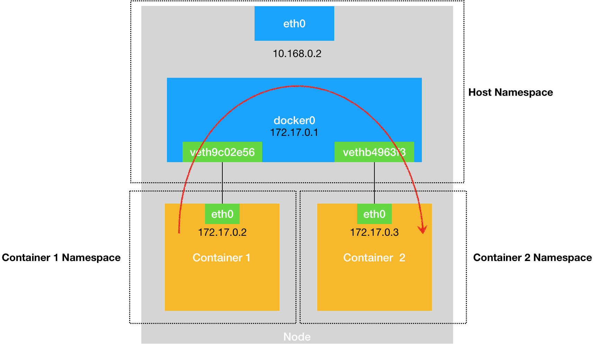
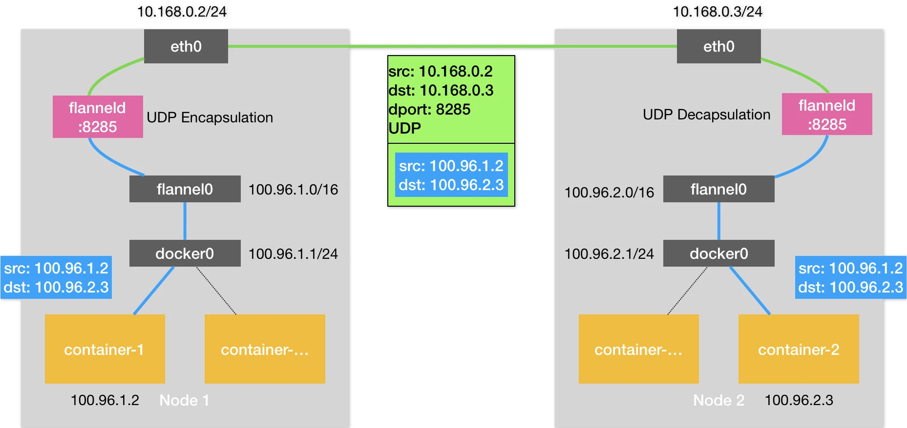
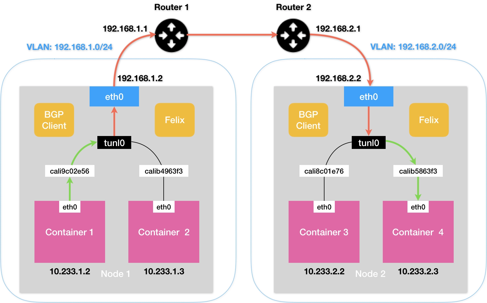

# Kubernetes Container Network


## 目录
- [1 浅谈容器网络](#1-浅谈容器网络)
- [2 深入解析容器跨主机网络](#2-深入解析容器跨主机网络)
- [3 Kubernetes网络模型与CNI网络插件](#3-kubernetes网络模型与cni网络插件)
- [4 解读Kubernetes三层网络方案](#4-解读kubernetes三层网络方案)
- [5 为什么说Kubernetes只有softmulti-tenancy？](#5-为什么说kubernetes只有softmulti-tenancy)
- [6 找到容器不容易：Service、DNS与服务发现](#6-找到容器不容易servicedns与服务发现)
- [7 从外界连通Service与Service调试“三板斧”](#7-从外界连通service与service调试三板斧)
- [8 谈谈Service与Ingress](#8-谈谈service与ingress)


## 1 浅谈容器网络
一个 Linux 容器能看见的“网络栈”，实际上是被隔离在它自己的 Network Namespace 当中的。

而所谓“网络栈”，就包括了：
1. 网卡（Network Interface）
1. 回环设备（Loopback Device）
1. 路由表（Routing Table）
1. iptables 规则

对于一个进程来说，这些要素，其实就构成了它发起和响应网络请求的基本环境。

需要指出的是，作为一个容器，它可以声明直接使用宿主机的网络栈（–net=host），即：不开启 Network Namespace

在这种情况下，这个容器启动后，直接监听的就是宿主机的 80 端口。像这样直接使用宿主机网络栈的方式，虽然可以为容器提供良好的网络性能，但也会不可避免地引入共享网络资源的问题，比如端口冲突。所以，在大多数情况下，我们都希望容器进程能使用自己 Network Namespace 里的网络栈，即：拥有属于自己的 IP 地址和端口。

- 问题：这个被隔离的容器进程，该如何跟其他 Network Namespace 里的容器进程进行交互呢？
    - 为了理解这个问题，你其实可以把每一个容器看做一台主机，它们都有一套独立的“网络栈”。
    - 如果你想要实现两台主机之间的通信，最直接的办法，就是把它们用一根网线连接起来；而如果你想要实现多台主机之间的通信，那就需要用网线，把它们连接在一台交换机上。
    - 在 Linux 中，能够起到虚拟交换机作用的网络设备，是网桥（Bridge）。它是一个工作在数据链路层（Data Link）的设备，主要功能是根据 MAC 地址学习来将数据包转发到网桥的不同端口（Port）上。
    - 为了实现上述目的，Docker 项目会默认在宿主机上创建一个名叫 docker0 的网桥，凡是连接在 docker0 网桥上的容器，就可以通过它来进行通信。
- 问题：我们又该如何把这些容器“连接”到 docker0 网桥上呢？
    - 使用一种名叫 Veth Pair 的虚拟设备。Veth Pair 设备的特点是：它被创建出来后，总是以两张虚拟网卡（Veth Peer）的形式成对出现的。并且，从其中一个“网卡”发出的数据包，可以直接出现在与它对应的另一张“网卡”上，哪怕这两个“网卡”在不同的 Network Namespace 里。这就使得 Veth Pair 常常被用作连接不同 Network Namespace 的“网线”。
- 原理：
    - nginx-1 容器里的第二条路由规则。可以看到，这条路由规则的网关（Gateway）是 0.0.0.0，这就意味着这是一条直连规则，即：凡是匹配到这条规则的 IP 包，应该经过本机的 eth0 网卡，通过 **二层网络** 直接发往目的主机。
    - 一旦一张虚拟网卡被“插”在网桥上，它就会变成该网桥的“从设备”。从设备会被“剥夺”调用网络协议栈处理数据包的资格，从而“降级”成为网桥上的一个端口。而这个端口唯一的作用，就是接收流入的数据包，然后把这些数据包的“生杀大权”（比如转发或者丢弃），全部交给对应的网桥。
    - docker0 处理转发的过程，则继续扮演二层交换机的角色

        

    - 熟悉了 docker0 网桥的工作方式，你就可以理解，在默认情况下，**被限制在 Network Namespace 里的容器进程，实际上是通过 Veth Pair 设备 + 宿主机网桥的方式，实现了跟同其他容器的数据交换。**
    - 与之类似地，当你在一台宿主机上，访问该宿主机上的容器的 IP 地址时，这个请求的数据包，也是先根据路由规则到达 docker0 网桥，然后被转发到对应的 Veth Pair 设备，最后出现在容器里。这个过程的示意图，如下所示：
        
        

    - 同样地，当一个容器试图连接到另外一个宿主机时，比如：ping 10.168.0.3，它发出的请求数据包，首先经过 docker0 网桥出现在宿主机上。然后根据宿主机的路由表里的直连路由规则（10.168.0.0/24 via eth0)），对 10.168.0.3 的访问请求就会交给宿主机的 eth0 处理。所以接下来，这个数据包就会经宿主机的 eth0 网卡转发到宿主机网络上，最终到达 10.168.0.3 对应的宿主机上。当然，这个过程的实现要求这两台宿主机本身是连通的。这个过程的示意图，如下所示：
        
        

    - **当你遇到容器连不通“外网”的时候，你都应该先试试 docker0 网桥能不能 ping 通，然后查看一下跟 docker0 和 Veth Pair 设备相关的 iptables 规则是不是有异常，往往就能够找到问题的答案了。**

- 问题：如果在另外一台宿主机（比如：10.168.0.3）上，也有一个 Docker 容器。那么，我们的 nginx-1 容器又该如何访问它呢？
    - 这个问题，其实就是容器的“跨主通信”问题。
    - 在 Docker 的默认配置下，一台宿主机上的 docker0 网桥，和其他宿主机上的 docker0 网桥，没有任何关联，它们互相之间也没办法连通。所以，连接在这些网桥上的容器，自然也没办法进行通信了。
    - 如果我们通过软件的方式，创建一个整个集群“公用”的网桥，然后把集群里的所有容器都连接到这个网桥上，不就可以相互通信了吗？
        
        

    - 可以看到，构建这种容器网络的核心在于：我们需要在已有的宿主机网络上，再通过软件构建一个覆盖在已有宿主机网络之上的、可以把所有容器连通在一起的虚拟网络。所以，这种技术就被称为：Overlay Network（覆盖网络）。
- 小结：
    - 这里的关键在于，容器要想跟外界进行通信，它发出的 IP 包就必须从它的 Network Namespace 里出来，来到宿主机上。
    - 而解决这个问题的方法就是：为容器创建一个一端在容器里充当默认网卡、另一端在宿主机上的 Veth Pair 设备。


## 2 深入解析容器跨主机网络
- 问题：为了解决这个容器“跨主通信”的问题，社区里出现那么多的容器网络方案的工作原理到底是什么？
    - 从 Flannel 这个项目说起
- Flannel 项目是 CoreOS 公司主推的容器网络方案。事实上，Flannel 项目本身只是一个框架，真正为我们提供容器网络功能的，是 Flannel 的后端实现。目前，Flannel 支持三种后端实现，分别是：
    1. VXLAN；
    1. host-gw；
    1. UDP。
1. 从 UDP 模式开始，讲解容器“跨主网络”的实现原理
    - UDP 模式，是 Flannel 项目最早支持的一种方式，却也是性能最差的一种方式。所以，这个模式目前已经被弃用。不过，Flannel 之所以最先选择 UDP 模式，就是因为这种模式是最直接、也是最容易理解的容器跨主网络实现。
    - Flannel 会先在宿主机上创建出了一系列的路由规则
    - flannel0 设备的类型：它是一个 TUN 设备（Tunnel 设备）。在 Linux 中，TUN 设备是一种工作在三层（Network Layer）的虚拟网络设备。TUN 设备的功能非常简单，即：在操作系统内核和用户应用程序之间传递 IP 包。
        1. 当操作系统将一个 IP 包发送给 flannel0 设备之后，flannel0 就会把这个 IP 包，交给创建这个设备的应用程序，也就是 Flannel 进程。这是一个从内核态（Linux 操作系统）向用户态（Flannel 进程）的流动方向。
        1. 反之，如果 Flannel 进程向 flannel0 设备发送了一个 IP 包，那么这个 IP 包就会出现在宿主机网络栈中，然后根据宿主机的路由表进行下一步处理。这是一个从用户态向内核态的流动方向。
    - 问题：flanneld 又是如何知道这个 IP 地址对应的容器，是运行在 Node 2 上的呢？
        - 这里，就用到了 Flannel 项目里一个非常重要的概念：子网（Subnet）。
        - 事实上，在由 Flannel 管理的容器网络里，一台宿主机上的所有容器，都属于该宿主机被分配的一个“子网”。
        - 而这些子网与宿主机的对应关系，正是保存在 Etcd 当中
    - 基于 Flannel UDP 模式的跨主通信的基本原理，如下所示：
        
        

        可以看到，Flannel UDP 模式提供的其实是一个三层的 Overlay 网络，即：它首先对发出端的 IP 包进行 UDP 封装，然后在接收端进行解封装拿到原始的 IP 包，进而把这个 IP 包转发给目标容器。这就好比，Flannel 在不同宿主机上的两个容器之间打通了一条“隧道”，使得这两个容器可以直接使用 IP 地址进行通信，而无需关心容器和宿主机的分布情况。
    
    - 实际上，相比于两台宿主机之间的直接通信，基于 Flannel UDP 模式的容器通信多了一个额外的步骤，即 flanneld 的处理过程。而这个过程，由于使用到了 flannel0 这个 TUN 设备，仅在发出 IP 包的过程中，就需要经过三次用户态与内核态之间的数据拷贝，如下所示：

        

        1. 第一次，用户态的容器进程发出的 IP 包经过 docker0 网桥进入内核态；
        1. 第二次，IP 包根据路由表进入 TUN（flannel0）设备，从而回到用户态的 flanneld 进程；
        1. 第三次，flanneld 进行 UDP 封包之后重新进入内核态，将 UDP 包通过宿主机的 eth0 发出去。

    - **我们在进行系统级编程的时候，有一个非常重要的优化原则，就是要减少用户态到内核态的切换次数，并且把核心的处理逻辑都放在内核态进行。这也是为什么，Flannel 后来支持的VXLAN 模式，逐渐成为了主流的容器网络方案的原因。**
1. VXLAN 模式，逐渐成为了主流的容器网络方案
    - VXLAN，即 Virtual Extensible LAN（虚拟可扩展局域网），是 Linux 内核本身就支持的一种网络虚似化技术。所以说，VXLAN 可以完全在内核态实现上述封装和解封装的工作，从而通过与前面相似的“隧道”机制，构建出覆盖网络（Overlay Network）。
    - VXLAN 的覆盖网络的设计思想是：在现有的三层网络之上，“覆盖”一层虚拟的、由内核 VXLAN 模块负责维护的二层网络，使得连接在这个 VXLAN 二层网络上的“主机”（虚拟机或者容器都可以）之间，可以像在同一个局域网（LAN）里那样自由通信。当然，实际上，这些“主机”可能分布在不同的宿主机上，甚至是分布在不同的物理机房里。
    - 而为了能够在二层网络上打通“隧道”，VXLAN 会在宿主机上设置一个特殊的网络设备作为“隧道”的两端。这个设备就叫作 VTEP，即：VXLAN Tunnel End Point（虚拟隧道端点）。
    - 基于 VTEP 设备进行“隧道”通信的流程示意图，如下所示
        
        


## 3 Kubernetes网络模型与CNI网络插件
- UDP 和 VXLAN 的共性：用户的容器都连接在 docker0 网桥上。而网络插件则在宿主机上创建了一个特殊的设备（UDP 模式创建的是 TUN 设备，VXLAN 模式创建的则是 VTEP 设备），docker0 与这个设备之间，通过 IP 转发（路由表）进行协作。然后，网络插件真正要做的事情，则是通过某种方法，把不同宿主机上的特殊设备连通，从而达到容器跨主机通信的目的。
- 实际上，上面这个流程，也正是 Kubernetes 对容器网络的主要处理方法。只不过，Kubernetes 是通过一个叫作 CNI 的接口，维护了一个单独的网桥来代替 docker0。这个网桥的名字就叫作：CNI 网桥，它在宿主机上的设备名称默认是：cni0。
- 以 Flannel 的 VXLAN 模式为例，在 Kubernetes 环境里，它的工作方式跟上述VXLAN没有任何不同。只不过，docker0 网桥被替换成了 CNI 网桥而已，如下所示：
    
    

- Kubernetes 之所以要设置这样一个与 docker0 网桥功能几乎一样的 CNI 网桥，主要原因包括两个方面：
    1. 一方面，Kubernetes 项目并没有使用 Docker 的网络模型（CNM），所以它并不希望、也不具备配置 docker0 网桥的能力；
    1. 另一方面，这还与 Kubernetes 如何配置 Pod，也就是 Infra 容器的 Network Namespace 密切相关。
        - Kubernetes 创建一个 Pod 的第一步，就是创建并启动一个 Infra 容器，用来“hold”住这个 Pod 的 Network Namespace
- CNI 的设计思想，就是：**Kubernetes 在启动 Infra 容器之后，就可以直接调用 CNI 网络插件，为这个 Infra 容器的 Network Namespace，配置符合预期的网络栈。**
- 问题：那么，这个网络栈的配置工作又是如何完成的呢？
    - 那就需要从 CNI 插件的部署和实现方式谈起了

- CNI 插件的部署
    1. 在部署 Kubernetes 的时候，有一个步骤是安装 kubernetes-cni 包，它的目的就是在宿主机上安装 **CNI 插件所需的基础可执行文件。**
        - 这些 CNI 的基础可执行文件，按照功能可以分为三类：
            1. 第一类，叫作 Main 插件，它是用来创建具体网络设备的二进制文件。比如，bridge（网桥设备）、ipvlan、loopback（lo 设备）、macvlan、ptp（Veth Pair 设备），以及 vlan。
            1. 第二类，叫作 IPAM（IP Address Management）插件，它是负责分配 IP 地址的二进制文件。比如，dhcp，这个文件会向 DHCP 服务器发起请求；host-local，则会使用预先配置的 IP 地址段来进行分配。
            1. 第三类，是由 CNI 社区维护的内置 CNI 插件。比如：flannel，就是专门为 Flannel 项目提供的 CNI 插件；tuning，是一个通过 sysctl 调整网络设备参数的二进制文件；portmap，是一个通过 iptables 配置端口映射的二进制文件；bandwidth，是一个使用 Token Bucket Filter (TBF) 来进行限流的二进制文件。
        - 从这些二进制文件中，我们可以看到，如果要实现一个给 Kubernetes 用的容器网络方案，其实需要做两部分工作，以 Flannel 项目为例：
            1. 首先，实现这个网络方案本身。这一部分需要编写的，其实就是 flanneld 进程里的主要逻辑。比如，创建和配置 flannel.1 设备、配置宿主机路由、配置 ARP 和 FDB 表里的信息等等。
            1. 然后，实现该网络方案对应的 CNI 插件。这一部分主要需要做的，就是配置 Infra 容器里面的网络栈，并把它连接在 CNI 网桥上。
    1. 由于 Flannel 项目对应的 CNI 插件已经被内置了，所以它无需再单独安装。而对于 Weave、Calico 等其他项目来说，我们就必须在安装插件的时候，把对应的 CNI 插件的可执行文件放在 ```/opt/cni/bin/``` 目录下
    1. 接下来，你就需要在宿主机上安装 flanneld（网络方案本身）。而在这个过程中，flanneld 启动后会在每台宿主机上生成它对应的 **CNI 配置文件**（它其实是一个 ConfigMap），从而告诉 Kubernetes，这个集群要使用 Flannel 作为容器网络方案。
        - 需要注意的是，在 Kubernetes 中，处理容器网络相关的逻辑并不会在 kubelet 主干代码里执行，而是会在具体的 CRI（Container Runtime Interface，容器运行时接口）实现里完成。对于 Docker 项目来说，它的 CRI 实现叫作 dockershim，你可以在 kubelet 的代码里找到它。
    1. 接下来 dockershim 会加载上述的 CNI 配置文件。
        - 需要注意，Kubernetes 目前不支持多个 CNI 插件混用。如果你在 CNI 配置目录（/etc/cni/net.d）里放置了多个 CNI 配置文件的话，dockershim 只会加载按字母顺序排序的第一个插件。
        - 但另一方面，CNI 允许你在一个 CNI 配置文件里，通过 plugins 字段，定义多个插件进行协作。
        - 比如，在我们上面这个例子里，Flannel 项目就指定了 flannel 和 portmap 这两个插件。**这时候，dockershim 会把这个 CNI 配置文件加载起来，并且把列表里的第一个插件、也就是 flannel 插件，设置为默认插件。**而在后面的执行过程中，flannel 和 portmap 插件会按照定义顺序被调用，从而依次完成“配置容器网络”和“配置端口映射”这两步操作。
- CNI 插件的工作原理
    1. 当 kubelet 组件需要创建 Pod 的时候，它第一个创建的一定是 Infra 容器。所以在这一步，dockershim 就会先调用 Docker API 创建并启动 Infra 容器，紧接着执行一个叫作 SetUpPod 的方法。这个方法的作用就是：为 CNI 插件准备参数，然后调用 CNI 插件为 Infra 容器配置网络。这里要调用的 CNI 插件，就是 /opt/cni/bin/flannel；而调用它所需要的参数，分为两部分。
        1. **第一部分，是由 dockershim 设置的一组 CNI 环境变量。**其中，最重要的环境变量参数叫作：CNI_COMMAND。它的取值只有两种：ADD 和 DEL。
            - **这个 ADD 和 DEL 操作，就是 CNI 插件唯一需要实现的两个方法。**其中 ADD 操作的含义是：把容器添加到 CNI 网络里；DEL 操作的含义则是：把容器从 CNI 网络里移除掉。
            - 而对于网桥类型的 CNI 插件来说，这两个操作意味着把容器以 Veth Pair 的方式“插”到 CNI 网桥上，或者从网桥上“拔”掉。
            - **以ADD进行说明：**CNI 的 ADD 操作需要的参数包括：容器里网卡的名字 eth0（CNI_IFNAME）、Pod 的 Network Namespace 文件的路径（CNI_NETNS）、容器的 ID（CNI_CONTAINERID）等。这些参数都属于上述环境变量里的内容。其中，Pod（Infra 容器）的 Network Namespace 文件的路径，我在前面讲解容器基础的时候提到过，即：```/proc/<容器进程的 PID>/ns/net```。除此之外，在 CNI 环境变量里，还有一个叫作 CNI_ARGS 的参数。通过这个参数，CRI 实现（比如 dockershim）就可以以 Key-Value 的格式，传递自定义信息给网络插件。这是用户将来自定义 CNI 协议的一个重要方法。
        1. **第二部分，则是 dockershim 从 CNI 配置文件里加载到的、默认插件的配置信息。**这个配置信息在 CNI 中被叫作 Network Configuration。dockershim 会把 Network Configuration 以 JSON 数据的格式，通过标准输入（stdin）的方式传递给 Flannel CNI 插件。
            - 需要注意的是，Flannel 的 CNI 配置文件（ /etc/cni/net.d/10-flannel.conflist）里有这么一个字段，叫作 delegate。意思是，这个 CNI 插件并不会自己做事儿，而是会调用 Delegate 指定的某种 CNI 内置插件来完成。对于 Flannel 来说，它调用的 Delegate 插件，就是前面介绍到的 CNI bridge 插件。所以说，dockershim 对 Flannel CNI 插件的调用，其实就是走了个过场。Flannel CNI 插件唯一需要做的，就是对 dockershim 传来的 Network Configuration 进行补充。比如，将 Delegate 的 Type 字段设置为 bridge，将 Delegate 的 IPAM 字段设置为 host-local 等
    1. 接下来，Flannel CNI 插件就会调用 CNI bridge 插件，也就是执行：/opt/cni/bin/bridge 二进制文件。
        1. 这一次，调用 CNI bridge 插件需要的两部分参数的第一部分、也就是 CNI 环境变量，并没有变化。所以，它里面的 CNI_COMMAND 参数的值还是“ADD”。
        1. 第二部分 Network Configration，正是上面补充好的 Delegate 字段。Flannel CNI 插件会把 Delegate 字段的内容以标准输入（stdin）的方式传递给 CNI bridge 插件。
            - 此外，Flannel CNI 插件还会把 Delegate 字段以 JSON 文件的方式，保存在 /var/lib/cni/flannel 目录下。这是为了给后面删除容器调用 DEL 操作时使用的
    1. 有了这两部分参数，接下来 CNI bridge 插件就可以“代表”Flannel，进行“将容器加入到 CNI 网络里”这一步操作了
        1. 首先，CNI bridge 插件会在宿主机上检查 CNI 网桥是否存在。如果没有的话，那就创建它。
        1. 接下来，CNI bridge 插件会通过 Infra 容器的 Network Namespace 文件，进入到这个 Network Namespace 里面，然后创建一对 Veth Pair 设备。
        1. 紧接着，它会把这个 Veth Pair 的其中一端，“移动”到宿主机上。
            - 当然，你可能已经想到，上述创建 Veth Pair 设备的操作，其实也可以先在宿主机上执行，然后再把该设备的一端放到容器的 Network Namespace 里，这个原理是一样的。
                - 这个设计其实很容易理解。在编程时，容器的 Namespace 是可以直接通过 Namespace 文件拿到的；而 Host Namespace，则是一个隐含在上下文的参数。所以，像上面这样，先通过容器 Namespace 进入容器里面，然后再反向操作 Host Namespace，对于编程来说要更加方便。
        1. 接下来，CNI bridge 插件就可以把 vethb4963f3 设备连接在 CNI 网桥上。
            - 在将 vethb4963f3 设备连接在 CNI 网桥之后，CNI bridge 插件还会为它设置 Hairpin Mode（发夹模式）。这是因为，在默认情况下，网桥设备是不允许一个数据包从一个端口进来后，再从这个端口发出去的。但是，它允许你为这个端口开启 Hairpin Mode，从而取消这个限制。
        1. 接下来，CNI bridge 插件会调用 CNI ipam 插件，从 ipam.subnet 字段规定的网段里为容器分配一个可用的 IP 地址。然后，CNI bridge 插件就会把这个 IP 地址添加在容器的 eth0 网卡上，同时为容器设置默认路由
        1. 最后，CNI bridge 插件会为 CNI 网桥添加 IP 地址
        1. 在执行完上述操作之后，CNI 插件会把容器的 IP 地址等信息返回给 dockershim，然后被 kubelet 添加到 Pod 的 Status 字段。
        1. 至此，CNI 插件的 ADD 方法就宣告结束了。

- 小结：
    - 本章难点在于实现网络方案对应的CNI插件，即配置Infra容器的网络栈，并连到网桥上。
    - 整体流程是：
        1. kubelet创建Pod -> 创建Infra容器 -> 调用SetUpPod()方法，该方法需要为CNI准备参数，然后调用CNI插件(flannel)为Infra配置网络；其中参数来源于1、dockershim设置的一组CNI环境变量；
        1. dockershim从CNI配置文件里（有flanneld启动后生成，类型为configmap）加载到的、默认插件的配置信息(network configuration)，这里对CNI插件的调用，实际是network configuration进行补充。
        1. 参数准备好后，调用Flannel CNI->调用CNI bridge（所需参数即为上面：设置的CNI环境变量和补充的network configuation）来执行具体的操作流程。
    - Kubernetes 网络模型
        1. 所有容器都可以直接使用 IP 地址与其他容器通信，而无需使用 NAT。
        1. 所有宿主机都可以直接使用 IP 地址与所有容器通信，而无需使用 NAT。反之亦然。
        1. 容器自己“看到”的自己的 IP 地址，和别人（宿主机或者容器）看到的地址是完全一样的。
            

## 4 解读Kubernetes三层网络方案
- 除了网桥类型这种模式之外，还有一种纯三层（Pure Layer 3）网络方案非常值得你注意。其中的典型例子，莫过于 Flannel 的 host-gw 模式和 Calico 项目了。
1. 先来看一下 Flannel 的 host-gw 模式
    - 它的工作原理非常简单，用一张图就可以和你说清楚。为了方便叙述，接下来称这张图为“host-gw 示意图”。
        
        

    - 所谓下一跳地址就是：如果 IP 包从主机 A 发到主机 B，需要经过路由设备 X 的中转。那么 X 的 IP 地址就应该配置为主机 A 的下一跳地址。
    - 可以看到，**host-gw 模式的工作原理，其实就是将每个 Flannel 子网（Flannel Subnet，比如：10.244.1.0/24）的“下一跳”，设置成了该子网对应的宿主机的 IP 地址。**
    - 也就是说，这台“主机”（Host）会充当这条容器通信路径里的“网关”（Gateway）。这也正是“host-gw”的含义。
    - 而在这种模式下，容器通信的过程就免除了额外的封包和解包带来的性能损耗。根据实际的测试，host-gw 的性能损失大约在 10% 左右，而其他所有基于 VXLAN“隧道”机制的网络方案，性能损失都在 20%~30% 左右。
    - 当然，通过上面的叙述，你也应该看到，host-gw 模式能够正常工作的核心，就在于 IP 包在封装成帧发送出去的时候，会使用路由表里的“下一跳”来设置目的 MAC 地址。这样，它就会经过二层网络到达目的宿主机。
    - **所以说，Flannel host-gw 模式必须要求集群宿主机之间是二层连通的。**
1. 而在容器生态中，要说到像 Flannel host-gw 这样的三层网络方案，我们就不得不提到这个领域里的“龙头老大”Calico 项目了。
    - 实际上，Calico 项目提供的网络解决方案，与 Flannel 的 host-gw 模式，几乎是完全一样的。也就是说，Calico 也会在每台宿主机上，添加一个格式如下所示的路由规则：
        ```sh

        <目的容器IP地址段> via <网关的IP地址> dev eth0
        ```
    - 而正如前所述，这个三层网络方案得以正常工作的核心，是为每个容器的 IP 地址，找到它所对应的、“下一跳”的网关。
    - 不过，不同于 Flannel 通过 Etcd 和宿主机上的 flanneld 来维护路由信息的做法，Calico 项目使用了一个“重型武器”来自动地在整个集群中分发路由信息。这个“重型武器”，就是 BGP。
    - BGP 的全称是 Border Gateway Protocol，即：边界网关协议。它是一个 Linux 内核原生就支持的、专门用在大规模数据中心里维护不同的“自治系统”之间路由信息的、无中心的路由协议。
        
        

        像上面这样负责把自治系统连接在一起的路由器，我们就把它形象地称为：边界网关。它跟普通路由器的不同之处在于，它的路由表里拥有其他自治系统里的主机路由信息。

        - 在使用了 BGP 之后，你可以认为，在每个边界网关上都会运行着一个小程序，它们会将各自的路由表信息，通过 TCP 传输给其他的边界网关。而其他边界网关上的这个小程序，则会对收到的这些数据进行分析，然后将需要的信息添加到自己的路由表里。
        - **所谓 BGP，就是在大规模网络中实现节点路由信息共享的一种协议。**
    - 在了解了 BGP 之后，Calico 项目的架构就非常容易理解了。它由三个部分组成：
        1. Calico 的 CNI 插件。这是 Calico 与 Kubernetes 对接的部分。我已经在上一篇文章中，和你详细分享了 CNI 插件的工作原理，这里就不再赘述了。
        1. Felix。它是一个 DaemonSet，负责在宿主机上插入路由规则（即：写入 Linux 内核的 FIB 转发信息库），以及维护 Calico 所需的网络设备等工作。
        1. BIRD。它就是 BGP 的客户端，专门负责在集群里分发路由规则信息。
    - **除了对路由信息的维护方式之外，Calico 项目与 Flannel 的 host-gw 模式的另一个不同之处，就是它不会在宿主机上创建任何网桥设备。**这时候，Calico 的工作方式，可以用一幅示意图来描述，如下所示（在接下来的讲述中，统一用“BGP 示意图”来指代它）：
        
        

        其中的绿色实线标出的路径，就是一个 IP 包从 Node 1 上的 Container 1，到达 Node 2 上的 Container 4 的完整路径。
        
        可以看到，Calico 的 CNI 插件会为每个容器设置一个 Veth Pair 设备，然后把其中的一端放置在宿主机上（它的名字以 cali 前缀开头）。
        
        此外，由于 Calico 没有使用 CNI 的网桥模式，Calico 的 CNI 插件还需要在宿主机上为每个容器的 Veth Pair 设备配置一条路由规则，用于接收传入的 IP 包。
        
        - 基于上述原因，Calico 项目在宿主机上设置的路由规则，肯定要比 Flannel 项目多得多。不过，Flannel host-gw 模式使用 CNI 网桥的主要原因，其实是为了跟 VXLAN 模式保持一致。否则的话，Flannel 就需要维护两套 CNI 插件了。
    - 其中，这里最核心的“下一跳”路由规则，就是由 Calico 的 Felix 进程负责维护的。这些路由规则信息，则是通过 BGP Client 也就是 BIRD 组件，使用 BGP 协议传输而来的。
    - 其中，这里最核心的“下一跳”路由规则，就是由 Calico 的 Felix 进程负责维护的。这些路由规则信息，则是通过 BGP Client 也就是 BIRD 组件，使用 BGP 协议传输而来的。
        - 需要注意的是，**Calico 维护的网络在默认配置下，是一个被称为“Node-to-Node Mesh”的模式。**这时候，每台宿主机上的 BGP Client 都需要跟其他所有节点的 BGP Client 进行通信以便交换路由信息。但是，随着节点数量 N 的增加，这些连接的数量就会以 N²的规模快速增长，从而给集群本身的网络带来巨大的压力。
        - 所以，Node-to-Node Mesh 模式一般推荐用在少于 100 个节点的集群里。而在更大规模的集群中，你需要用到的是一个叫作 Route Reflector 的模式。
        - 在这种模式下，Calico 会指定一个或者几个专门的节点，来负责跟所有节点建立 BGP 连接从而学习到全局的路由规则。而其他节点，只需要跟这几个专门的节点交换路由信息，就可以获得整个集群的路由规则信息了。
        - 这些专门的节点，就是所谓的 Route Reflector 节点，它们实际上扮演了“中间代理”的角色，从而把 BGP 连接的规模控制在 N 的数量级上。
        - 此外，我在前面提到过，Flannel host-gw 模式最主要的限制，就是要求集群宿主机之间是二层连通的。而这个限制对于 Calico 来说，也同样存在。
    - **在这种情况下，你就需要为 Calico 打开 IPIP 模式。**
        
        

        但这一次，要负责将 IP 包发出去的设备，变成了 tunl0。注意，是 T-U-N-L-0，而不是 Flannel UDP 模式使用的 T-U-N-0（tun0），这两种设备的功能是完全不一样的。

        - Calico 使用的这个 tunl0 设备，是一个 IP 隧道（IP tunnel）设备。
        - 在上面的例子中，IP 包进入 IP 隧道设备之后，就会被 Linux 内核的 IPIP 驱动接管。IPIP 驱动会将这个 IP 包直接封装在一个宿主机网络的 IP 包中，如下所示：
            
            

            难看到，当 Calico 使用 IPIP 模式的时候，集群的网络性能会因为额外的封包和解包工作而下降。在实际测试中，Calico IPIP 模式与 Flannel VXLAN 模式的性能大致相当。所以，在实际使用时，如非硬性需求，我建议你将所有宿主机节点放在一个子网里，避免使用 IPIP。
    - 问题：不过，通过上面对 Calico 工作原理的讲述，你应该能发现这样一个事实：如果 Calico 项目能够让宿主机之间的路由设备（也就是网关），也通过 BGP 协议“学习”到 Calico 网络里的路由规则，那么从容器发出的 IP 包，不就可以通过这些设备路由到目的宿主机了么？
        - 遗憾的是，上述流程虽然简单明了，但是在 Kubernetes 被广泛使用的公有云场景里，却完全不可行。这里的原因在于：公有云环境下，宿主机之间的网关，肯定不会允许用户进行干预和设置。
        - 不过，在私有部署的环境下，宿主机属于不同子网（VLAN）反而是更加常见的部署状态。这时候，想办法将宿主机网关也加入到 BGP Mesh 里从而避免使用 IPIP，就成了一个非常迫切的需求。
1. 不过，在私有部署的环境下，宿主机属于不同子网（VLAN）反而是更加常见的部署状态。这时候，想办法将宿主机网关也加入到 BGP Mesh 里从而避免使用 IPIP，就成了一个非常迫切的需求
    1. 第一种方案，就是所有宿主机都跟宿主机网关建立 BGP Peer 关系。
        - 这种方案下，Node 1 和 Node 2 就需要主动跟宿主机网关 Router 1 和 Router 2 建立 BGP 连接。从而将类似于 10.233.2.0/24 这样的路由信息同步到网关上去。
        - 需要注意的是，这种方式下，Calico 要求宿主机网关必须支持一种叫作 Dynamic Neighbors 的 BGP 配置方式。这是因为，在常规的路由器 BGP 配置里，运维人员必须明确给出所有 BGP Peer 的 IP 地址。考虑到 Kubernetes 集群可能会有成百上千个宿主机，而且还会动态地添加和删除节点，这时候再手动管理路由器的 BGP 配置就非常麻烦了。而 Dynamic Neighbors 则允许你给路由器配置一个网段，然后路由器就会自动跟该网段里的主机建立起 BGP Peer 关系。
    1. 第二种方案
        - 这种方案，是使用一个或多个独立组件负责搜集整个集群里的所有路由信息，然后通过 BGP 协议同步给网关。而我们前面提到，在大规模集群中，Calico 本身就推荐使用 Route Reflector 节点的方式进行组网。所以，这里负责跟宿主机网关进行沟通的独立组件，直接由 Route Reflector 兼任即可。
        - 更重要的是，这种情况下网关的 BGP Peer 个数是有限并且固定的。所以我们就可以直接把这些独立组件配置成路由器的 BGP Peer，而无需 Dynamic Neighbors 的支持。
        - 当然，这些独立组件的工作原理也很简单：它们只需要 WATCH Etcd 里的宿主机和对应网段的变化信息，然后把这些信息通过 BGP 协议分发给网关即可。
- 问题：三层网络方案和“隧道模式”的异同，以及各自的优缺点？
    - 相同之处是都实现了跨主机容器的三层互通，而且都是通过对目的 MAC 地址的操作来实现的；不同之处是三层通过配置下一条主机的路由规则来实现互通，隧道则是通过通过在 IP 包外再封装一层 MAC 包头来实现。
    - 三层的优点：少了封包和解包的过程，性能肯定是更高的。
    - 三层的缺点：需要自己想办法维护路由规则。
    - 隧道的优点：简单，原因是大部分工作都是由 Linux 内核的模块实现了，应用层面工作量较少。
    - 隧道的缺点：主要的问题就是性能低。


## 5 为什么说Kubernetes只有softmulti-tenancy？
- 不难发现，Kubernetes 的网络模型，以及前面这些网络方案的实现，都只关注容器之间网络的“连通”，却并不关心容器之间网络的“隔离”。这跟传统的 IaaS 层的网络方案，区别非常明显。
- 问题：你肯定会问了，Kubernetes 的网络方案对“隔离”到底是如何考虑的呢？难道 Kubernetes 就不管网络“多租户”的需求吗？
    - 以这个问题为这部分解释的核心
- 在 Kubernetes 里，网络隔离能力的定义，是依靠一种专门的 API 对象来描述的，即：NetworkPolicy。
    - **Kubernetes 里的 Pod 默认都是“允许所有”（Accept All）的**，即：Pod 可以接收来自任何发送方的请求；或者，向任何接收方发送请求。而如果你要对这个情况作出限制，就必须通过 NetworkPolicy 对象来指定。
    - 如果把 podSelector 字段留空，那么这个 NetworkPolicy 就会作用于当前 Namespace 下的所有 Pod。
    - 而一旦 Pod 被 NetworkPolicy 选中，那么这个 Pod 就会进入“拒绝所有”（Deny All）的状态，即：这个 Pod 既不允许被外界访问，也不允许对外界发起访问。**而 NetworkPolicy 定义的规则，其实就是“白名单”。**
    - 需要注意的是，定义一个 NetworkPolicy 对象的过程，容易犯错的是“白名单”部分（from 和 to 字段）。
        - “或”关系
            ```yaml
            
            ...
            ingress:
            - from:
                - namespaceSelector:
                    matchLabels:
                    user: alice
                - podSelector:
                    matchLabels:
                    role: client
            ...
            ```
            
            像上面这样定义的 namespaceSelector 和 podSelector，是“或”（OR）的关系。所以说，这个 from 字段定义了两种情况，无论是 Namespace 满足条件，还是 Pod 满足条件，这个 NetworkPolicy 都会生效。
        - “与”关系
            ```yaml
            
            ...
            ingress:
            - from:
                - namespaceSelector:
                    matchLabels:
                    user: alice
                podSelector:
                    matchLabels:
                    role: client
            ...
            ```

            注意看，这样定义的 namespaceSelector 和 podSelector，其实是“与”（AND）的关系。所以说，这个 from 字段只定义了一种情况，只有 Namespace 和 Pod 同时满足条件，这个 NetworkPolicy 才会生效。
        - 此外，如果要使上面定义的 NetworkPolicy 在 Kubernetes 集群里真正产生作用，你的 CNI 网络插件就必须是支持 Kubernetes 的 NetworkPolicy 的。
            - 在 Kubernetes 生态里，目前已经实现了 NetworkPolicy 的网络插件包括 Calico、Weave 和 kube-router 等多个项目，但是并不包括 Flannel 项目。
- 那么，这些网络插件，又是如何根据 NetworkPolicy 对 Pod 进行隔离的呢？
    - 以三层网络插件为例（比如 Calico 和 kube-router），分析一下这部分的原理
    1. 编写了一个比较简单的 NetworkPolicy 对象
    1. Kubernetes 的网络插件就会使用这个 NetworkPolicy 的定义，在宿主机上生成 iptables 规则
    - **可以看到，Kubernetes 网络插件对 Pod 进行隔离，其实是靠在宿主机上生成 NetworkPolicy 对应的 iptable 规则来实现的。**
    - 在 CNI 网络插件中，上述需求可以通过设置两组 iptables 规则来实现。
        1. 第一组规则，负责“拦截”对被隔离 Pod 的访问请求。
            - 实际上，iptables 只是一个操作 Linux 内核 Netfilter 子系统的“界面”。顾名思义，Netfilter 子系统的作用，就是 Linux 内核里挡在“网卡”和“用户态进程”之间的一道“防火墙”。它们的关系，可以用如下的示意图来表示：
                
                
            
            - 可以看到，这幅示意图中，IP 包“一进一出”的两条路径上，有几个关键的“检查点”，它们正是 Netfilter 设置“防火墙”的地方。在 iptables 中，这些“检查点”被称为：链（Chain）。这是因为这些“检查点”对应的 iptables 规则，是按照定义顺序依次进行匹配的。这些“检查点”的具体工作原理，可以用如下所示的示意图进行描述：

                

            - 这些链路层的“检查点”对应的操作界面叫作 ebtables。所以，准确地说，数据包在 Linux Netfilter 子系统里完整的流动过程，其实应该如下所示（这是一幅来自Netfilter 官方的原理图，建议你点击图片以查看大图）：

                

            - 另外，你应该还能看到，每一个白色的“检查点”上，还有一个绿色的“标签”，比如：raw、nat、filter 等等。
            - 在 iptables 里，这些标签叫作：表。比如，同样是 OUTPUT 这个“检查点”，filter Output 和 nat Output 在 iptables 里的语法和参数，就完全不一样，实现的功能也完全不同。
            - 所以说，iptables 表的作用，就是在某个具体的“检查点”（比如 Output）上，按顺序执行几个不同的检查动作（比如，先执行 nat，再执行 filter）。

        1. 不难看到，这些规则最后都跳转（即：-j）到了名叫 KUBE-POD-SPECIFIC-FW-CHAIN 的规则上。它正是网络插件为 NetworkPolicy 设置的第二组规则。
            - 而这个 KUBE-POD-SPECIFIC-FW-CHAIN 的作用，就是做出“允许”或者“拒绝”的判断
                1. 首先在第一条规则里，我们会把 IP 包转交给前面定义的 KUBE-NWPLCY-CHAIN 规则去进行匹配。按照我们之前的讲述，如果匹配成功，那么 IP 包就会被“允许通过”。
                1. 首先在第一条规则里，我们会把 IP 包转交给前面定义的 KUBE-NWPLCY-CHAIN 规则去进行匹配。按照我们之前的讲述，如果匹配成功，那么 IP 包就会被“允许通过”。
- 小结：
    - 可以看到，NetworkPolicy 实际上只是宿主机上的一系列 iptables 规则。这跟传统 IaaS 里面的安全组（Security Group）其实是非常类似的。
    - Kubernetes 的网络模型以及大多数容器网络实现，其实既不会保证容器之间二层网络的互通，也不会实现容器之间的二层网络隔离。这跟 IaaS 项目管理虚拟机的方式，是完全不同的。
    - 所以说，Kubernetes 从底层的设计和实现上，更倾向于假设你已经有了一套完整的物理基础设施。然后，Kubernetes 负责在此基础上提供一种“弱多租户”（soft multi-tenancy）的能力。
    - 并且，基于上述思路，Kubernetes 将来也不大可能把 Namespace 变成一个具有实质意义的隔离机制，或者把它映射成为“子网”或者“租户”。毕竟你可以看到，NetworkPolicy 对象的描述能力，要比基于 Namespace 的划分丰富得多。
    - 这也是为什么，到目前为止，Kubernetes 项目在云计算生态里的定位，其实是基础设施与 PaaS 之间的中间层。这是非常符合“容器”这个本质上就是进程的抽象粒度的。


## 6 找到容器不容易：Service、DNS与服务发现
- Kubernetes 之所以需要 Service，一方面是因为 Pod 的 IP 不是固定的，另一方面则是因为一组 Pod 实例之间总会有负载均衡的需求。
- 被 selector 选中的 Pod，就称为 Service 的 Endpoints，你可以使用 kubectl get ep 命令看到它们
    - VIP 地址是 Kubernetes 自动为 Service 分配的。而像上面这样，通过三次连续不断地访问 Service 的 VIP 地址和代理端口 80，它就为我们依次返回了三个 Pod 的 hostname。这也正印证了 Service 提供的是 Round Robin 方式的负载均衡。对于这种方式，我们称为：ClusterIP 模式的 Service。
- 问题：Kubernetes 里的 Service 究竟是如何工作的呢？
    - 实际上，**Service 是由 kube-proxy 组件，加上 iptables 来共同实现的。**
    - 作为对事件的响应，它就会在宿主机上创建这样一条 iptables 规则（你可以通过 iptables-save 看到它）。实际上，它是一组规则的集合。而这三条链指向的最终目的地，其实就是这个 Service 代理的三个 Pod。所以这一组规则，就是 Service 实现负载均衡的位置。
        - 假设endpoint数量是3，那么三条规则的 probability 字段的值分别设置为 1/3、1/2 和 1。这么设置的原理很简单：第一条规则被选中的概率就是 1/3；而如果第一条规则没有被选中，那么这时候就只剩下两条规则了，所以第二条规则的 probability 就必须设置为 1/2；类似地，最后一条就必须设置为 1。
    - 可以看到，这三条链，其实是三条 DNAT 规则。但在 DNAT 规则之前，iptables 对流入的 IP 包还设置了一个“标志”（–set-xmark）。
        - 而 DNAT 规则的作用，就是在 PREROUTING 检查点之前，也就是在路由之前，将流入 IP 包的目的地址和端口，改成–to-destination 所指定的新的目的地址和端口。可以看到，这个目的地址和端口，正是被代理 Pod 的 IP 地址和端口。
    - 这样，访问 Service VIP 的 IP 包经过上述 iptables 处理之后，就已经变成了访问具体某一个后端 Pod 的 IP 包了。不难理解，这些 Endpoints 对应的 iptables 规则，正是 kube-proxy 通过监听 Pod 的变化事件，在宿主机上生成并维护的。
- 问题：此外，你可能已经听说过，Kubernetes 的 kube-proxy 还支持一种叫作 IPVS 的模式。这又是怎么一回事儿呢？
    - 其实，通过上面的讲解，你可以看到，kube-proxy 通过 iptables 处理 Service 的过程，其实需要在宿主机上设置相当多的 iptables 规则。而且，kube-proxy 还需要在控制循环里不断地刷新这些规则来确保它们始终是正确的。
    - 不难想到，当你的宿主机上有大量 Pod 的时候，成百上千条 iptables 规则不断地被刷新，会大量占用该宿主机的 CPU 资源，甚至会让宿主机“卡”在这个过程中。所以说，一直以来，基于 iptables 的 Service 实现，都是制约 Kubernetes 项目承载更多量级的 Pod 的主要障碍。
    - 而 IPVS 模式的 Service，就是解决这个问题的一个行之有效的方法
- IPVS
    - IPVS 模式的工作原理，其实跟 iptables 模式类似。当我们创建了前面的 Service 之后，kube-proxy 首先会在宿主机上创建一个虚拟网卡（叫作：kube-ipvs0），并为它分配 Service VIP 作为 IP 地址
    - 而接下来，kube-proxy 就会通过 Linux 的 IPVS 模块，为这个 IP 地址设置三个 IPVS 虚拟主机，并设置这三个虚拟主机之间使用轮询模式 (rr) 来作为负载均衡策略。我们可以通过 ipvsadm 查看到这个设置
    - 而相比于 iptables，IPVS 在内核中的实现其实也是基于 Netfilter 的 NAT 模式，所以在转发这一层上，理论上 IPVS 并没有显著的性能提升。但是，IPVS 并不需要在宿主机上为每个 Pod 设置 iptables 规则，而是把对这些“规则”的处理放到了内核态，从而极大地降低了维护这些规则的代价。这也正印证了我在前面提到过的，“将重要操作放入内核态”是提高性能的重要手段。
    - 不过需要注意的是，IPVS 模块只负责上述的负载均衡和代理功能。而一个完整的 Service 流程正常工作所需要的包过滤、SNAT 等操作，还是要靠 iptables 来实现。只不过，这些辅助性的 iptables 规则数量有限，也不会随着 Pod 数量的增加而增加。
    - 所以，在大规模集群里，我非常建议你为 kube-proxy 设置–proxy-mode=ipvs 来开启这个功能。它为 Kubernetes 集群规模带来的提升，还是非常巨大的。
- Service 与 DNS 的关系
    - 在 Kubernetes 中，Service 和 Pod 都会被分配对应的 DNS A 记录（从域名解析 IP 的记录）
    1. 对于 ClusterIP 模式的 Service 来说（比如我们上面的例子），它的 A 记录的格式是：..svc.cluster.local。当你访问这条 A 记录的时候，它解析到的就是该 Service 的 VIP 地址。
    1. 对于 ClusterIP 模式的 Service 来说，它代理的 Pod 被自动分配的 A 记录的格式是：..pod.cluster.local。这条记录指向 Pod 的 IP 地址。
    1. 对 Headless Service 来说，它代理的 Pod 被自动分配的 A 记录的格式是：...svc.cluster.local。这条记录也指向 Pod 的 IP 地址。
        - 如果你为 Pod 指定了 Headless Service，并且 Pod 本身声明了 hostname 和 subdomain 字段，那么这时候 Pod 的 A 记录就会变成：...svc.cluster.local。比如：
            ```yaml
            
            apiVersion: v1
            kind: Service
            metadata:
            name: default-subdomain
            spec:
            selector:
                name: busybox
            clusterIP: None
            ports:
            - name: foo
                port: 1234
                targetPort: 1234
            ---
            apiVersion: v1
            kind: Pod
            metadata:
            name: busybox1
            labels:
                name: busybox
            spec:
            hostname: busybox-1
            subdomain: default-subdomain
            containers:
            - image: busybox
                command:
                - sleep
                - "3600"
                name: busybox
            ```

            在上面这个 Service 和 Pod 被创建之后，你就可以通过 busybox-1.default-subdomain.default.svc.cluster.local (\<hostname\>.\<subdomain\>.\<namespace\>.svc.cluster.local)解析到这个 Pod 的 IP 地址了。


## 7 从外界连通Service与Service调试“三板斧”
- Service 的访问信息在 Kubernetes 集群之外，其实是无效的
- 这其实也容易理解：所谓 Service 的访问入口，其实就是每台宿主机上由 kube-proxy 生成的 iptables 规则，以及 kube-dns 生成的 DNS 记录。而一旦离开了这个集群，这些信息对用户来说，也就自然没有作用了。
- 问题：如何从外部（Kubernetes 集群之外），访问到 Kubernetes 里创建的 Service？
    1. 最常用的一种方式就是：NodePort
        - 当然，如果你不显式地声明 nodePort 字段，Kubernetes 就会为你分配随机的可用端口来设置代理。这个端口的范围默认是 30000-32767，你可以通过 kube-apiserver 的–service-node-port-range 参数来修改它。
            ```
            <任何一台宿主机的IP地址>:<Port>
            ```
        - NodePort 模式也就非常容易理解了。显然，kube-proxy 要做的，就是在每台宿主机上生成这样一条 iptables 规则
        - 需要注意的是，在 NodePort 方式下，Kubernetes 会在 IP 包离开宿主机发往目的 Pod 时，对这个 IP 包做一次 SNAT 操作。可以看到，这条规则设置在 POSTROUTING 检查点，也就是说，它给即将离开这台主机的 IP 包，进行了一次 SNAT 操作，将这个 IP 包的源地址替换成了这台宿主机上的 CNI 网桥地址，或者宿主机本身的 IP 地址（如果 CNI 网桥不存在的话）。
        - 问题：为什么一定要对流出的包做 SNAT操作呢？
            - 这里的原理其实很简单，如下所示：
                ```
                
                        client
                          \ ^
                           \ \
                            v \
                node 1 <--- node 2
                | ^    SNAT
                | |    --->
                v |
                endpoint
                ```
            - 当一个外部的 client 通过 node 2 的地址访问一个 Service 的时候，node 2 上的负载均衡规则，就可能把这个 IP 包转发给一个在 node 1 上的 Pod。这里没有任何问题。
            - 而当 node 1 上的这个 Pod 处理完请求之后，它就会按照这个 IP 包的源地址发出回复。
            - 可是，如果没有做 SNAT 操作的话，这时候，被转发来的 IP 包的源地址就是 client 的 IP 地址。所以此时，Pod 就会直接将回复发给client。对于 client 来说，它的请求明明发给了 node 2，收到的回复却来自 node 1，这个 client 很可能会报错。
            - 所以，在上图中，当 IP 包离开 node 2 之后，它的源 IP 地址就会被 SNAT 改成 node 2 的 CNI 网桥地址或者 node 2 自己的地址。这样，Pod 在处理完成之后就会先回复给 node 2（而不是 client），然后再由 node 2 发送给 client。
            - 当然，这也就意味着这个 Pod 只知道该 IP 包来自于 node 2，而不是外部的 client。对于 Pod 需要明确知道所有请求来源的场景来说，这是不可以的。
            - 所以这时候，你就可以将 Service 的 spec.externalTrafficPolicy 字段设置为 local，这就保证了所有 Pod 通过 Service 收到请求之后，一定可以看到真正的、外部 client 的源地址。
            - 而这个机制的实现原理也非常简单：这时候，一台宿主机上的 iptables 规则，会设置为只将 IP 包转发给运行在这台宿主机上的 Pod。所以这时候，Pod 就可以直接使用源地址将回复包发出，不需要事先进行 SNAT 了。这个流程，如下所示：
                ```
                        client
                        ^ /   \
                       / /     \
                      / v       X
                    node 1     node 2
                    ^ |
                    | |
                    | v
                endpoint
                ```
            - 当然，这也就意味着如果在一台宿主机上，没有任何一个被代理的 Pod 存在，比如上图中的 node 2，那么你使用 node 2 的 IP 地址访问这个 Service，就是无效的。此时，你的请求会直接被 DROP 掉。
    1. 从外部访问 Service 的第二种方式，适用于公有云上的 Kubernetes 服务。这时候，你可以指定一个 LoadBalancer 类型的 Service
        - 在公有云提供的 Kubernetes 服务里，都使用了一个叫作 CloudProvider 的转接层，来跟公有云本身的 API 进行对接。所以，在上述 LoadBalancer 类型的 Service 被提交后，Kubernetes 就会调用 CloudProvider 在公有云上为你创建一个负载均衡服务，并且把被代理的 Pod 的 IP 地址配置给负载均衡服务做后端。
    1. 而第三种方式，是 Kubernetes 在 1.7 之后支持的一个新特性，叫作 ExternalName
        - 举个例子：
            ```yaml
            
            kind: Service
            apiVersion: v1
            metadata:
                name: my-service
            spec:
                type: ExternalName
                externalName: my.database.example.com
            ```
            - 在上述 Service 的 YAML 文件中，我指定了一个 externalName=my.database.example.com 的字段。而且你应该会注意到，这个 YAML 文件里不需要指定 selector。
            - 这时候，当你通过 Service 的 DNS 名字访问它的时候，比如访问：my-service.default.svc.cluster.local。那么，Kubernetes 为你返回的就是my.database.example.com。所以说，ExternalName 类型的 Service，其实是在 kube-dns 里为你添加了一条 CNAME 记录。这时，访问 my-service.default.svc.cluster.local 就和访问 my.database.example.com 这个域名是一个效果了。
        - 此外，Kubernetes 的 Service 还允许你为 Service 分配公有 IP 地址，比如下面这个例子：
            ```yaml

            kind: Service
            apiVersion: v1
            metadata:
            name: my-service
            spec:
            selector:
                app: MyApp
            ports:
            - name: http
                protocol: TCP
                port: 80
                targetPort: 9376
            externalIPs:
            - 80.11.12.10
            ```
            - 在上述 Service 中，我为它指定的 externalIPs=80.11.12.10，那么此时，你就可以通过访问 80.11.12.10:80 访问到被代理的 Pod 了。不过，在这里 Kubernetes 要求 externalIPs 必须是至少能够路由到一个 Kubernetes 的节点。
- 在理解了 Kubernetes Service 机制的工作原理之后，很多与 Service 相关的问题，其实都可以通过分析 Service 在宿主机上对应的 iptables 规则（或者 IPVS 配置）得到解决
    - 比如，当你的 Service 没办法通过 DNS 访问到的时候。你就需要区分到底是 Service 本身的配置问题，还是集群的 DNS 出了问题。一个行之有效的方法，就是检查 Kubernetes 自己的 Master 节点的 Service DNS 是否正常
        1. 如果上面访问 kubernetes.default 返回的值都有问题，那你就需要检查 kube-dns 的运行状态和日志了。否则的话，你应该去检查自己的 Service 定义是不是有问题。
        1. 而如果你的 Service 没办法通过 ClusterIP 访问到的时候，你首先应该检查的是这个 Service 是否有 Endpoints
            - 需要注意的是，如果你的 Pod 的 readniessProbe 没通过，它也不会出现在 Endpoints 列表里
            - 如果 Endpoints 正常，那么你就需要确认 kube-proxy 是否在正确运行。在我们通过 kubeadm 部署的集群里，你应该看到 kube-proxy 输出的日志
            - 如果 kube-proxy 一切正常，你就应该仔细查看宿主机上的 iptables 了。而一个 iptables 模式的 Service 对应的规则，它们包括：
                1. KUBE-SERVICES 或者 KUBE-NODEPORTS 规则对应的 Service 的入口链，这个规则应该与 VIP 和 Service 端口一一对应；
                1. KUBE-SEP-(hash) 规则对应的 DNAT 链，这些规则应该与 Endpoints 一一对应；
                1. KUBE-SVC-(hash) 规则对应的负载均衡链，这些规则的数目应该与 Endpoints 数目一致；
                1. 如果是 NodePort 模式的话，还有 POSTROUTING 处的 SNAT 链。
    - 还有一种典型问题，就是 Pod 没办法通过 Service 访问到自己
        - 这往往就是因为 kubelet 的 hairpin-mode 没有被正确设置。关于 Hairpin 的原理我在前面已经介绍过，这里就不再赘述了。你只需要确保将 kubelet 的 hairpin-mode 设置为 hairpin-veth 或者 promiscuous-bridge 即可。
            - CNI bridge 插件能设置 Hairpin Mode（发夹模式）。这是因为，在默认情况下，网桥设备是不允许一个数据包从一个端口进来后，再从这个端口发出去的。但是，它允许你为这个端口开启 Hairpin Mode，从而取消这个限制。
            - 这个特性，主要用在容器需要通过NAT（即：端口映射）的方式，“自己访问自己”的场景下。
- 小结：
    - 通过上述讲解不难看出，所谓 Service，其实就是 Kubernetes 为 Pod 分配的、固定的、基于 iptables（或者 IPVS）的访问入口。而这些访问入口代理的 Pod 信息，则来自于 Etcd，由 kube-proxy 通过控制循环来维护。
    - 并且，你可以看到，Kubernetes 里面的 Service 和 DNS 机制，也都不具备强多租户能力。比如，在多租户情况下，每个租户应该拥有一套独立的 Service 规则（Service 只应该看到和代理同一个租户下的 Pod）。再比如 DNS，在多租户情况下，每个租户应该拥有自己的 kube-dns（kube-dns 只应该为同一个租户下的 Service 和 Pod 创建 DNS Entry）。
    - 当然，在 Kubernetes 中，kube-proxy 和 kube-dns 其实也是普通的插件而已。你完全可以根据自己的需求，实现符合自己预期的 Service。


## 8 谈谈Service与Ingress
- 由于每个 Service 都要有一个负载均衡服务，所以这个做法实际上既浪费成本又高。作为用户，我其实更希望看到 Kubernetes 为我内置一个全局的负载均衡器。然后，通过我访问的 URL，把请求转发给不同的后端 Service。**这种全局的、为了代理不同后端 Service 而设置的负载均衡服务，就是 Kubernetes 里的 Ingress 服务。**所以，**Ingress 的功能其实很容易理解：所谓 Ingress，就是 Service 的“Service”**
- 问题：那么现在，我如何能使用 Kubernetes 的 Ingress 来创建一个统一的负载均衡器，从而实现当用户访问不同的域名时，能够访问到不同的 Deployment 呢？
    - ingress YAML中，最值得我们关注的，是 rules 字段。在 Kubernetes 里，这个字段叫作：**IngressRule**
        - IngressRule 的 Key，就叫做：host。它必须是一个标准的域名格式（Fully Qualified Domain Name）的字符串，而不能是 IP 地址。
        - 而 host 字段定义的值，就是这个 Ingress 的入口。
        - 而接下来 IngressRule 规则的定义，则依赖于 path 字段。你可以简单地理解为，这里的每一个 path 都对应一个后端 Service。
- **通过上面的讲解，不难看到，所谓 Ingress 对象，其实就是 Kubernetes 项目对“反向代理”的一种抽象。**
    - 一个 Ingress 对象的主要内容，实际上就是一个“反向代理”服务（比如：Nginx）的配置文件的描述。而这个代理服务对应的转发规则，就是 IngressRule。
    - 这就是为什么在每条 IngressRule 里，需要有一个 host 字段来作为这条 IngressRule 的入口，然后还需要有一系列 path 字段来声明具体的转发策略。
- **可以看到，一个 Nginx Ingress Controller 为你提供的服务，其实是一个可以根据 Ingress 对象和被代理后端 Service 的变化，来自动进行更新的 Nginx 负载均衡器。**
- 问题：不过，你可能会有一个疑问，如果我的请求没有匹配到任何一条 IngressRule，那么会发生什么呢？
    - 首先，既然 Nginx Ingress Controller 是用 Nginx 实现的，那么它当然会为你返回一个 Nginx 的 404 页面。
    - 不过，Ingress Controller 也允许你通过 Pod 启动命令里的–default-backend-service 参数，设置一条默认规则，比如：–default-backend-service=nginx-default-backend。
    - 这样，任何匹配失败的请求，就都会被转发到这个名叫 nginx-default-backend 的 Service。所以，你就可以通过部署一个专门的 Pod，来为用户返回自定义的 404 页面了。
- 小结：
    - Ingress 实际上就是 Kubernetes 对“反向代理”的抽象。
    - 目前，Ingress 只能工作在七层，而 Service 只能工作在四层。所以当你想要在 Kubernetes 里为应用进行 TLS 配置等 HTTP 相关的操作时，都必须通过 Ingress 来进行。
    - 当然，正如同很多负载均衡项目可以同时提供七层和四层代理一样，将来 Ingress 的进化中，也会加入四层代理的能力。这样，一个比较完善的“反向代理”机制就比较成熟了。
    - 而 Kubernetes 提出 Ingress 概念的原因其实也非常容易理解，有了 Ingress 这个抽象，用户就可以根据自己的需求来自由选择 Ingress Controller。比如，如果你的应用对代理服务的中断非常敏感，那么你就应该考虑选择类似于 Traefik 这样支持“热加载”的 Ingress Controller 实现。
    - 更重要的是，一旦你对社区里现有的 Ingress 方案感到不满意，或者你已经有了自己的负载均衡方案时，你只需要做很少的编程工作，就可以实现一个自己的 Ingress Controller。


[06 Kubernetes Job Scheduling and Resource Management](./06%20Kubernetes%20Job%20Scheduling%20and%20Resource%20Management.md)