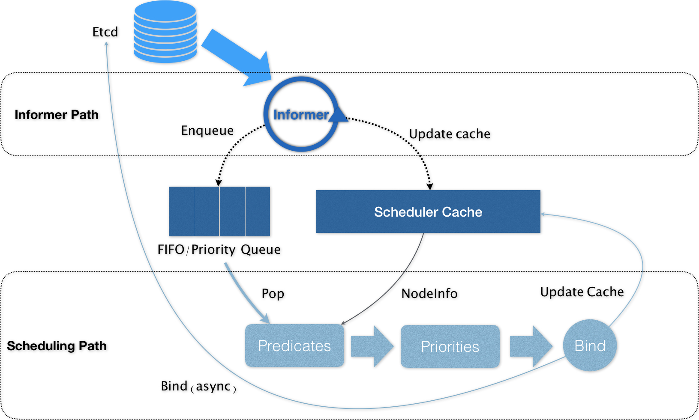
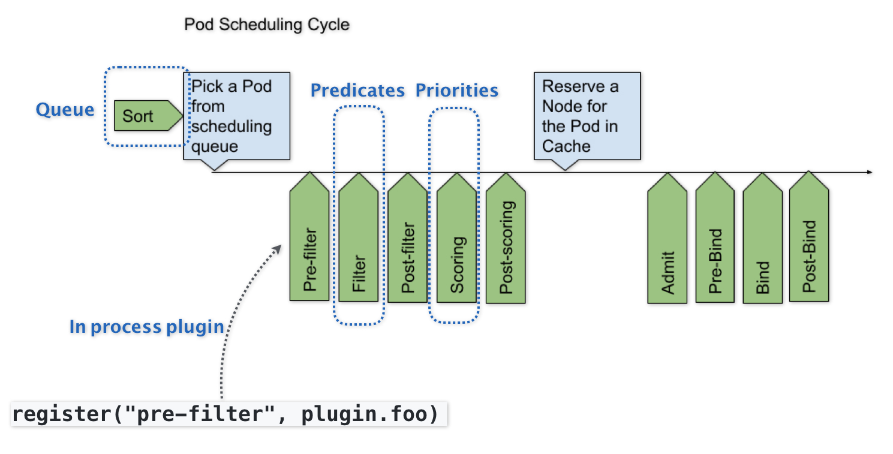
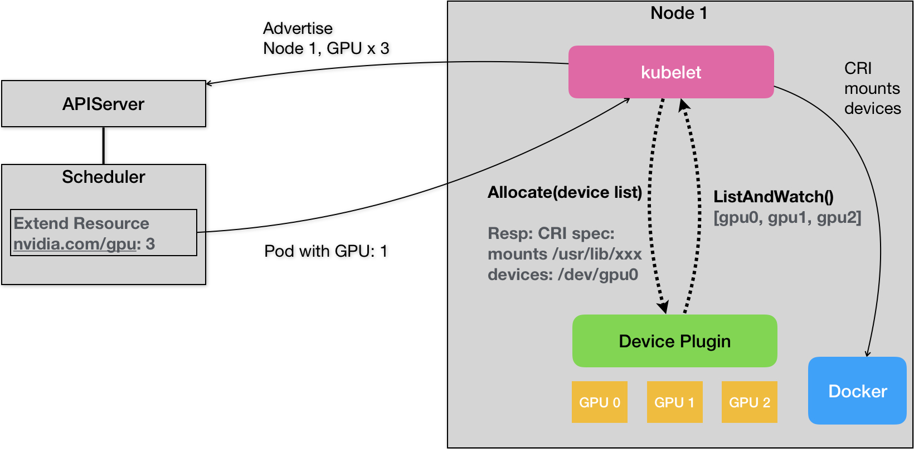

# Kubernetes Job Scheduling and Resource Management


## 目录
- [1 Kubernetes的资源模型与资源管理](#1-kubernetes的资源模型与资源管理)
- [2 十字路口上的Kubernetes默认调度器](#2-十字路口上的kubernetes默认调度器)
- [3 Kubernetes默认调度器调度策略解析](#3-kubernetes默认调度器调度策略解析)
- [4 Kubernetes默认调度器的优先级与抢占机制](#4-kubernetes默认调度器的优先级与抢占机制)
- [5 Kubernetes GPU管理与Device Plugin机制](#5-kubernetes-gpu管理与device-plugin机制)


## 1 Kubernetes的资源模型与资源管理
- 资源类别：
    1. 在 Kubernetes 中，像 CPU 这样的资源被称作“可压缩资源”（compressible resources）。它的典型特点是，当可压缩资源不足时，Pod 只会“饥饿”，但不会退出。
        - Kubernetes 里为 CPU 设置的单位是“CPU 的个数”。可以直接把这个配置写成 cpu=0.5。但在实际使用时，我还是推荐你使用 500m 的写法，毕竟这才是 Kubernetes 内部通用的 CPU 表示方式。所谓 500m，指的就是 500 millicpu，也就是 0.5 个 CPU 的意思
    1. 在 Kubernetes 中，像 CPU 这样的资源被称作“可压缩资源”（compressible resources）。它的典型特点是，当可压缩资源不足时，Pod 只会“饥饿”，但不会退出。
        - 对于内存资源来说，它的单位自然就是 bytes。Kubernetes 支持你使用 Ei、Pi、Ti、Gi、Mi、Ki（或者 E、P、T、G、M、K）的方式来作为 bytes 的值。比如，在我们的例子里，Memory requests 的值就是 64MiB (2 的 26 次方 bytes) 。这里要注意区分 MiB（mebibyte）和 MB（megabyte）的区别。备注：1Mi=1024*1024；1M=1000*1000
- Kubernetes 里 Pod 的 CPU 和内存资源，实际上还要分为 limits 和 requests 两种情况
    - 这两者的区别其实非常简单：在调度的时候，kube-scheduler 只会按照 requests 的值进行计算。而在真正设置 Cgroups 限制的时候，kubelet 则会按照 limits 的值来进行设置。
    - Kubernetes 的 requests+limits 的做法，其实就是Borg 论文中对“动态资源边界”的思路的一个简化版：用户在提交 Pod 时，可以声明一个相对较小的 requests 值供调度器使用，而 Kubernetes 真正设置给容器 Cgroups 的，则是相对较大的 limits 值。不难看到，这跟 Borg 的思路相通的。
- Kubernetes 里的 QoS （Quality of Service，服务质量）模型
    1. 当 Pod 里的每一个 Container 都同时设置了 requests 和 limits，并且 requests 和 limits 值相等的时候，这个 Pod 就属于 Guaranteed 类别
        - 需要注意的是，当 Pod 仅设置了 limits 没有设置 requests 的时候，Kubernetes 会自动为它设置与 limits 相同的 requests 值，所以，这也属于 Guaranteed 情况。
    1. 当 Pod 不满足 Guaranteed 的条件，但至少有一个 Container 设置了 requests。那么这个 Pod 就会被划分到 Burstable 类别
    1. 如果一个 Pod 既没有设置 requests，也没有设置 limits，那么它的 QoS 类别就是 BestEffort
- 问题：那么，Kubernetes 为 Pod 设置这样三种 QoS 类别，具体有什么作用呢？
    - 实际上，QoS 划分的主要应用场景，是当宿主机资源紧张的时候，kubelet 对 Pod 进行 Eviction（即资源回收）时需要用到的。
    - 具体地说，当 Kubernetes 所管理的宿主机上不可压缩资源短缺时，就有可能触发 Eviction。比如，可用内存（memory.available）、可用的宿主机磁盘空间（nodefs.available），以及容器运行时镜像存储空间（imagefs.available）等等。
    - Eviction 在 Kubernetes 里其实分为 Soft 和 Hard 两种模式
        1. 其中，Soft Eviction 允许你为 Eviction 过程设置一段“优雅时间”，比如上面例子里的 imagefs.available=2m，就意味着当 imagefs 不足的阈值达到 2 分钟之后，kubelet 才会开始 Eviction 的过程。
        1. 而 Hard Eviction 模式下，Eviction 过程就会在阈值达到之后立刻开始。
            - Kubernetes 计算 Eviction 阈值的数据来源，主要依赖于从 Cgroups 读取到的值，以及使用 cAdvisor 监控到的数据。
    - 当宿主机的 Eviction 阈值达到后，就会进入 MemoryPressure 或者 DiskPressure 状态，从而避免新的 Pod 被调度到这台宿主机上。
    - 而当 Eviction 发生的时候，kubelet 具体会挑选哪些 Pod 进行删除操作，就需要参考这些 Pod 的 QoS 类别了。
        1. 首当其冲的，自然是 BestEffort 类别的 Pod。
        1. 其次，是属于 Burstable 类别、并且发生“饥饿”的资源使用量已经超出了 requests 的 Pod。
        1. 最后，才是 Guaranteed 类别。并且，Kubernetes 会保证只有当 Guaranteed 类别的 Pod 的资源使用量超过了其 limits 的限制，或者宿主机本身正处于 Memory Pressure 状态时，Guaranteed 的 Pod 才可能被选中进行 Eviction 操作。
        - 当然，对于同 QoS 类别的 Pod 来说，Kubernetes 还会根据 Pod 的优先级来进行进一步地排序和选择。
- cpuset 的设置
    - 以通过设置 cpuset 把容器绑定到某个 CPU 的核上，而不是像 cpushare 那样共享 CPU 的计算能力。
    - 这种情况下，由于操作系统在 CPU 之间进行上下文切换的次数大大减少，容器里应用的性能会得到大幅提升。事实上，**cpuset 方式，是生产环境里部署在线应用类型的 Pod 时，非常常用的一种方式。**
    - 问题：这样的需求在 Kubernetes 里又该如何实现呢？
        1. 首先，你的 Pod 必须是 Guaranteed 的 QoS 类型；
        1. 然后，你只需要将 Pod 的 CPU 资源的 requests 和 limits 设置为同一个相等的整数值即可。
- 问题：为什么宿主机进入 MemoryPressure 或者 DiskPressure 状态后，新的 Pod 就不会被调度到这台宿主机上呢？
    - 这是因为给宿主机打了污点标记


## 2 十字路口上的Kubernetes默认调度器
- 在 Kubernetes 项目中，默认调度器的主要职责，就是为一个新创建出来的 Pod，寻找一个最合适的节点（Node）。
- 而这里“最合适”的含义，包括两层：
    1. 从集群所有的节点中，根据调度算法挑选出所有可以运行该 Pod 的节点
        - 默认调度器会首先调用一组叫作 Predicate 的调度算法，来检查每个 Node
    1. 从第一步的结果中，再根据调度算法挑选一个最符合条件的节点作为最终结果
        - 然后，再调用一组叫作 Priority 的调度算法，来给上一步得到的结果里的每个 Node 打分。最终的调度结果，就是得分最高的那个 Node
    - 调度器对一个 Pod 调度成功，实际上就是将它的 spec.nodeName 字段填上调度结果的节点名字。



- Kubernetes 的调度器的核心，实际上就是两个相互独立的控制循环
    1. 第一个控制循环，我们可以称之为 Informer Path
        - 它的主要目的，是启动一系列 Informer，用来监听（Watch）Etcd 中 Pod、Node、Service 等与调度相关的 API 对象的变化。比如，当一个待调度 Pod（即：它的 nodeName 字段是空的）被创建出来之后，调度器就会通过 Pod Informer 的 Handler，将这个待调度 Pod 添加进调度队列。
        - 在默认情况下，Kubernetes 的调度队列是一个 PriorityQueue（优先级队列），并且当某些集群信息发生变化的时候，调度器还会对调度队列里的内容进行一些特殊操作。这里的设计，主要是出于调度优先级和抢占的考虑，我会在后面的文章中再详细介绍这部分内容。
        - 此外，Kubernetes 的默认调度器还要负责对调度器缓存（即：scheduler cache）进行更新。事实上，Kubernetes 调度部分进行性能优化的一个最根本原则，就是尽最大可能将集群信息 Cache 化，以便从根本上提高 Predicate 和 Priority 调度算法的执行效率。
    1. 第二个控制循环，是调度器负责 Pod 调度的主循环，我们可以称之为 Scheduling Path
        1. Scheduling Path 的主要逻辑，就是不断地从调度队列里出队一个 Pod。然后，调用 Predicates 算法进行“过滤”。这一步“过滤”得到的一组 Node，就是所有可以运行这个 Pod 的宿主机列表。当然，Predicates 算法需要的 Node 信息，都是从 Scheduler Cache 里直接拿到的，这是调度器保证算法执行效率的主要手段之一。
        1. 接下来，调度器就会再调用 Priorities 算法为上述列表里的 Node 打分，分数从 0 到 10。得分最高的 Node，就会作为这次调度的结果。
        1. 调度算法执行完成后，调度器就需要将 Pod 对象的 nodeName 字段的值，修改为上述 Node 的名字。这个步骤在 Kubernetes 里面被称作 Bind。
        1. 但是，为了不在关键调度路径里远程访问 APIServer，Kubernetes 的默认调度器在 Bind 阶段，**只会更新 Scheduler Cache 里的 Pod 和 Node 的信息。这种基于“乐观”假设的 API 对象更新方式，在 Kubernetes 里被称作 Assume**。
            - **“Cache 化”，这个变化其实是最近几年 Kubernetes 调度器性能得以提升的一个关键演化**
        1. Assume 之后，调度器才会创建一个 Goroutine 来异步地向 APIServer 发起更新 Pod 的请求，来真正完成 Bind 操作。如果这次异步的 Bind 过程失败了，其实也没有太大关系，等 Scheduler Cache 同步之后一切就会恢复正常。
        1. 当然，正是由于上述 Kubernetes 调度器的“乐观”绑定的设计，当一个新的 Pod 完成调度需要在某个节点上运行起来之前，该节点上的 kubelet 还会通过一个叫作 Admit 的操作来再次验证该 Pod 是否确实能够运行在该节点上。这一步 Admit 操作，实际上就是把一组叫作 GeneralPredicates 的、最基本的调度算法，比如：“资源是否可用”“端口是否冲突”等再执行一遍，作为 kubelet 端的二次确认。
- 除了上述的“Cache 化”和“乐观绑定”，Kubernetes 默认调度器还有一个重要的设计，那就是“无锁化”。
    - 在 Scheduling Path 上，调度器会启动多个 Goroutine 以节点为粒度并发执行 Predicates 算法，从而提高这一阶段的执行效率。而与之类似的，Priorities 算法也会以 MapReduce 的方式并行计算然后再进行汇总。而在这些所有需要并发的路径上，调度器会避免设置任何全局的竞争资源，从而免去了使用锁进行同步带来的巨大的性能损耗。
    - 所以，在这种思想的指导下，如果你再去查看一下前面的调度器原理图，你就会发现，Kubernetes 调度器只有对调度队列和 Scheduler Cache 进行操作时，才需要加锁。而这两部分操作，都不在 Scheduling Path 的算法执行路径上。
- Kubernetes 默认调度器的可扩展性设计，可以用如下所示的一幅示意图来描述：
    
    

    - 可以看到，默认调度器的可扩展机制，在 Kubernetes 里面叫作 Scheduler Framework。顾名思义，这个设计的主要目的，就是在调度器生命周期的各个关键点上，为用户暴露出可以进行扩展和实现的接口，从而实现由用户自定义调度器的能力。
    - 上图中，每一个绿色的箭头都是一个可以插入自定义逻辑的接口。
    - 需要注意的是，上述这些可插拔式逻辑，都是标准的 Go 语言插件机制（Go plugin 机制），也就是说，你需要在编译的时候选择把哪些插件编译进去。


## 3 Kubernetes默认调度器调度策略解析
1. 首先，我们一起看看 Predicates。
    - Predicates 在调度过程中的作用，可以理解为 Filter，即：它按照调度策略，从当前集群的所有节点中，“过滤”出一系列符合条件的节点。这些节点，都是可以运行待调度 Pod 的宿主机
    - 在 Kubernetes 中，默认的调度策略有如下四种
        1. 第一种类型，叫作 GeneralPredicates
            - 顾名思义，这一组过滤规则，负责的是最基础的调度策略。比如，PodFitsResources 计算的就是宿主机的 CPU 和内存资源等是否够用。
            - PodFitsResources 检查的只是 Pod 的 requests 字段。需要注意的是，Kubernetes 的调度器并没有为 GPU 等硬件资源定义具体的资源类型，而是统一用一种名叫 Extended Resource 的、Key-Value 格式的扩展字段来描述的
            1. PodFitsHost 检查的是，宿主机的名字是否跟 Pod 的 spec.nodeName 一致。
            1. PodFitsHostPorts 检查的是，Pod 申请的宿主机端口（spec.nodePort）是不是跟已经被使用的端口有冲突。
            1. PodMatchNodeSelector 检查的是，Pod 的 nodeSelector 或者 nodeAffinity 指定的节点，是否与待考察节点匹配，等等。
            - 可以看到，像上面这样一组 GeneralPredicates，正是 Kubernetes 考察一个 Pod 能不能运行在一个 Node 上最基本的过滤条件。所以，GeneralPredicates 也会被其他组件（比如 kubelet）直接调用。
            - kubelet 在启动 Pod 前，会执行一个 Admit 操作来进行二次确认。这里二次确认的规则，就是执行一遍 GeneralPredicates。
        1. 第二种类型，是与 Volume 相关的过滤规则
            - 这一组过滤规则，负责的是跟容器持久化 Volume 相关的调度策略。
            1. NoDiskConflict 检查的条件，是多个 Pod 声明挂载的持久化 Volume 是否有冲突
            1. MaxPDVolumeCountPredicate 检查的条件，则是一个节点上某种类型的持久化 Volume 是不是已经超过了一定数目，如果是的话，那么声明使用该类型持久化 Volume 的 Pod 就不能再调度到这个节点了。
            1. VolumeZonePredicate，则是检查持久化 Volume 的 Zone（高可用域）标签，是否与待考察节点的 Zone 标签相匹配
            1. VolumeBindingPredicate 的规则。它负责检查的，是该 Pod 对应的 PV 的 nodeAffinity 字段，是否跟某个节点的标签相匹配
        1. 第三种类型，是宿主机相关的过滤规则
            - 这一组规则，主要考察待调度 Pod 是否满足 Node 本身的某些条件。
            1. PodToleratesNodeTaints，负责检查的就是我们前面经常用到的 Node 的“污点”机制
            1. NodeMemoryPressurePredicate，检查的是当前节点的内存是不是已经不够充足，如果是的话，那么待调度 Pod 就不能被调度到该节点上。
        1. 第四种类型，是 Pod 相关的过滤规则
            - 这一组规则，跟 GeneralPredicates 大多数是重合的。
            1. 而比较特殊的，是 PodAffinityPredicate。这个规则的作用，是检查待调度 Pod 与 Node 上的已有 Pod 之间的亲密（affinity）和反亲密（anti-affinity）关系
    - 在具体执行的时候， 当开始调度一个 Pod 时，Kubernetes 调度器会同时启动 16 个 Goroutine，来并发地为集群里的所有 Node 计算 Predicates，最后返回可以运行这个 Pod 的宿主机列表。
    - 需要注意的是，在为每个 Node 执行 Predicates 时，调度器会按照固定的顺序来进行检查。这个顺序，是按照 Predicates 本身的含义来确定的。比如，宿主机相关的 Predicates 会被放在相对靠前的位置进行检查。要不然的话，在一台资源已经严重不足的宿主机上，上来就开始计算 PodAffinityPredicate，是没有实际意义的。
1. 接下来，我们再来看一下 Priorities。
    - 在 Predicates 阶段完成了节点的“过滤”之后，Priorities 阶段的工作就是为这些节点打分。这里打分的范围是 0-10 分，得分最高的节点就是最后被 Pod 绑定的最佳节点。
    1. Priorities 里最常用到的一个打分规则，是 LeastRequestedPriority。它的计算方法，可以简单地总结为如下所示的公式：
        ```

        score = (cpu((capacity-sum(requested))10/capacity) + memory((capacity-sum(requested))10/capacity))/2
        ```

        可以看到，这个算法实际上就是在选择空闲资源（CPU 和 Memory）最多的宿主机。

    1. 与 LeastRequestedPriority 一起发挥作用的，还有 BalancedResourceAllocation。它的计算公式如下所示：
        ```
        
        score = 10 - variance(cpuFraction,memoryFraction,volumeFraction)*10
        ```

        其中，每种资源的 Fraction 的定义是 ：Pod 请求的资源 / 节点上的可用资源。而 variance 算法的作用，则是计算每两种资源 Fraction 之间的“距离”。而最后选择的，则是资源 Fraction 差距最小的节点。
        
    - 所以说，BalancedResourceAllocation 选择的，其实是调度完成后，所有节点里各种资源分配最均衡的那个节点，从而避免一个节点上 CPU 被大量分配、而 Memory 大量剩余的情况。
    - 此外，还有 NodeAffinityPriority、TaintTolerationPriority 和 InterPodAffinityPriority 这三种 Priority。顾名思义，它们与前面的 PodMatchNodeSelector、PodToleratesNodeTaints 和 PodAffinityPredicate 这三个 Predicate 的含义和计算方法是类似的。但是作为 Priority，一个 Node 满足上述规则的字段数目越多，它的得分就会越高。
    - 在默认 Priorities 里，还有一个叫作 ImageLocalityPriority 的策略。它是在 Kubernetes v1.12 里新开启的调度规则，即：如果待调度 Pod 需要使用的镜像很大，并且已经存在于某些 Node 上，那么这些 Node 的得分就会比较高。
- **在实际的执行过程中，调度器里关于集群和 Pod 的信息都已经缓存化，所以这些算法的执行过程还是比较快的。**
- 此外，对于比较复杂的调度算法来说，比如 PodAffinityPredicate，它们在计算的时候不只关注待调度 Pod 和待考察 Node，还需要关注整个集群的信息，比如，遍历所有节点，读取它们的 Labels。这时候，Kubernetes 调度器会在为每个待调度 Pod 执行该调度算法之前，先将算法需要的集群信息初步计算一遍，然后缓存起来。这样，在真正执行该算法的时候，调度器只需要读取缓存信息进行计算即可，从而避免了为每个 Node 计算 Predicates 的时候反复获取和计算整个集群的信息。


## 4 Kubernetes默认调度器的优先级与抢占机制
- 首先需要明确的是，优先级和抢占机制，解决的是 Pod 调度失败时该怎么办的问题
- 正常情况下，当一个 Pod 调度失败后，它就会被暂时“搁置”起来，直到 Pod 被更新，或者集群状态发生变化，调度器才会对这个 Pod 进行重新调度。
- 但在有时候，我们希望的是这样一个场景。当一个高优先级的 Pod 调度失败后，该 Pod 并不会被“搁置”，而是会“挤走”某个 Node 上的一些低优先级的 Pod 。这样就可以保证这个高优先级 Pod 的调度成功。这个特性，其实也是一直以来就存在于 Borg 以及 Mesos 等项目里的一个基本功能。
- **Kubernetes 规定，优先级是一个 32 bit 的整数，最大值不超过 1000000000（10 亿，1 billion），并且值越大代表优先级越高。**而超出 10 亿的值，其实是被 Kubernetes 保留下来分配给系统 Pod 使用的。显然，这样做的目的，就是保证系统 Pod 不会被用户抢占掉。
- 调度器里维护着一个调度队列。所以，当 Pod 拥有了优先级之后，高优先级的 Pod 就可能会比低优先级的 Pod 提前出队，从而尽早完成调度过程。这个过程，就是“优先级”这个概念在 Kubernetes 里的主要体现。
- 而当一个高优先级的 Pod 调度失败的时候，调度器的抢占能力就会被触发。这时，调度器就会试图从当前集群里寻找一个节点，使得当这个节点上的一个或者多个低优先级 Pod 被删除后，待调度的高优先级 Pod 就可以被调度到这个节点上。这个过程，就是“抢占”这个概念在 Kubernetes 里的主要体现。
- 抢占过程：
    1. 当上述抢占过程发生时，抢占者并不会立刻被调度到被抢占的 Node 上。事实上，调度器只会将抢占者的 spec.nominatedNodeName 字段，设置为被抢占的 Node 的名字。然后，抢占者会重新进入下一个调度周期，然后在新的调度周期里来决定是不是要运行在被抢占的节点上。这当然也就意味着，即使在下一个调度周期，调度器也不会保证抢占者一定会运行在被抢占的节点上。
    1. 而在抢占者等待被调度的过程中，如果有其他更高优先级的 Pod 也要抢占同一个节点，那么调度器就会清空原抢占者的 spec.nominatedNodeName 字段，从而允许更高优先级的抢占者执行抢占，并且，这也就使得原抢占者本身，也有机会去重新抢占其他节点。这些，都是设置 nominatedNodeName 字段的主要目的。
- 问题：Kubernetes 调度器里的抢占机制，又是如何设计的呢？
    - Kubernetes 调度器实现抢占算法的一个最重要的设计，就是在调度队列的实现里，使用了两个不同的队列。
    1. 第一个队列，叫作 activeQ。
        - 凡是在 activeQ 里的 Pod，都是下一个调度周期需要调度的对象。所以，当你在 Kubernetes 集群里新创建一个 Pod 的时候，调度器会将这个 Pod 入队到 activeQ 里面。而我在前面提到过的、调度器不断从队列里出队（Pop）一个 Pod 进行调度，实际上都是从 activeQ 里出队的。
    1. 第二个队列，叫作 unschedulableQ，专门用来存放调度失败的 Pod。
        - 这里的一个关键点就在于，当一个 unschedulableQ 里的 Pod 被更新之后，调度器会自动把这个 Pod 移动到 activeQ 里，从而给这些调度失败的 Pod “重新做人”的机会。
    - 调度器为抢占者寻找牺牲者的流程
        1. 第一步，调度器会检查这次失败事件的原因，来确认抢占是不是可以帮助抢占者找到一个新节点。这是因为有很多 Predicates 的失败是不能通过抢占来解决的。比如，PodFitsHost 算法（负责的是，检查 Pod 的 nodeSelector 与 Node 的名字是否匹配），这种情况下，除非 Node 的名字发生变化，否则你即使删除再多的 Pod，抢占者也不可能调度成功。
        1. 第二步，如果确定抢占可以发生，那么调度器就会把自己缓存的所有节点信息复制一份，然后使用这个副本来模拟抢占过程。
            - 这里的抢占过程很容易理解。调度器会检查缓存副本里的每一个节点，然后从该节点上最低优先级的 Pod 开始，逐一“删除”这些 Pod。而每删除一个低优先级 Pod，调度器都会检查一下抢占者是否能够运行在该 Node 上。一旦可以运行，调度器就记录下这个 Node 的名字和被删除 Pod 的列表，这就是一次抢占过程的结果了。
            - 当遍历完所有的节点之后，调度器会在上述模拟产生的所有抢占结果里做一个选择，找出最佳结果。而这一步的判断原则，就是尽量减少抢占对整个系统的影响。比如，需要抢占的 Pod 越少越好，需要抢占的 Pod 的优先级越低越好，等等。
    - 在得到了最佳的抢占结果之后，这个结果里的 Node，就是即将被抢占的 Node；被删除的 Pod 列表，就是牺牲者。所以接下来，调度器就可以真正开始抢占的操作了，这个过程，可以分为三步。
        1. 第一步，调度器会检查牺牲者列表，清理这些 Pod 所携带的 nominatedNodeName 字段。
        1. 第二步，调度器会把抢占者的 nominatedNodeName，设置为被抢占的 Node 的名字。
            - 对抢占者 Pod 的更新操作，就会触发到我前面提到的“重新做人”的流程，从而让抢占者在下一个调度周期重新进入调度流程。
        1. 第三步，调度器会开启一个 Goroutine，同步地删除牺牲者。
    - 不过，对于任意一个待调度 Pod 来说，因为有上述抢占者的存在，它的调度过程，其实是有一些特殊情况需要特殊处理的。具体来说，在为某一对 Pod 和 Node 执行 Predicates 算法的时候，如果待检查的 Node 是一个即将被抢占的节点，即：调度队列里有 nominatedNodeName 字段值是该 Node 名字的 Pod 存在（可以称之为：“潜在的抢占者”）。那么，调度器就会对这个 Node ，将同样的 Predicates 算法运行两遍。
        1. 第一遍， 调度器会假设上述“潜在的抢占者”已经运行在这个节点上，然后执行 Predicates 算法；
        1. 第二遍， 调度器会正常执行 Predicates 算法，即：不考虑任何“潜在的抢占者”。
        - 而只有这两遍 Predicates 算法都能通过时，这个 Pod 和 Node 才会被认为是可以绑定（bind）的。
        - 不难想到，这里需要执行第一遍 Predicates 算法的原因，是由于 InterPodAntiAffinity 规则的存在。由于 InterPodAntiAffinity 规则关心待考察节点上所有 Pod 之间的互斥关系，所以我们在执行调度算法时必须考虑，如果抢占者已经存在于待考察 Node 上时，待调度 Pod 还能不能调度成功。当然，这也就意味着，我们在这一步只需要考虑那些优先级等于或者大于待调度 Pod 的抢占者。毕竟对于其他较低优先级 Pod 来说，待调度 Pod 总是可以通过抢占运行在待考察 Node 上。
        - 而我们需要执行第二遍 Predicates 算法的原因，则是因为“潜在的抢占者”最后不一定会运行在待考察的 Node 上。关于这一点，我在前面已经讲解过了：Kubernetes 调度器并不保证抢占者一定会运行在当初选定的被抢占的 Node 上。
    

## 5 Kubernetes GPU管理与Device Plugin机制
- Kubernetes 的 Device Plugin 机制，我可以用如下所示的一幅示意图来和你解释清楚:
    
    

    1. 首先，对于每一种硬件设备，都需要有它所对应的 Device Plugin 进行管理，这些 Device Plugin，都通过 gRPC 的方式，同 kubelet 连接起来。以 NVIDIA GPU 为例，它对应的插件叫作NVIDIA GPU device plugin。
    1. 这个 Device Plugin 会通过一个叫作 ListAndWatch 的 API，定期向 kubelet 汇报该 Node 上 GPU 的列表。比如，在我们的例子里，一共有三个 GPU（GPU0、GPU1 和 GPU2）。这样，kubelet 在拿到这个列表之后，就可以直接在它向 APIServer 发送的心跳里，以 Extended Resource 的方式，加上这些 GPU 的数量，比如nvidia.com/gpu=3。所以说，用户在这里是不需要关心 GPU 信息向上的汇报流程的。
    1. 需要注意的是，ListAndWatch 向上汇报的信息，只有本机上 GPU 的 ID 列表，而不会有任何关于 GPU 设备本身的信息。而且 kubelet 在向 API Server 汇报的时候，只会汇报该 GPU 对应的 Extended Resource 的数量。当然，kubelet 本身，会将这个 GPU 的 ID 列表保存在自己的内存里，并通过 ListAndWatch API 定时更新。
    1. 而当一个 Pod 想要使用一个 GPU 的时候，它只需要像我在本文一开始给出的例子一样，在 Pod 的 limits 字段声明nvidia.com/gpu: 1。那么接下来，Kubernetes 的调度器就会从它的缓存里，寻找 GPU 数量满足条件的 Node，然后将缓存里的 GPU 数量减 1，完成 Pod 与 Node 的绑定。
    1. 这个调度成功后的 Pod 信息，自然就会被对应的 kubelet 拿来进行容器操作。而当 kubelet 发现这个 Pod 的容器请求一个 GPU 的时候，kubelet 就会从自己持有的 GPU 列表里，为这个容器分配一个 GPU。此时，kubelet 就会向本机的 Device Plugin 发起一个 Allocate() 请求。这个请求携带的参数，正是即将分配给该容器的设备 ID 列表。
    1. 当 Device Plugin 收到 Allocate 请求之后，它就会根据 kubelet 传递过来的设备 ID，从 Device Plugin 里找到这些设备对应的设备路径和驱动目录。当然，这些信息，正是 Device Plugin 周期性的从本机查询到的。比如，在 NVIDIA Device Plugin 的实现里，它会定期访问 nvidia-docker 插件，从而获取到本机的 GPU 信息。
    1. 而被分配 GPU 对应的设备路径和驱动目录信息被返回给 kubelet 之后，kubelet 就完成了为一个容器分配 GPU 的操作。接下来，kubelet 会把这些信息追加在创建该容器所对应的 CRI 请求当中。这样，当这个 CRI 请求发给 Docker 之后，Docker 为你创建出来的容器里，就会出现这个 GPU 设备，并把它所需要的驱动目录挂载进去。
- 小结
    - 这里最大的问题在于，GPU 等硬件设备的调度工作，实际上是由 kubelet 完成的。即，kubelet 会负责从它所持有的硬件设备列表中，为容器挑选一个硬件设备，然后调用 Device Plugin 的 Allocate API 来完成这个分配操作。可以看到，在整条链路中，调度器扮演的角色，仅仅是为 Pod 寻找到可用的、支持这种硬件设备的节点而已。
    - 这就使得，Kubernetes 里对硬件设备的管理，只能处理“设备个数”这唯一一种情况。一旦你的设备是异构的、不能简单地用“数目”去描述具体使用需求的时候，比如，“我的 Pod 想要运行在计算能力最强的那个 GPU 上”，Device Plugin 就完全不能处理了。
    - 更不用说，在很多场景下，我们其实希望在调度器进行调度的时候，就可以根据整个集群里的某种硬件设备的全局分布，做出一个最佳的调度选择。
    - 此外，上述 Device Plugin 的设计，也使得 Kubernetes 里，缺乏一种能够对 Device 进行描述的 API 对象。这就使得如果你的硬件设备本身的属性比较复杂，并且 Pod 也关心这些硬件的属性的话，那么 Device Plugin 也是完全没有办法支持的。
    - 更为棘手的是，在 Device Plugin 的设计和实现中，Google 的工程师们一直不太愿意为 Allocate 和 ListAndWatch API 添加可扩展性的参数。这就使得，当你确实需要处理一些比较复杂的硬件设备使用需求时，是没有办法通过扩展 Device Plugin 的 API 来实现的。
    - 针对这些问题，RedHat 在社区里曾经大力推进过 ResourceClass的设计，试图将硬件设备的管理功能上浮到 API 层和调度层。但是，由于各方势力的反对，这个提议最后不了了之了。
    - 所以说，目前 Kubernetes 本身的 Device Plugin 的设计，实际上能覆盖的场景是非常单一的，属于“可用”但是“不好用”的状态。并且， Device Plugin 的 API 本身的可扩展性也不是很好。这也就解释了为什么像 NVIDIA 这样的硬件厂商，实际上并没有完全基于上游的 Kubernetes 代码来实现自己的 GPU 解决方案，而是做了一定的改动，也就是 fork。这，实属不得已而为之。


[07 Kubernetes Container Runtime](./07%20Kubernetes%20Container%20Runtime.md)