# Kubernetes Container Runtime

## 目录
- [1 幕后英雄：SIG-Node与CRI](#1-幕后英雄sig-node与cri)
- [2 解读CRI与容器运行时](#2-解读cri与容器运行时)
- [3 绝不仅仅是安全：Kata Containers与gVisor](#3-绝不仅仅是安全kata-containers与gvisor)

## 1 幕后英雄：SIG-Node与CRI
- kubelet 这个核心组件的主要功能
    - 在调度这一步完成后，Kubernetes 就需要负责将这个调度成功的 Pod，在宿主机上创建出来，并把它所定义的各个容器启动起来
    - kubelet 这个组件本身，也是 Kubernetes 里面第二个不可被替代的组件（第一个不可被替代的组件当然是 kube-apiserver）
- 问题：什么是SIG-Node？
    - 与 kubelet 以及容器运行时管理相关的内容，都属于 SIG-Node 的范畴
- kubelet的工作原理
    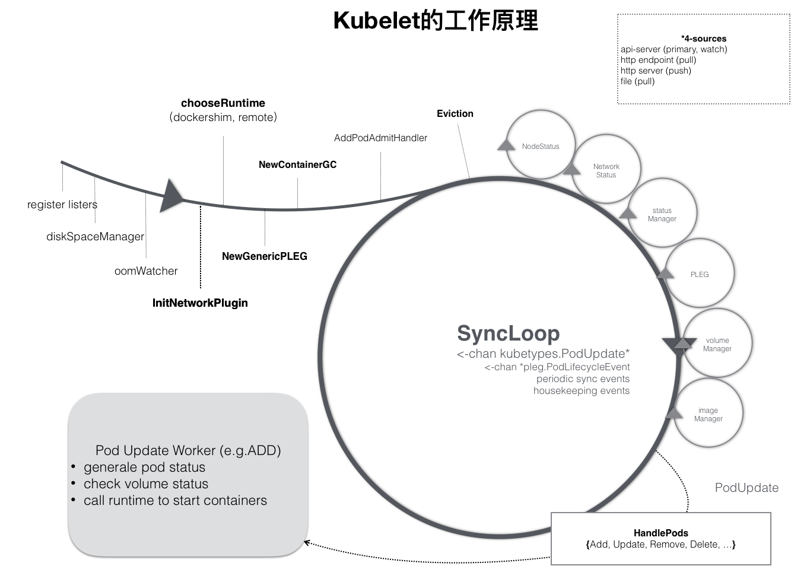

    - kubelet 的工作核心，就是一个控制循环，即：SyncLoop（图中的大圆圈）。而驱动这个控制循环运行的事件，包括四种：
        1. Pod 更新事件；
        1. Pod 生命周期变化；
        1. kubelet 本身设置的执行周期；
        1. 定时的清理事件。
    1. kubelet 启动的时候，要做的第一件事情，就是设置 Listers，也就是注册它所关心的各种事件的 Informer。这些 Informer，就是 SyncLoop 需要处理的数据的来源。
    1. kubelet 还负责维护着很多很多其他的子控制循环（也就是图中的小圆圈）。这些控制循环的名字，一般被称作某某 Manager，比如 Volume Manager、Image Manager、Node Status Manager 等等。
        - 不难想到，这些控制循环的责任，就是通过控制器模式，完成 kubelet 的某项具体职责。比如 Node Status Manager，就负责响应 Node 的状态变化，然后将 Node 的状态收集起来，并通过 Heartbeat 的方式上报给 APIServer。再比如 CPU Manager，就负责维护该 Node 的 CPU 核的信息，以便在 Pod 通过 cpuset 的方式请求 CPU 核的时候，能够正确地管理 CPU 核的使用量和可用量。
    
    - 问题：SyncLoop，又是如何根据 Pod 对象的变化，来进行容器操作的呢？
        - kubelet 也是通过 Watch 机制，监听了与自己相关的 Pod 对象的变化。当然，这个 Watch 的过滤条件是该 Pod 的 nodeName 字段与自己相同。kubelet 会把这些 Pod 的信息缓存在自己的内存里。
        - 而当一个 Pod 完成调度、与一个 Node 绑定起来之后， 这个 Pod 的变化就会触发 kubelet 在控制循环里注册的 Handler，也就是上图中的 HandlePods 部分。此时，通过检查该 Pod 在 kubelet 内存里的状态，kubelet 就能够判断出这是一个新调度过来的 Pod，从而触发 Handler 里 ADD 事件对应的处理逻辑。
        - 在具体的处理过程当中，kubelet 会启动一个名叫 Pod Update Worker 的、单独的 Goroutine 来完成对 Pod 的处理工作。
            - 比如，如果是 ADD 事件的话，kubelet 就会为这个新的 Pod 生成对应的 Pod Status，检查 Pod 所声明使用的 Volume 是不是已经准备好。然后，调用下层的容器运行时（比如 Docker），开始创建这个 Pod 所定义的容器。
            - 而如果是 UPDATE 事件的话，kubelet 就会根据 Pod 对象具体的变更情况，调用下层容器运行时进行容器的重建工作。
            - 在这里需要注意的是，kubelet 调用下层容器运行时的执行过程，并不会直接调用 Docker 的 API，而是通过一组叫作 CRI（Container Runtime Interface，容器运行时接口）的 gRPC 接口来间接执行的。
- 问题：Kubernetes社区要为纷繁复杂的每一种容器实现都要去开发对应的源码，非常麻烦
    - 把 kubelet 对容器的操作，统一地抽象成一个接口。这样，kubelet 就只需要跟这个接口打交道了。而作为具体的容器项目，比如 Docker、 rkt、runV，它们就只需要自己提供一个该接口的实现，然后对 kubelet 暴露出 gRPC 服务即可。
    - 造就了CRI
        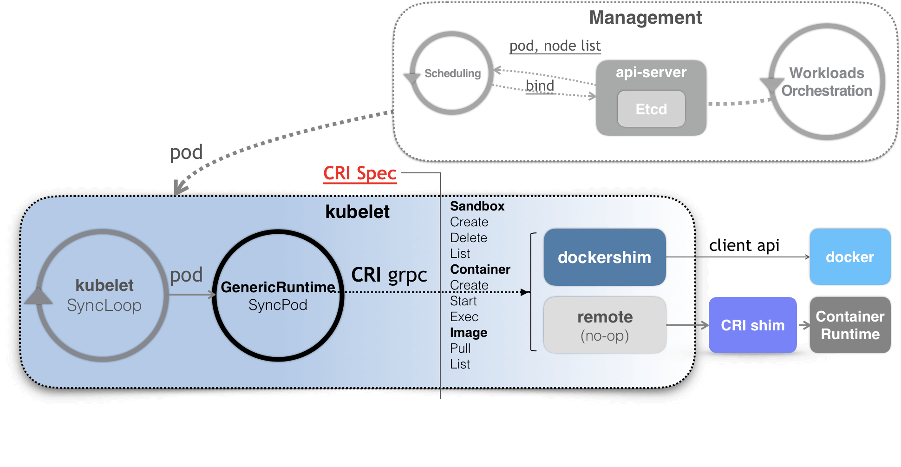

        - 当 Kubernetes 通过编排能力创建了一个 Pod 之后，调度器会为这个 Pod 选择一个具体的节点来运行。
        - 这时候，kubelet 当然就会通过前面讲解过的 SyncLoop 来判断需要执行的具体操作，比如创建一个 Pod。
        - 那么此时，kubelet 实际上就会调用一个叫作 GenericRuntime 的通用组件来发起创建 Pod 的 CRI 请求。
        - 问题：这个 CRI 请求，又该由谁来响应呢？
            - 如果你使用的容器项目是 Docker 的话，那么负责响应这个请求的就是一个叫作 dockershim 的组件。它会把 CRI 请求里的内容拿出来，然后组装成 Docker API 请求发给 Docker Daemon。需要注意的是，在 Kubernetes 目前的实现里，dockershim 依然是 kubelet 代码的一部分。当然，在将来，dockershim 肯定会被从 kubelet 里移出来，甚至直接被废弃掉。而更普遍的场景，就是你需要在每台宿主机上单独安装一个负责响应 CRI 的组件，这个组件，一般被称作 CRI shim。顾名思义，CRI shim 的工作，就是扮演 kubelet 与容器项目之间的“垫片”（shim）。所以它的作用非常单一，那就是实现 CRI 规定的每个接口，然后把具体的 CRI 请求“翻译”成对后端容器项目的请求或者操作。
- 设计核心
    - 在这个过程中，kubelet 的 SyncLoop 和 CRI 的设计，是其中最重要的两个关键点。也正是基于以上设计，SyncLoop 本身就要求这个控制循环是绝对不可以被阻塞的。所以，凡是在 kubelet 里有可能会耗费大量时间的操作，比如准备 Pod 的 Volume、拉取镜像等，SyncLoop 都会开启单独的 Goroutine 来进行操作。

## 2 解读CRI与容器运行时
- CRI架构图
    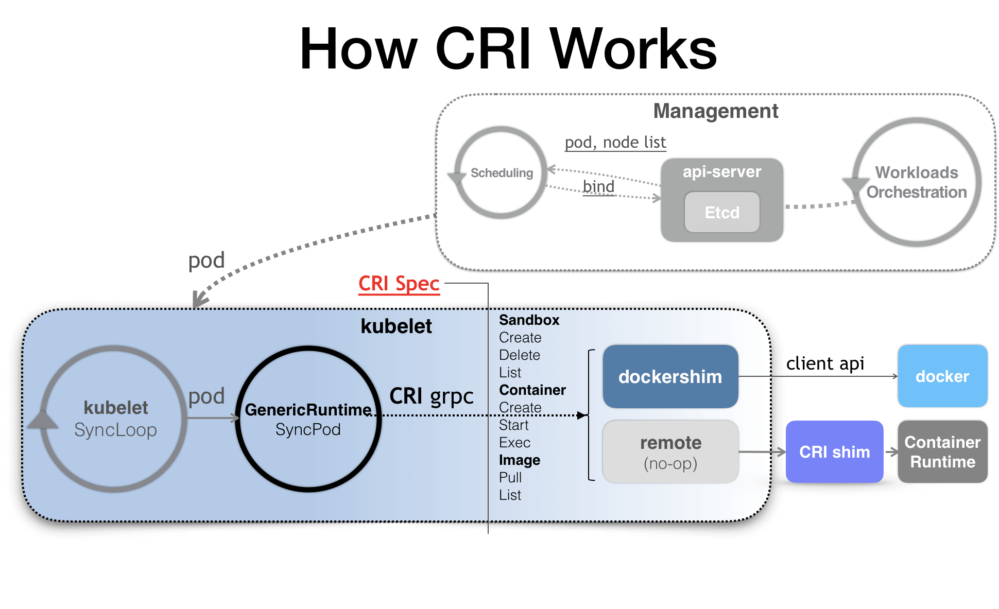

    - CRI 机制能够发挥作用的核心，就在于每一种容器项目现在都可以自己实现一个 CRI shim，自行对 CRI 请求进行处理。这样，Kubernetes 就有了一个统一的容器抽象层，使得下层容器运行时可以自由地对接进入 Kubernetes 当中。

    - 举例：containerd
        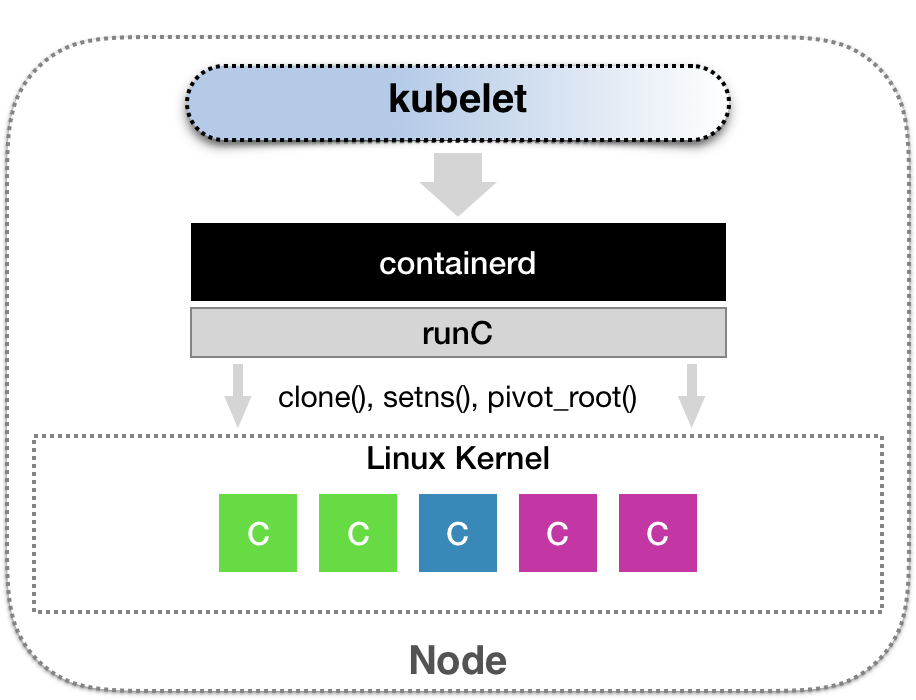

        - CNCF 里的 containerd 项目，就可以提供一个典型的 CRI shim 的能力，即：将 Kubernetes 发出的 CRI 请求，转换成对 containerd 的调用，然后创建出 runC 容器。而 runC 项目，才是负责执行我们前面讲解过的设置容器 Namespace、Cgroups 和 chroot 等基础操作的组件。所以，这几层的组合关系，可以用如下所示的示意图来描述。

- 问题：作为一个 CRI shim，containerd 对 CRI 的具体实现，又是怎样的呢？
    - CRI中需要实现的接口
        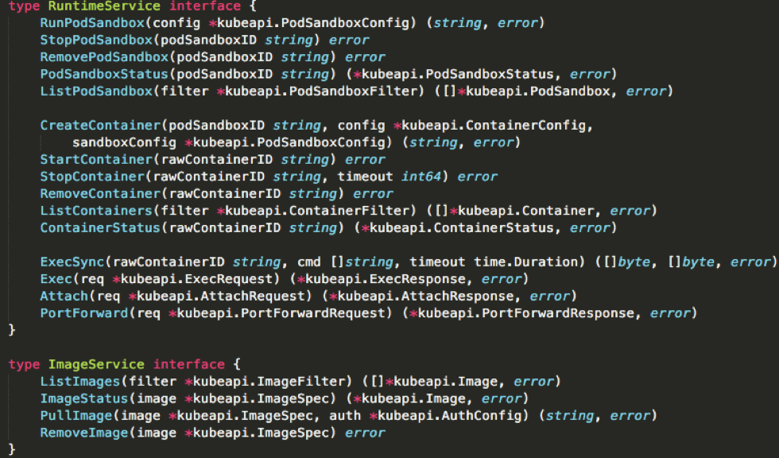

    - CRI可以分为两组
        1. 第一组，是 RuntimeService。它提供的接口，主要是跟容器相关的操作。比如，创建和启动容器、删除容器、执行 exec 命令等等。
            - 在这一部分，CRI 设计的一个重要原则，就是确保这个接口本身，只关注容器，不关注 Pod
                1. 第一，Pod 是 Kubernetes 的编排概念，而不是容器运行时的概念。所以，我们就不能假设所有下层容器项目，都能够暴露出可以直接映射为 Pod 的 API。
                1. 第二，如果 CRI 里引入了关于 Pod 的概念，那么接下来只要 Pod API 对象的字段发生变化，那么 CRI 就很有可能需要变更。而在 Kubernetes 开发的前期，Pod 对象的变化还是比较频繁的，但对于 CRI 这样的标准接口来说，这个变更频率就有点麻烦了。
        1. 第二组，则是 ImageService。它提供的接口，主要是容器镜像相关的操作，比如拉取镜像、删除镜像等等。
    - 作为具体的容器项目，你就需要自己决定如何使用这些字段来实现一个 Kubernetes 期望的 Pod 模型。这里的原理，可以用如下所示的示意图来表示清楚。
        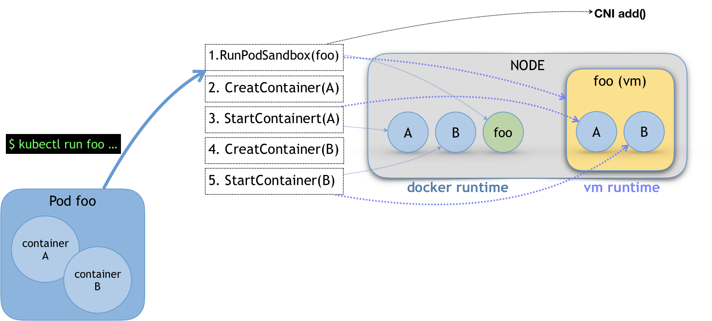

- 除了上述对容器生命周期的实现之外，CRI shim 还有一个重要的工作，就是如何实现 exec、logs 等接口。这些接口跟前面的操作有一个很大的不同，就是这些 gRPC 接口调用期间，kubelet 需要跟容器项目维护一个长连接来传输数据。这种 API，我们就称之为 Streaming API。
    - CRI shim 里对 Streaming API 的实现，依赖于一套独立的 Streaming Server 机制。这一部分原理，可以用如下所示的示意图来为你描述。
        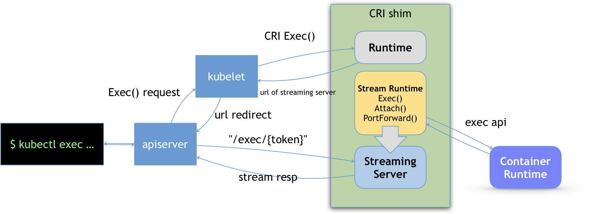

    1. 当我们对一个容器执行 kubectl exec 命令的时候，这个请求首先交给 API Server，然后 API Server 就会调用 kubelet 的 Exec API。
    1. 这时，kubelet 就会调用 CRI 的 Exec 接口，而负责响应这个接口的，自然就是具体的 CRI shim。
    1. 但在这一步，CRI shim 并不会直接去调用后端的容器项目（比如 Docker ）来进行处理，而只会返回一个 URL 给 kubelet。这个 URL，就是该 CRI shim 对应的 Streaming Server 的地址和端口。
    1. 而 kubelet 在拿到这个 URL 之后，就会把它以 Redirect 的方式返回给 API Server。所以这时候，API Server 就会通过重定向来向 Streaming Server 发起真正的 /exec 请求，与它建立长连接。

## 3 绝不仅仅是安全：Kata Containers与gVisor
- 无论是 Kata Containers，还是 gVisor，它们实现安全容器的方法其实是殊途同归的。这两种容器实现的本质，都是给进程分配了一个独立的操作系统内核，从而避免了让容器共享宿主机的内核。这样，容器进程能够看到的攻击面，就从整个宿主机内核变成了一个极小的、独立的、以容器为单位的内核，从而有效解决了容器进程发生“逃逸”或者夺取整个宿主机的控制权的问题。这个原理，可以用如下所示的示意图来表示清楚。
    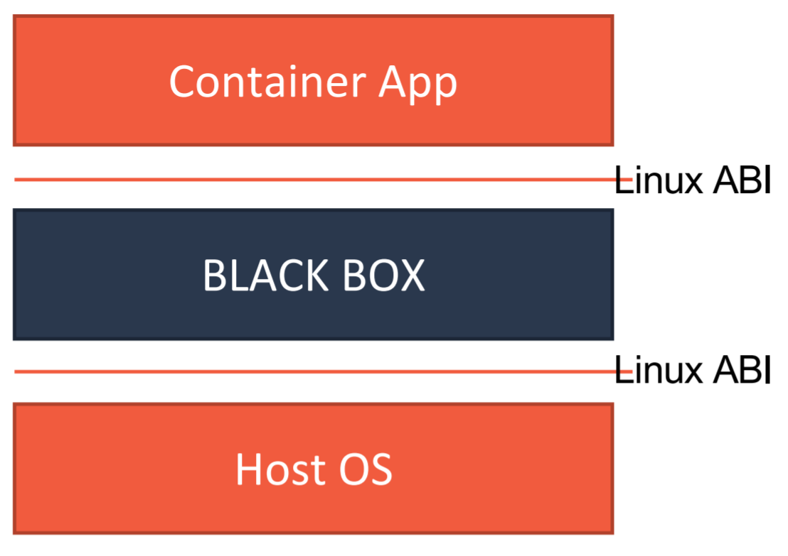

    1. Kata Containers 使用的是传统的虚拟化技术，通过虚拟硬件模拟出了一台“小虚拟机”，然后在这个小虚拟机里安装了一个裁剪后的 Linux 内核来实现强隔离。
    1. gVisor 的做法则更加激进，Google 的工程师直接用 Go 语言“模拟”出了一个运行在用户态的操作系统内核，然后通过这个模拟的内核来代替容器进程向宿主机发起有限的、可控的系统调用。

1. KataContainers
    - 工作原理
        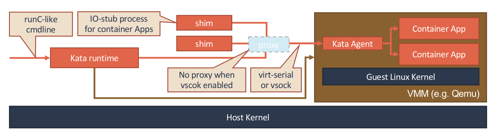

        - Kata Containers 的本质，就是一个轻量化虚拟机。所以当你启动一个 Kata Containers 之后，你其实就会看到一个正常的虚拟机在运行。这也就意味着，一个标准的虚拟机管理程序（Virtual Machine Manager, VMM）是运行 Kata Containers 必备的一个组件。在我们上面图中，使用的 VMM 就是 Qemu。
        - 而使用了虚拟机作为进程的隔离环境之后，Kata Containers 原生就带有了 Pod 的概念。即：这个 Kata Containers 启动的虚拟机，就是一个 Pod；而用户定义的容器，就是运行在这个轻量级虚拟机里的进程。在具体实现上，Kata Containers 的虚拟机里会有一个特殊的 Init 进程负责管理虚拟机里面的用户容器，并且只为这些容器开启 Mount Namespace。所以，这些用户容器之间，原生就是共享 Network 以及其他 Namespace 的。
        - 此外，为了跟上层编排框架比如 Kubernetes 进行对接，Kata Containers 项目会启动一系列跟用户容器对应的 shim 进程，来负责操作这些用户容器的生命周期。当然，这些操作，实际上还是要靠虚拟机里的 Init 进程来帮你做到。
    - 而在具体的架构上，Kata Containers 的实现方式同一个正常的虚拟机其实也非常类似。这里的原理，可以用如下所示的一幅示意图来表示。
        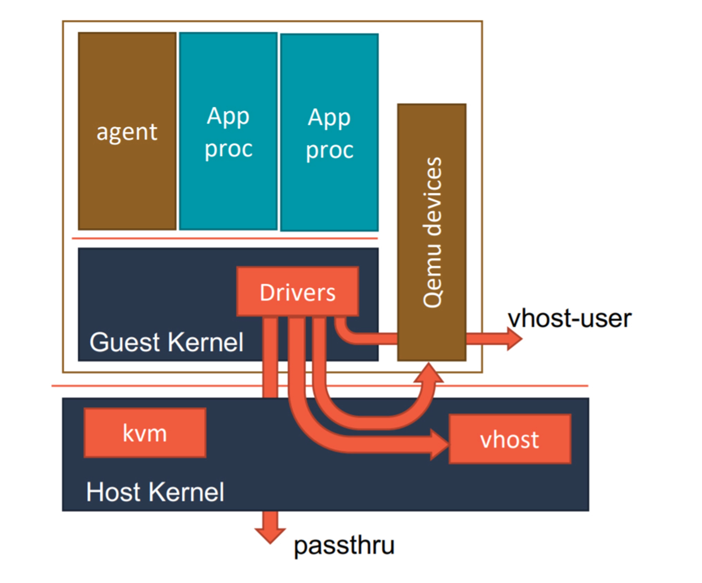

        - 当 Kata Containers 运行起来之后，虚拟机里的用户进程（容器），实际上只能看到虚拟机里的、被裁减过的 Guest Kernel，以及通过 Hypervisor 虚拟出来的硬件设备。
        - 而为了能够对这个虚拟机的 I/O 性能进行优化，Kata Containers 也会通过 vhost 技术（比如：vhost-user）来实现 Guest 与 Host 之间的高效的网络通信，并且使用 PCI Passthrough （PCI 穿透）技术来让 Guest 里的进程直接访问到宿主机上的物理设备。这些架构设计与实现，其实跟常规虚拟机的优化手段是基本一致的。

1. gVisor（设计其实要更加“激进”一些）
    - 工作原理
        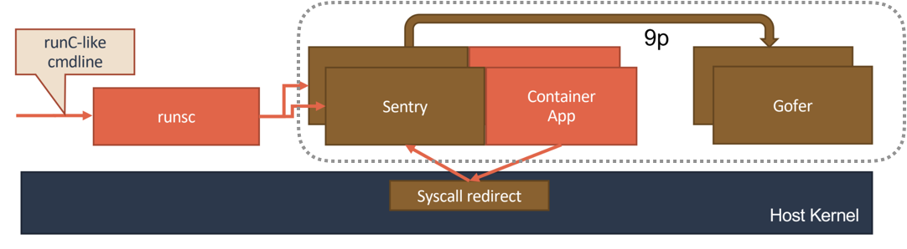

        - gVisor 工作的核心，在于它为应用进程、也就是用户容器，启动了一个名叫 Sentry 的进程。 而 Sentry 进程的主要职责，就是提供一个传统的操作系统内核的能力，即：运行用户程序，执行系统调用。所以说，Sentry 并不是使用 Go 语言重新实现了一个完整的 Linux 内核，而只是一个对应用进程“冒充”内核的系统组件。
        - 在这种设计思想下，我们就不难理解，Sentry 其实需要自己实现一个完整的 Linux 内核网络栈，以便处理应用进程的通信请求。然后，把封装好的二层帧直接发送给 Kubernetes 设置的 Pod 的 Network Namespace 即可。
        - 此外，Sentry 对于 Volume 的操作，则需要通过 9p 协议交给一个叫做 Gofer 的代理进程来完成。Gofer 会代替应用进程直接操作宿主机上的文件，并依靠 seccomp 机制将自己的能力限制在最小集，从而防止恶意应用进程通过 Gofer 来从容器中“逃逸”出去。
    - 而在具体的实现上，gVisor 的 Sentry 进程，其实还分为两种不同的实现方式。这里的工作原理，可以用下面的示意图来描述清楚。
        1. 第一种实现方式，是使用 Ptrace 机制来拦截用户应用的系统调用（System Call），然后把这些系统调用交给 Sentry 来进行处理。
            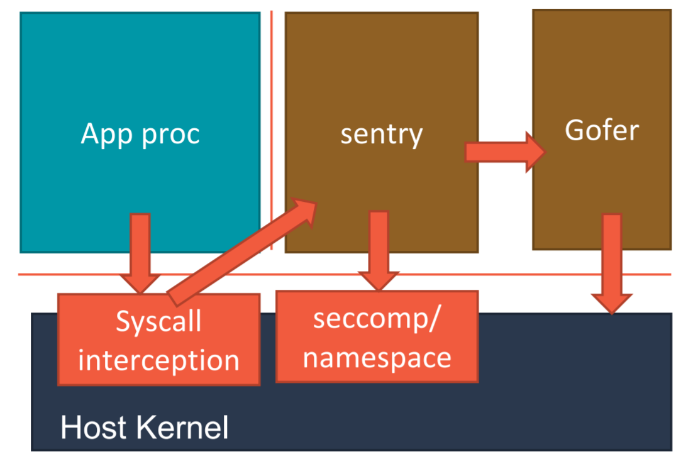
            
            - 这个过程，对于应用进程来说，是完全透明的。而 Sentry 接下来，则会扮演操作系统的角色，在用户态执行用户程序，然后仅在需要的时候，才向宿主机发起 Sentry 自己所需要执行的系统调用。这，就是 gVisor 对用户应用进程进行强隔离的主要手段。不过， Ptrace 进行系统调用拦截的性能实在是太差，仅能供 Demo 时使用。
        1. 第二种实现方式，则更加具有普适性。它的工作原理如下图所示。
            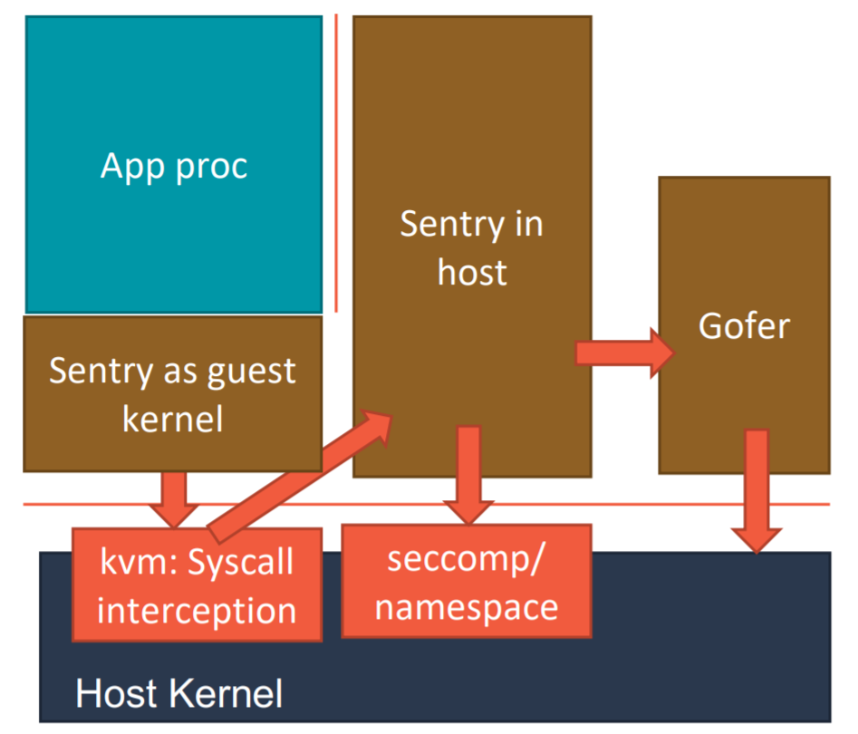

            - 在这种实现里，Sentry 会使用 KVM 来进行系统调用的拦截，这个性能比 Ptrace 就要好很多了。
            - 当然，为了能够做到这一点，Sentry 进程就必须扮演一个 Guest Kernel 的角色，负责执行用户程序，发起系统调用。而这些系统调用被 KVM 拦截下来，还是继续交给 Sentry 进行处理。只不过在这时候，Sentry 就切换成了一个普通的宿主机进程的角色，来向宿主机发起它所需要的系统调用。
            - 可以看到，在这种实现里，Sentry 并不会真的像虚拟机那样去虚拟出硬件设备、安装 Guest 操作系统。它只是借助 KVM 进行系统调用的拦截，以及处理地址空间切换等细节。

[08 Kubernetes Container Monitoring and Logging](./08%20Kubernetes%20Container%20Monitoring%20and%20Logging.md)