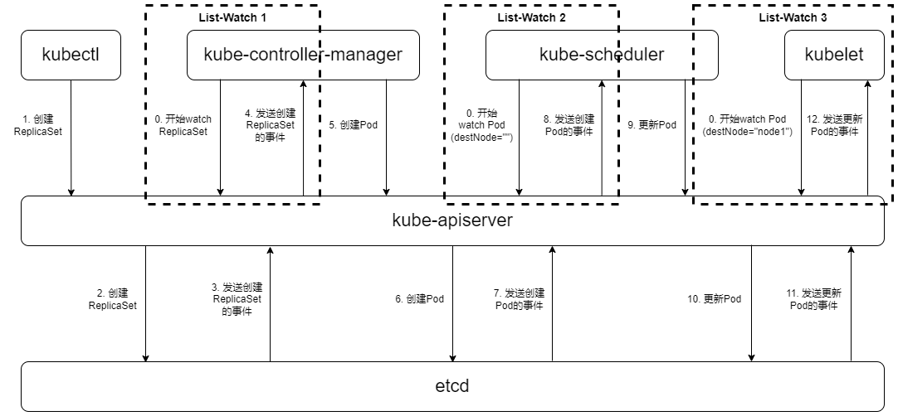
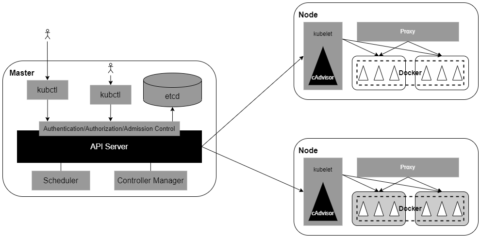

## Pod中的进程是如何知道API Server的访问地址的呢？
> Kubernetes API Server本身也是一个Service，它的名称就是kubernetes
> 
> 并且他的ClusterIP地址事ClusterIP地址池里的第1个地址
> 
> 它所服务的端口是HTTPS端口443

## API Server设计和实现的核心目标
> 由于API Server是Kubernetes集群数据的唯一访问入口

1. 安全性
1. 高性能

> 通过采用HTTPS安全传输通道与CA签名数字证书强制双向认证的方式，API Server的安全性得以保障

## 架构
1. API层
    - ：主要以 REST 方式提供各种 API 接口，除了有 Kubernetes 资源对象CRUD Watch 等主要 API, 还有健康检查、UI 、日志、性能指标等运维监控相关的 API。Kubernetes 1.11 版本开始废弃 Heapster 监控组件，转而使用 Metrics Server 提供 Metrics API接口，进一步完善了自身的监控能力
1. 访问控制层
    - 当客户端访问 API 接口时，访问控制层负责对用户身份鉴权，验明用户身份，核准用户对 Kubernetes 资源对象的访问权限，然后根据配置的各种资源访问许可逻辑 (Admissi Control) ，判断是否允许访问
1. 注册表层
    - Kubernetes 把所有资源对象都保存在注册表 (Registry) 中，针对注册表中的各种资源对象都定义了资源对象的类型、如何创建资源对象、如何转换资源的不同版本，以及如何将资源编码和解码为JSON或ProtoBuf格式进行存储
1. etcd数据库
    - 用于持久化存储Kubernetes资源对象的KV数据库。etcd的Watch API接口对于
    API Server来说只管重要，因为通过这个接口，API Server创新性地设计了List-Watch这种高性能的资源对向实时同步机制，使Kubernetes可以管理超大规模的集群，及时响应和快速处理集群中的各种事件

## Kubernetes 中的 CRD 在 API Server 中的设计和实现机制
根据 Kubernetes 的设计 ，每种官方内建的资源对象如 Node Pod Service 等的实现都包含以下主要功能：

1. 资源对象的元数据(Schema)的定义 ：可以将其理解为数据 Table 的定义，定义了对应资源对象的数据结构，官方内建资源对象的元数据定义是固化在源码中的
1. 资源对象的校验逻辑：确保用户提交的资源对象的属性的合法性
1. 资源对象的 CRUD 操作代码：可以将其理解为数据库表的 CRUD 代码，但比后者更难，因为 API Server 对资源对象的 CRUD 操作都会保存到 etcd 数据库中，对处理性能的要求也更高，还要考虑版本兼容性和版本转换等复杂问题
1. 资源对象相关的“自动控制器”（如 RC、Deployment 等资源对象背后的控制器）：这是很重要的一个功能 Kubernetes 个以自动化为核心目标的平台，用户给出期望的资源对象声明，运行过程中由资源背后的“自动控制器”确保对应资源对象的数量、状态、行为等始终符合用户的预期

类似地，每个自定义 CRD 的开发人员都需要实现上面的功能。为了降低编程难度与工作量， API Server 的设计者们做出了大益努力，使得直接编写 YAML 定义文件即可实现
以上前 3 个功能。对于唯一需要编程的第 4 个功能，由于 API Server 提供了大量的基础 API 库，特别是易用的 List-Watch 的编程框架，所以 CRD 自动控制器的编程难度大大降低。

