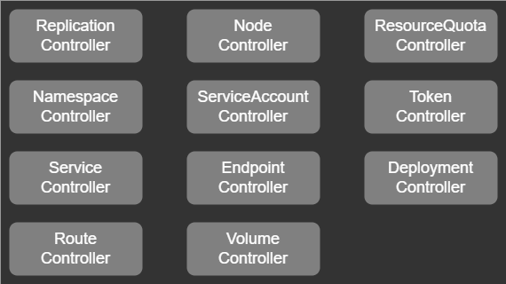
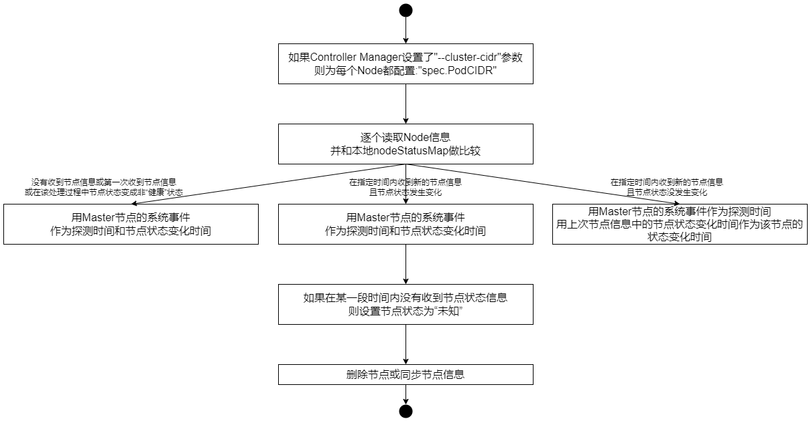
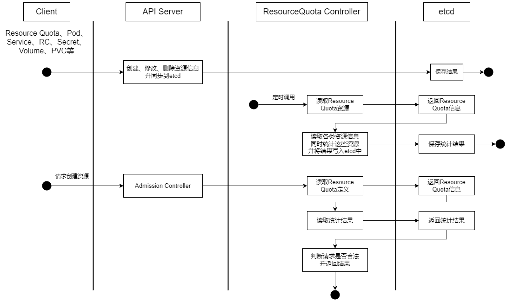
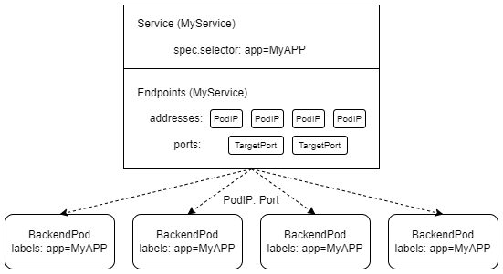

## Controller Manager作用
在Kubernetes集群中，每个Controller都是一个不断修正系统的工作状态的“操作系统”，它们通过API Server提供的（List-Watch）接口实时监控集群中特定资源的状态变化，当发生各种故障导致某资源对象的状态变化时，Controller会尝试将其状态调整为期望的状态。

比如，当某个Node意外宕机时，Node Controller会及时发现此故障并执行自动化修复流程，确保集群始终处于预期的工作状态下。

Controller Manager是Kubernetes中各种操作系统的管理者，是集群内部的管理控制中心，也是Kubernetes自动化功能的核心

## 总结 Deployment Controller 的作用

### 总结 Deployment Controller 的作用
1. 确保在当前集群中有且仅有 N 个 Pod 实例，N 是在 RC 中定义的 Pod 副本数量
2. 通过调整 spec.replicas 属性的值来实现系统扩容或者缩容
3. 通过改变 Pod 模板 (主要是镜像版本) 来实现系统的滚动升级

### Deployment Controller 的典型使用场景
1. 重新调度 (Rescheduling) :
    - 如前面所述，不管想运行 1 个副本还是 1000 个副本，副本控制器都能确保指定数量的副本存在于集群中，即使发生节点故障或 Pod 副本被终止运行等意外状况
1. 弹性伸缩 (Scaling) ：
    - 手动或者通过自动扩容代理修改副本控制器 spec.replicas 属性的值，非常容易实现增加或减少副本的数量
1. 滚动更新 (Rolling Updates) ：
    - 副本控制器被设计成通过逐个替换 Pod 来辅助服务的滚动更新

## Node Controller
kubelet 进程在启动时通过 API Server 注册自身节点信息，并定时向 API Server 汇报状态信息，API Server 在接收到这些信息后，会将这些信息更新到 etcd 中。在 etcd 中存储的节点信息包括：节点健康状况、节点资源、节点名称、节点地址信息、操作系统版本、Docker版本、kubelet 版本等。节点健康状况包含就绪 (True) 、未就绪 (False) 、未知 (Unknown) 三种

## ResourceQuota Controller
作为完备的企业级的容器集群管理平台，Kubernete 也提供了 ResourceQuota Controller（资源配额管理）这一高级功能，资源配额管理确保指定的资源对象在任何时候都不会超量占用系统物理资源，避免由于某些业务进程在设计或实现上的缺陷导致整个系统运行紊乱甚至意外宕机，对整个集群的平稳运行和稳定性都有非常重要的作用

目前 Kubernetes 支持如下三个层次的资源配额管理。
1. 容器级别，可以对 CPU 和 Memory 进行限制
2. Pod 级别，可以对一个 Pod 内所有容器的可用资源进行限制
3. Namespace 级别，为 Namespace （多租户）级别的资源限制，包括：Pod 数量、Replication Controller 数量、Service 数量、ResourceQuota 数量、Secret 数量和可持有的 PV数量

## Namespace Controller
用户通过 API Server可以创建新的 Namespace 并将其保存在 etcd 中，Namespace Controller 定时通过 API Server 读取这些 Namespace 的信息。如果 Namespace 被 API 标识为优雅删除（通过设置删除期限实现，即设置 DeletionTimestamp属性），则将该 NameSpace 的状态设置成 Terminating 并保存在 etcd 中。同时，Namespace Controller 删除该 Namespace 下的 ServiceAccount、RC、Pod、Secret、PersistentVolume、ListRange、ResourceQuota 和 Event 等资源对象。

在 Namespace 的状态被设置成 Terminating 后，由 Admission Controller 的 NamespaceLifecycle 插件来阻止为该 Namespace 创建新的资源。同时，在 Namespace Controller 删除该 Namespace 中的所有资源对象后，Namespace Controller 会对该 Namespace 执行 finalize 操作，删除 Namespace 的 spec.finalizers 域中的信息

如果 Namespace Controller 观察到 Namespace 设置了删除期限，同时 Namespace 的 spec.finalizers 阈值是空的，那么 Namespace Controller将通过API Server 删除该 Namespace 资源。

## Service Controller 与 Endpoints Controller
Endpoints表示一个Service对应的所有Pod副本的访问地址，Endpoints Controller就是负责生成和维护所有Endpoints对象的控制器

Endpoints Controller负责监听Service和对应的Pod副本的变化，如果检测到Service被删除，则删除和该Service同名的Endpoints对象。如果检测到新的Service被创建或者修改，则根据该Service信息获得相关的Pod列表，然后创建或者跟更新Service对应的Endpoints对象。如果检测到Pod的事件，则更新它所对应的Service的Endpoints对象(增加、删除或者修改对应的Endpoint条目)

### Endpoint对象使用位置
每个Node上的kube-proxy进程会使用。kube-proxy进程获取每个Service的Endpoints，实现了Service的负载均衡功能

### Service Controller
Service Controller是Kubernetes集群与外部的云平台之间的一个接口控制器。Service Controller监听Service的变化，如果该Service是一个LoadBalance类型的Service(externalLoadBalancers=true)，则Service Controller确保该Service对应的LoadBalancer实例在外部的云平台上被相应地创建、删除及更新路由转发表(根据Endpoints的条目)