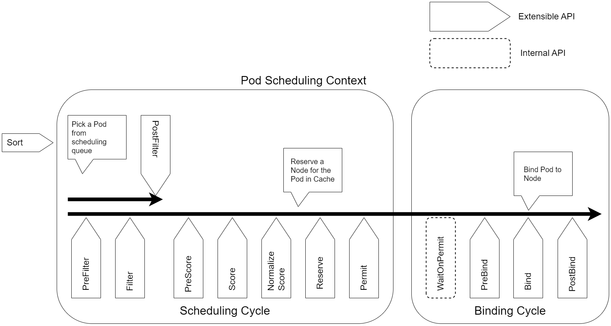

## Kubernetes Scheduler的作用
Kubernetes Scheduler 是负责 Pod 调度的进程(组件) ，随着 Kubernetes功能的不断增强和完善，Pod 调度也变得越来越复杂，Kubernetes Scheduler 内部的实现机制也在不断优化，从最初的两阶段调度机制 (Predicates & Priorities) 发展到后来的升级版的调度框架(Scheduling Framework)，以满足越来越复杂的调度场景

为什么 Kubernetes 里的 Pod 调度会如此复杂？这主要是因为 Kubernetes 要努力满足各种类型应用的不同需求并且努力“让大家和平共处”。Kubernetes 集群里的 Pod 有无状态服务类、有状态集群类及批处理类三大类，不同类型的 Pod 对资源占用的需求不同，对节点故障引发的中断／恢复及节点迁移方面的容忍度都不同，如果再考虑到业务方面不同服务的 Pod 的优先级不同带来的额外约束和限制，以及从租户（用户）的角度希望占据更多的资源增加稳定性和集群拥有者希望调度更多 Pod 提升资源使用率两者之间的矛盾，则当这些相互冲突的调度因素都被考虑到时， 如何进 Pod 调度就变成一个很棘手的问题了

## Kubernetes Scheduler的调度流程
Kubernetes Scheduler在整个系统中承担了“承上启下”的重要功能，“承上”是指它负责接受Controller Manager创建的新Pod，为其安排一个落脚的“家”——目标Node；“启下”是指安置工作完成后，目标Node上的kubelet服务进程接管后续工作，负责Pod生命周期中的“下半生”

具体来说，Kubernetes Scheduler的作用是将待调度的Pod（API新创建的Pod、Controller Manager为补足副本而创建的Pod等）按照特定的调度算法和调度策略绑定（Binding）到集群中某个合适的Node上，并将绑定信息写入etcd中。在整个调度过程中涉及三个对象，分别是待调度Pod列表、可用Node列表及调度算法和策略。简单地说，就是通过调度算法为待调度Pod列表中的每个Pod都从Node列表中选择一个最合适的Node。

随后，目标节点上的kubelet通过API Server监听到Kubernetes Scheduler产生的Pod绑定事件，然后获取对应的Pod清单，下载Image镜像并启动容器。

Scheduler 只跟API Server打交道，其输入和输出如下：
- 输入：待调度的Pod和全部计算节点的信息
- 输出：目标Pod要“安家”的最优节点（或者暂时不存在）

## 旧版Kubernetes Scheduler
旧版Kubernetes Scheduler的调度总体上包括两个阶段：过滤（Filtering）+打分（Scoring），随后就是绑定目标节点，完成调度

1. 过滤阶段：遍历所有目标Node，筛选出符合要求的候选节点。再次阶段，Scheduler会将不合适的所有Node节点全部过滤，只留下符合条件的候选节点。其具体方式是通过一系列特定的Filter对每个Node都进行筛选，筛选完成后通常会有对各候选节点供调度，从而进入打分阶段；如果结果集为空，则表示当前还没有符合条件的Node节点，Pod会维持在Pending状态
1. 打分阶段：在过滤阶段的基础上，采用优选策略（xxx Priorities）计算出每个候选节点的积分，积分最高者胜出，因为积分最高者表示最佳人选。挑选出最佳节点后，Scheduler会把目标Pod安置到此节点上，调度完成。

在过滤阶段中提到的Predicates是一系列过滤器，每种过滤器都实现一种节点特征的检测，比如磁盘（NoDiskConflict）、主机（PodFitsHost）、节点上的可用端口（PodFitsPorts）、节点标签（CheckNodeLabelPresence）、CPU和内存资源（PodFitsResources）、服务亲和性（CheckServiceAffinity）等。在打分阶段提到的Priorities则用来对满足条件的Node节点进行打分，常见的Priorities包含LeastRequestedPriority（选出资源消耗最小的节点）、BalancedResourceAllocation（选出各项资源使用率最均衡的节点）及CalculateNodeLabelPriority（优先选择含有指定Label的节点）等。Predicates与Priorities合在一起被称为Kubernetes Scheduling Policies，需要特别注意。

## Scheduler Framework

考虑到旧版本的 Kubernetes Scheduler 不足以支持更复杂和灵活的调度场景，因此在 Kubernetes 1.5 版本中出现一个新的调度机制一Scheduler Framework。从整个调度流程来看，新的 Schedule Framework 是在旧流程的基础上增加了一些扩展点（基于调度 Stage 的扩展点），同时支持用户以插件的方式 (Plugin) 进行扩展。

Scheduling Framework流程中这些扩展点的说明：
- QueueSort：对调度队列中待调度的 Pod 进行排序，一次只能启用一个队列排序插件
- PreFilter：在过滤之前预处理或检查 Pod 或集群的信息，可以将 Pod 标记为不可调度
- Filter：相当于调度策略中的 Predicates, 用于过滤不能运行 Pod 的节点。过滤器的调用顺序是可配置的，如果没有一个节点通过所有过滤器的筛选，Pod 则将被标记为不可调度
- PreScore：是一个信息扩展点，可用于预打分工作
- Score：给完成过滤阶段的节点打分，调度器会选择得分最高的节点
- Reserve：是一个信息扩展点，当资源已被预留给 Pod 时，会通知插件。这些插件还实现了 Unreserve 接口，在 Reserve 期间或之后出现故障时调用
- Permit：可以阻止或延迟 Pod 绑定
- PreBind： 在 Pod 绑定节点之前执行
- Bind：将 Pod 与节点绑定。绑定插件是按顺序调用的，只要有一个插件完成了绑定，其余插件就会跳过。绑定插件至少需要一个
- PostBind：是一个信息扩展点，在Pod绑定节点之后调用

目前常用的插件：
- PrioritySort：提供默认的基于优先级的排序。实现的扩展点为QueueSort
- ImageLocality：选择已经存在Pod运行所需容器镜像的节点。实现的扩展点为Score
- TaintToleration：实现污点和容忍。实现的扩展点为Filter、Prescore、Score
- NodeName：检查Pod指定的节点名称与当前节点是否匹配。实现的扩展点为Filter
- NodePorts：检查Pod请求的端口在节点上是否可用。实现的扩展点为PreFilter、Filter
- NodeAffinity：实现节点选择器和节点亲和性。实现的扩展点为Filter、Score
- SelectorSpread：对于属于Services、ReplicaSets和StatefulSets的Pod，偏好跨多个节点部署。实现的扩展点为PreScore、Score
- PodTopologySpread：实现Pod拓扑分布。实现的扩展点为PreFilter、Filter、PreScore、Score
- NodeResourcesFit：检查节点是否拥有Pod请求的所有资源。实现的扩展点为PreFilter、Filter
- DefaultPreemption：提供默认的抢占机制。实现的扩展点欸PostFilter
- NodeResourcesBalancedAllocation：在调度Pod时选择资源使用更为均衡的节点。实现的扩展点为Score
- NodeResourcesLeastAllocated：选择资源分配较少的节点，实现的扩展点为Score。
- VolumeBinding：检查节点是否有请求的卷，或是否可以绑定请求的卷。实现的扩展点为PreFilter、Filter、Reserve、PreBind
- InterPodAffinity：实现Pod间的亲和性与反亲和性。实现的扩展点为PreFilter、Filter、PreScore、Score
- DefaultBinder：提供默认的绑定机制。实现的扩展点为Bind
