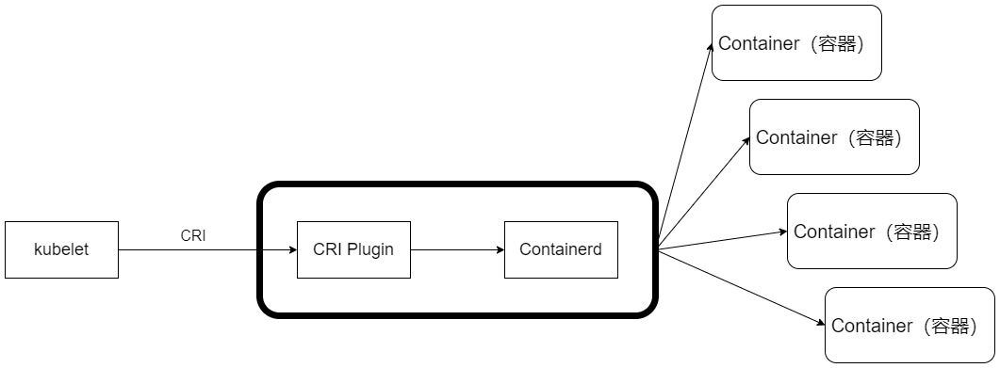

## kubelet创建和修改Pod任务
1. 为该Pod创建一个数据目录
1. 从API Server中读取该Pod清单
1. 为该Pod挂载外部卷（External Volume）
1. 下载Pod用到的Secret
1. 检查已经运行在节点上的Pod，如果该Pod没有容器或Pause容器（kubernetes/pause镜像创建的容器）没有启动，则先停止Pod里所有容器的进程。如果在Pod中有需要删除的容器，则删除这些容器
1. 用kubernetes/pause镜像为每个Pod都创建一个容器。该Pause容器用于接管Pod中所有其他容器的网络。每创建一个新的Pod，kubelet都会先创建一个Pause容器，然后创建其他容器。kubernetes/pause镜像大概有200KB，是个非常小的容器镜像
1. 为Pod中的每个容器都做如下处理
    - 为容器计算一个哈希值，然后用容器的名称去查询对应Docker容器的哈希值。若查找到容器，且二者的哈希值不同，则停止Docker中容器的进程，并停止与之关联的Pause容器的进程；若二者相同，则不做任何处理
    - 如果容器被终止，且容器没有指定的restartPolicy（重启策略），则不做任何处理。
    - 调用Docker Client下载容器镜像，调用Docker Client运行容器

## 容器健康检查
Pod通过两类探针来检查容器得健康状态。一类是LivenessProbe探针，用于判断容器是否健康并反馈给kubelet，如果LivenessProbe探针探测到容器不健康，则kubelet将删除该容器，并根据容器的重启策略做相应的处理；如果一个容器不包含LivenessProbe探针，则kubelet会认为该容器的LivenessProbe探针返回的值永远是Success。另一类是ReadinessProbe探针，用于判断容器是否启动完成，且准备接收请求。如果ReadinessProbe探针检测到容器启动失败，则Pod的状态将被修改，Endpoint Controller将从Service的Endpoint中删除包含该容器所在Pod的IP地址的Endpoint条目

kubelet定期调用容器中的LivenessProbe探针来诊断容器的健康状况。LivenessProbe包含以下3中实现方式：
1. ExecAction：在容器内部运行一个命令，如果该命令的退出状态码为0，则表明容器健康
1. TCPSocketAction：通过容器的IP地址和端口号执行TCP检查，如果端口能被访问，则表明容器健康
1. HTTPGetAction：通过容器的IP地址和端口号及路径调用HTTP Get方法，如果响应的状态码大于或等于200且小于或等于400，则认为容器状态健康

LivenessProbe探针被包含在Pod定义的spec.containers.{某个容器}中。下面的示例展示了两种Pod中的容器健康检查方式：HTTP检查和容器命令执行检查
1. 本示例实现了通过容器命令执行检查：
    ```yaml
    livenessProbe:
        exec:
            command:
            - cat
            - /tmp/health
        initialDelaySeconds: 15
        timeoutSeconds: 1
    ```
    kubelet在容器中运行"cat /tmp/health"命令，如果该命令返回的值为0，则表明容器处于健康状态，否则表明容器处于不健康状态

1. 本示例实现了对容器的HTTP检查：
    ```yaml
    livenessProbe:
        httpGet:
            path: /health
            port: 8080
        initialDelaySeconds: 15
        timeoutSeconds: 1
    ```
    kubelet发送一个HTTP请求到本地主机、端口及指定的路径，来检查容器的健康状况

## cAdvisor资源监控
cAdvisor是一个开源的分析容器资源使用率和性能特性的代理工具。但是它只能提供2~3min的监控数据

在新的Kubernetes监控体系中，Metrics Server用于提供Core Metrics（核心指标），包括Node和Pod的CPU和内存使用数据。其他Custom Metrics（自定义指标）则由第三方组件（如Prometheus）采集和存储

## 容器运行时
> 最早时LXC项目，一个Linux容器的工具集
>
> Docker公司在LXC项目代码的基础上，自研了新一代容器运行时Libcontainer
> 
> 后来，Libcontainer更名为runc，被捐赠给OCI组织，成为OCI容器运行时规范的第1个标准参考实现
> 
> runc属于低级别的容器运行时（low-level container runtimes），无镜像操作功能，如拉取镜像，对外提供远程编程接口
> 
> containerd属于高级别容器运行时（high-level container runtimes），也属于docker公司的
> 
> containerd底层驱动runc来实现底层的容器运行时，对外则提供了镜像拉取及基于gRPC接口的容器CRUD封装接口
>
> 所有Container Runtime都有两个共同特点：
> 1. 基于runc发展而来
> 2. 实现了Kubernetes提出的CRI接口规范（Container Runtime Interface）




CRI 接口规范主要定义了两个 gRPC 接口服务：ImageService 和 RuntimeService。其中， ImageService 提供了从仓库拉取镜像、查看和移除镜像的功能；RuntimeService 则负责实现 Pod 和容器的生命周期管理，以及与容器的交互 （exec/attach/port-forward）。Pod 由一组应用容器组成，其中包含共有的环境和资源约束，这个环境在 CRI 里被称为 Pod Sandbox。Container Runtime 可以根据自己的内部实现来解释和实现自己的 Pod Sandbox，比如对于 Hypervisor 这种容器运行时引擎，会把 PodSandbox 具体实现为一个虚拟机。所以 RuntimeService 服务接口除了提供了针对 Container 的相关操作，也提供了针对 Pod Sandbox 的相关操作以供 kubelet 调用。在启动 Pod 之前，kubelet调用 RuntimeService.RunPodSandbox 来创建 Pod 环境，这一过程也包括为 Pod 设置网络资
源（分配 IP 等操作），Pod Sandbox 在被激活之后，就可以独立地创建、启动、停止和删
除用户业务相关的 Container 了，当 Pod 销毁时，kubelet 会在停止和删除 Pod Sandbox
前首先停止和删除其中的 Container


```yaml
apiVersion: node.k8s.io/v1beta1
kind: RuntimeClass
metadata:
    name: myclass
handler: myconfiguration
scheduling: *Scheduling
overhead: *Overhead
```

其中，handler 参数是对应的 CRI 配置名称，指定 Container Runtime 的类型，一旦创建好 RuntimeClass 资源，我们就可以通过 Pod 中的 spec.runtimeClassName 字段与它进行关联了。当目标 Pod 被调度到某个具体的 kubelet 时，kubelet 就会通过 CRI 接口调用指定 Container Runtime 来运行该Pod，如果指定的 RuntimeClass 不存在，无法运行相应的
Container Runtime, 那么 Pod 会进入 Failed 状态