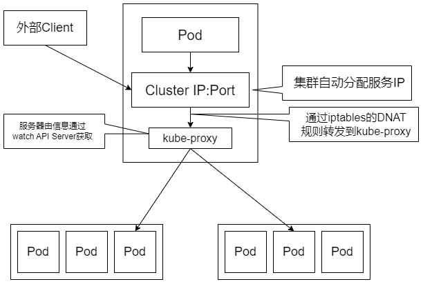
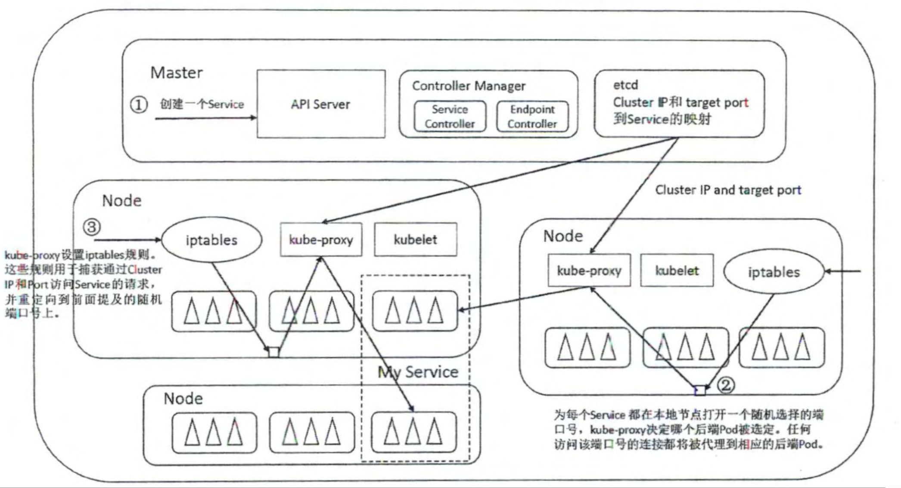
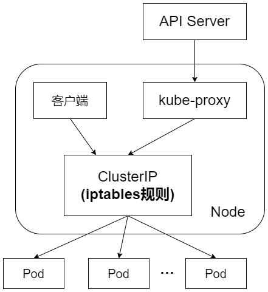
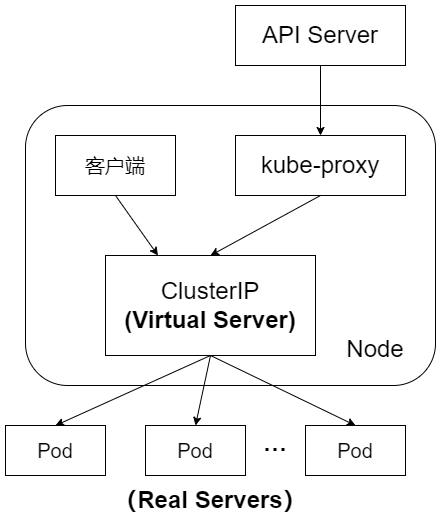

## kube-proxy  Operating Mechanism
为了支待集群的水平扩展和高可用性， Kubernetes 抽象出了 Service 的概念 Service 是对一组 Pod 的抽象，它会根据访问策略（如负载均衡策略）来访问这组 Pod

Kubernetes 在创建服务时会为服务分配一个虚拟 IP 地址，客户端通过访问这个虚拟 IP 地址来访问服务，服务则负责将请求转发到后端的 Pod 。这其实就是一个反向代理，但与普通的反向代理有一些不同：它的IP地址是虚拟，若想从外面访问，则还需要一些技巧；它的部署和启停是由 Kubernetes 统一自动管理的。

在很多情况下， Service 只是一个概念，而真正将 Service 的作用落实的是它背后的  kube-proxy 服务进程。只有理解了 kube-proxy 的原理和机制，我们才能真正理解 Service 的实现逻辑

## 第一代Proxy

此外，Service ClusterIP NodePort 等概念是 kube proxy 服务通过 iptables 的 NAT 转换实现的，kube-proxy 在运行过程中动态创建与 Service 相关的 iptables 规则，这些规则实现了将访问服务 （ClusterIP 或 NodePort）的请求负载分发到后端 Pod 的功能。由于 iptables 机制针对的是本地的 kube-proxy 端口，所以在每个  Node 上都要运行 kube-proxy 组件，这样一来，在 Kubernetes 集群内部，我们可以在任意 Node 上发起对 Service 的访问请求。综上所述，由于 kube-proxy 的作用 ，客户端在 Service 调用过程中无须关心后端有几个 Pod，中间过程的通信、负载均衡及故障恢复都是透明的

## 第二代Proxy
iptables 模式下的第二代 kube-proxy 进程不再起到数据层面的 Proxy 的作用，Client 向 Service 的请求流量通过 iptables 的 NAT 机制直接发送到目标 Pod，不经过kube-proxy进程的转发，kube-proxy进程只承担了控制层面的功能，即通过API Server的Watch接口实时跟踪Service与Endpoint的变更信息，并更新Node节点上相应的iptables规则。

根绝Kubernetes的网络模型，一个Node上的Pod与其他Node上的Pod应该能够直接建立双向的TCP/IP通信通道，所以如果直接修改iptables规则，则也可以实现kube-proxy的功能，只不过后者更加高端，因为是全自动模式的。与第一代的userspace模式相比，iptables模式完全工作在内核态，不用再经过用户态的kube-proxy中转，因而性能更强

kube-proxy针对Service和Pod创建的一些主要iptables规则如下：
- KUBE-CLUSTER-IP：在masquerade-all=true或clusterCIDR指定的情况下对Service CLusterIP地址进行伪装，以解决数据包欺骗问题
- KUBE-EXTERNAL-IP：将数据包伪装成Service的外部IP地址
- KUBE-LOAD—BALANCER、KUBE—LOAD-BALANCER-LOCAL：伪装Load Balancer类型的Service流量
- KUBE-NODE-PORT-TCP、KUBE-NODE-PORT-LOCAL-TCP、KUBE-NODE-PORT-UDP、KUBE-NODE-PORT-LOCAL-UDP：伪装NodePort类型的Service流量

## 第三代Proxy
第二代的iptables模式实现起来虽然简单，性能也提升很多，但存在固有缺陷：在集群中的Service和Pod大量增加以后，每个Node节点上iptables中的规则会急速膨胀，导致网络性能显著下降，在某些极端情况下甚至会出现规则丢失的情况，并且这种故障难以重现与排查。于是Kubernetes从1.8版本开始引入第三代的IPVS（IP Virtual Server）模式。IPVS在Kubernetes 1.11版本中升级为GA稳定版本

iptables与IPVS虽然都是基于Netfilter实现的，但因为定位不同，二者有着本质的差别：iptables是为防火墙设计的；IPVS专门用于高性能负载均衡，并使用更高效的数据结构（哈希表），允许几乎无限的规模扩张，因此被kube-proxy采纳为第三代模式

与iptables相比，IPVS拥有以下明显优势：
- 为大型集群提供了更好的可扩展性和性能；
- 支持比iptables更复杂的复制均衡算法（最小负载、最少连接、加权等）；
- 支持服务器健康检查和连接重试等功能；
- 可以动态修改ipset的集合，即使iptables的规则正在使用这个集合。

由于IPVS无法提供包过滤、airpin-madquerade tricks（地址伪装）、SNAT等功能，因此在某些场景（如NodePort的实现）下还要与iptables搭配使用。在IPVS模式下，kube-proxy又做了重要的升级，即使用iptables的扩展ipset，而不是直接调用iptables来生成规则链

iptables规则链是一个线性数据结构，ipset则引入了带索引的数据结构，因此当规则很多时，也可以高效地查找和匹配。我们可以将ipset简单理解为一个IP（段）的集合，这个集合的内容可以是IP地址、IP网段、端口等，iptables可以直接添加规则对这个“可变的集合”进行操作，这样做的好处在于大大减少了iptables规则的数量，从而减少了性能损耗。假设要禁止上万个IP访问我们的服务器，则用iptables的话，就需要一条一条地添加规则，会在iptables中生成大量的规则；但是用ipset的话，只需将相关的IP地址（网段）键入ipset集合中即可，这样只需设置少量的iptables规则即可实现目标

