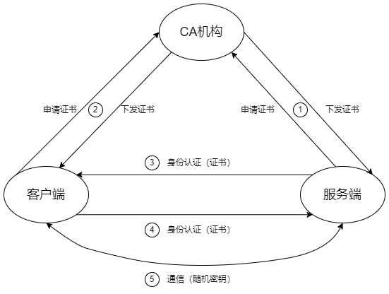

## API Server Authentication
Kubernetes 集群中所有资源的访问和变更都是通过 Kubernetes API Server 的 REST API 实现的，所以集群安全的关键点就在于如何识别并认证客户端身份（Authentication），以及随后访问权限的授权（Authorization）这两个关键问题。


任一Kubernetes API的访问都属于以下三种方式之一：
- 以证书方式访问的普通用户或进程，包括运维人员及kubectl、kubelets等进程；
- 以Service Account方式访问的Kubernetes的内部服务进程；
- 以匿名方式访问的进程。


Kubernetes集群提供了以下用户身份认证方式。
- HTTPS证书认证：基于CA根证书签名的双向数字证书认证方式
- HTTP Bearer Token认证：通过一个Bearer Token识别合法用户
- OpenID Connect Token第三方认证：通过第三方OIDC协议进行认证
- Webhook Token认证：通过外部Webhook服务进行认证
- Authenticating Proxy认证：通过认证代理程序进行认证

### HTTPS证书认证
CA是PKI系统中通信双方都信任的实体，被称为可信第三方（Trust Third Party, TTP）

CA认证的工作流程如下：
1. HTTPS 通信双方的服务端向 CA 机构申请证书，CA 机构是可信的第三方机构，它可以是一个公认的权威企业，也可以是企业自身。企业内部系统一般都用企业自身的认证系统。CA 机构下发根证书、服务端证书及私钥给申请者
1. HTTPS 通信双方的客户端向 CA 机构申请证书，CA 机构下发根证书 客户书及私钥给申请者
1. 客户端向服务端发起请求，服务端下发服务端证书给客户端。客户端在接收到证书后，通过私钥解密证书，并利用服务端证书中的公钥认证证书信息比较证书里的消息，例如，比较域名和公钥与服务器刚刚发送的相关消息是否一致，如果一致，则客户端认可这个服务器的合法身份
1. 客户端发送客户端证书给服务端，服务端在接收到证书后通过私钥解密证书，获得客户端证书公钥，并用该公钥认证证书的信息，确认客户端是否合法
1. 客户端通过随机密钥加密信息，并发送加密后的信息给服务端。在服务端和客户端协商好加密方案后，客户端会产生一个随机的密钥，客户端通过协商好的加密方案加密该随机密钥，并发送随机密钥到服务端。服务端接收到这个密钥后，双方通信的所有内容都通过该随机密钥加密



### HTTP Bearer Token 认证 
使用这种认证方式，就需要为API Server服务设置一个保存用户信息和Token的文件，通过启动参数--token-auth-file=SOMEFILE指定文件路径。该文件为CSV文本文件格式，每行内容都由以下字段组成：

```CSV
token, user, uid[, groupnames]
```

对其中各字段说明如下：
- token：必填，Token字符串
- user：必填，用户名
- uid：必填，用户ID
- groupnames：可选，用户组列表，如果有多个组，则必须使用双引号

通过Service Account认证方式访问API Server，其实也采用了与HTTP Bearer Token相同的实现方式。每个Service Account都对应一个Secret对象，在Secret对象中就有一个加密的Token字段，这个Token字段就是Bearer Token。这个Token是用哪个私钥加密的，要取决于API Server的启动参数--service-account-key-file设置的文件，如果没有指定该参数，则会采用API Server自己的私钥进行加密。为了方便Pod里的用户进程使用这个Token访问API Server，Secret Token里的内容会被映射到Pod中固定路径和名字的文件中。另外，如果API Server设置了启动参数--service-account-lookup=true，API Server就会验证Token是否在etcd中存在，如果已从etcd中删除，则将注销容器中Token的有效性


### OpenID Connect Token 第三方认证
OIDC协议是基于OAuth 2.0构建了一个身分层，OIDC的登录过程与OAuth相比，最主要的扩展就是提供了ID Token，这是一个JWT格式的加密Token。API Server本身与OIDC Server（即Identity Provider）没有太多交互，用户（主要是kubectl用户）通过OIDC Server得到一个合法的ID Token，并作为命令行参数（或者kubectl的配置文件）传递给API Server，API Server则通过验证该Token是否合法即是否有效来确定用户身份。虽然在 OIDC Server 中可以做到用户的权限管理 ，但Kubernetes并不使用 OIDC Server 的权限管理，因为它有自已完善的 BRAC 权限管理体系

需要说明的是，Kubernetes 本身不提供 OpenID Connect ID 服务，用户可以选择使用互联网 ID 提供商的服务，或者使用第三方系统，例如 dex、Keycloak、CloudFoundry UAA、OpenUnison等。

为了与Kubernetes一起工作，ID提供商必须满足以下要求：
- 提供OpenID Connect发现机制
- 基于TLS协议运行，并且不存在已过时的密码
- 拥有经过权威CA中心签发的证书

### Webhook Token认证
Kubemetes 也支待通过外部 Webhook 认证服务器，配合 HTTP Bearer Token 来实现自定义的用户身份认证功能

其工作原理和流程：开启并配置 API Server 的 Webhook Token Authentication 功能，API Server 在收到客户端发起的一个需要认证的请求后，从 HTTP Header 中提取出 Token 信息，然后将包含该 Token 的 TokenReview 资源以 HTTP POST 方式发送给远程 Webhook
服务进行认证 。然后，API Server 根据远程 Webhook 服务返回的结果判断是否认证成功。远程 Webhook 服务返回的结果也需要是一个 TokenReview 资源对象，并且它的 apiVersion 需要与 API Serve 发出请求的 apiVersion 保持一致，即同为 authentication.k8s.io/v1beta1 或 authentication.k8s.io/v1

访问远程 Webhook 服务的配置文件使用 kubeconfig 格式，其中 clusters 字段设置远程 Webhook 服务的信息，users 字段设置 API Server 的信息 ，例如：
[Webhook kubeconfig yaml](./webhook-kubeconfig.yaml)

API Server 收到客户端的认证请求之后，提取其 HTTP Header 中的 Token 之后，将会生成如下内容的 TokenReview 资源对象：
```json
{
    "apiVersion": "authentication.k8s.io/v1beta1",
    "kind": "TokenReview",
    "spec": {
        "token": "014fbff9a07c...",
        "audiences": ["https://myserver.example.com",
        "https://myserver.internal.example.com"]
    }
}
```

API Server 将这个 TokenReview 资源对象的 JSON 报文序列化后发送给远程 Webhook 服务，认证结果也以 TokenReview 资源对象的格式返回给 API Server, 结果通过 status 字段进行声明

一个认证成功的应答 TokenReview 内容示例如下：
```json
{
    "apiVersion": "authentication.k8s.io/v1beta1",
    "kind": "TokenReview",
    "status": {
        "authenticated": true,
        "user": {
            "username": "janedoe@example.com",
            "uid": "42",
            "groups":  ["developers", "qa"],
            "extra": {
                "extrafield1": [
                    "extravalue1",
                    "extravalue2"
                ]
            }
        },
        "audiences": ["https://myserver.example.com"]
    }
}
```

一个认证失败的应答 TokenReview 内容示例如下：
```json
{
    "apiVersion": "authentication.k8s.io/v1beta1",
    "kind": "TokenReview",
    "status": {
        "authenticated": false,
        "error": "Credentials are expired"
    }
}
```


### Authenticating Proxy（认证代理）
在这种方式下，将API Server配置为从HTTP Header（例如 X-Remote-User字段）对用户进行识别。这需要与Authenticating Proxy程序一同工作，由Authenticating Proxy设置HTTP Header的值

为了验证 Authenticating Proxy 程序的身份，Authenticating Proxy 程序需要把有效的客户端 CA 证书先提供给 API Server, 使得 API Server 可以向 CA 中心进行身份认证。只有在API Server 验证了该客户端 CA 证书有效之后，才会校验在 HTTP Header 中设置的用户名