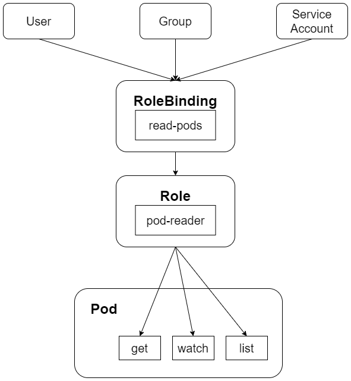

## API Server Authorization
当客户端发起 API Server 调用时， API Server 内部要先进行用户认证， 然后执行用户授权流程，即通过授权策略 (Authorization Policy) 决定一个 API 调用是否合法。对合法用户进行授权并随后在用户访问时进行鉴权，是权限与安全系统中的重要一环。简单地说，授权就是授予不同的用户不同的访问权限。API Server 目前支持以下授权策略。
- AlwaysDeny: 表示拒绝所有请求，仅用于测试
- AlwaysAllow ：允许接收所有请求，如果集群不需要授权流程，则可以采用该策略
- ABAC (Attribute-Based Access Control) ：基于属性的访问控制，表示使用用户配置的授权规则对用户的诮求进行匹配和控制
- RBAC : Role-Based Access Control, 是基于角色的访间控制
- Webhook: 通过调用外部的 REST 服务对用户进行授权
- Node: 是一种对 kubelet 进行授权的特殊模式

AlwaysDeny 因为缺三实际意义，已于 Kubernetes 1.13 版本之后被废弃。AIwaysAIlow基本不会被用于实际生产中。ABAC 是了ubernetes 1.6 版本之前的默认授权模式，功能强大，但存在理解和配置复杂、修改后需要重启 API Server 等硬伤，因此从 Kubernetes 1.5版本开始，己被全新的 RBAC 授权模式替代。如果 RBAC 仍然不满足某些特定需求，则用户还可以自行编写授权逻辑并通过 Webhook 方式注册为  Kubernetes 的授权服务，以实现更加复杂的授权规则。

通过 API Server 的启动参数 --authorization-mode 可配置多种授权策略，用逗号分隔即可。在通常情况下，我们会设置授权策略为 Node,RBAC, API Server 在收到请求后，会读取该请求中的数据，生成一个访问策略对象，API Server 会将这个访问策略对象和配置的授权模式逐条进行匹配，第一个被满足或拒绝的授权策略决定了该请求的授权结果，如果匹配的结果是禁止访问，则 API Server 会终止 API 调用流程，并返回客户端的错误调用码。

Node授权策略用于对 kubelet 发出的请求进行访问控制，与用户的应用授权无关，属于Kubernetes 自身安全的增强功能。简单来说，就是限制每个 Node 只访问它自身运行的 Pod 及相关的 Service、Endpoints 等信息；也只能受限于修改自身 Node 的一些信息，比如 Label；也不能操作其他 Node 上的资源。而之前用 RBAC 这种通用权限模型其实并不能满足 Node 这种特殊的安全要求，所以将其剥离出来定义为新的 Node 授权策略。

### ABAC 授权模式详解
在 API Server 启用 ABAC 模式时，集群管理员需要指定授权策略文件的路径和名称（-authorization-policy-file=SOME_ FILENAME），授权策略文件里的每一行都以一个 Map 类型的 JSON 对象进行设置，它被称为“访问策略对象”。在授权策路文件中，集群管理员需要设置访问策略对象中的 apiVersion、kind、spec 属性来确定具体的授权策略，其中，apiversion 的当前版本为 abac.authorization.kubernetes.io/v1beta1；kind 被设置为 Policy；spec 指详细的策略设置，包括主体属性、资源属性、非资源属性这三个字段。
1. 对主体属性说明如下：
    - user（用户名）：字符串类型，该宇符串类型的用户名来源于 Token 文件（--token-auth-fle 参数设置的文件）或基本认证文件中用户名称段的值。
    - group（用户组）：在放设置为“system:authenticated”时，表示匹配所有已认证清求；在被设置为“system:unauthenticated”时，表示匹配所有未认证请求。
2. 对资源属性说明如下：
    - apiGroup (API 组）：字符串类型，表明匹配哪些 API Group, 例如 extensions 或＊（表示匹配所有 API Group)
    - namespace（命名空间）：字符串类型，表明该策略允许访问某个 Namespace 的资源，例如 kube-system 或＊（表示匹配所有 Namespace）
    - resource（资源）：字符串类型，表明要匹配的 API 资源对象，例如 pods 或＊ （表示匹配所有资源对象 ）。
3. 对非资源属性说明如下
    - nonResourcePath（非资源对象类路径）： 非资源对象类的 URL 路径，例如/version或/apis，＊表示匹配所有非资源对象类的请求路径，也可以将其设置为子路径，/foo/＊表示匹配所有 /foo 路径下的所有子路径
    - readonly（只读标识）：布尔类型，当它的值为 true 时，表明仅允许 GET 请求通过。

下面对 ABAC 授权算法 使用 kubectl 时的授权机制 常见的 ABAC 授权示例及如何Service Account 进行授权进行说明

#### 1 ABAC授权算法
API Server 进行 ABAC 授权的算法为：在 API Server 收到请求之后，首先识别出请求携带的策略对象的属性，然后根据在策略文件中定义的策略对这些属性进行逐条匹配，以判定是否允许授权。如果有至少一条匹配成功，这个请求就通过了授权（不过还是可能在后续的其他授权校验中失败）。常见的策略配置如下：
- 要允许所有认证用户做某件事，则可以写一个策略，将 group 属性设置为 system:authenticated
- 要允许所有未认证用户做某件事，则可以把策略的 group 属性设置为 system:unauthenticated
- 要允许一个用户做任何事，则将策略的 apiGroup、namespace、resource和nonResourcePath 属性设置为“*”即可

#### 2 使用 kubectl 时的授权机制
kubectl 使用 API Server 的/api和/apis端点来获取版本信息。要验证 kubectl create/ update 命令发送给服务器的对象，kubectl 则需要向 OpenAPI 查询，对应的 URL 路径为 /openapi/v2

使用ABAC授权模式时，以下特殊资源必须显式地通过nonResourcePath属性设置
- API版本协商过程中的 ```/api、/api/*、/apis 和 /apis/*```
- 通过 kubectl version命令从服务器中获取版本时的/version
- create/update操作过程中的/swaggerapi

使用kubectl操作时，如果需要查看发送到API Server的HTTP请求，则可以将日志级别设置为8，例如：
```bash
kubectl --v=8 version
```

#### 3 常见的ABAC授权示例
下面通过几个授权策略文件（Json格式）示例说明ABAC的访问控制用法
1. 允许用户alice对所有资源做任意操作：
    ```json
    {
        "apiVersion": "abac.authorization.kubernetes.io/v1beta1",
        "kind": "Policy",
        "spec": {
            "user": "alice",
            "namespace": "*",
            "resource": "*",
            "apiGroup": "*"
        }
    }
    ```
2. kubelet可以读取任意Pod：
    ```json
    {
        "apiVersion": "abac.authorization.kubernetes.io/v1beta1",
        "kind": "Policy",
        "spec": {
            "user": "`",
            "namespace": "*",
            "resource": "pods",
            "readonly": "true"
        }
    }
    ```

3. kubelet可以读写Event对象
    ```json
    {
        "apiVersion": "abac.authorization.kubernetes.io/v1beta1",
        "kind": "Policy",
        "spec": {
            "user": "kubelet",
            "namespace": "*",
            "resource": "events"
        }
    }
    ```

4. 用户bob只能读取projectCaribou中的Pod：
    ```json
    {
        "apiVersion": "abac.authorization.kubernetes.io/v1beta1",
        "kind": "Policy",
        "spec": {
            "user": "bob",
            "namespace": "projectCaribou",
            "resource": "pods",
            "readonly": true
        }
    }
    ```

5. 任意用户都可以对非资源类路径进行只读请求：
    ```json
    {
        "apiVersion": "abac.authorization.kubernetes.io/v1beta1",
        "kind": "Policy",
        "spec": {
            "group": "system:authenticated",
            "readonly": true,
            "nonResourcePath": "*"
        }
    }

    {
        "apiVersion": "abac.authorization.kubernetes.io/v1beta1",
        "kind": "Policy",
        "spec": {
            "group": "system:unauthenticated",
            "readonly": true,
            "nonResourcePath": "*"
        }
    }
    ```

如果添加了新的ABAC策略，则需要重启API Server以使其生效


#### 4 对 Service Account 进行授权


### Webhook授权模式详解

[Webhook kubeconfig yaml](./webhook-kubeconfig.yaml)

### RBAC授权模式详解
相对于其他访问控制方式，RBAC授权具有如下优势：
- 对集群中的资源和非自愿权限均有完整的覆盖
- RBAC的权限配置通过几个API对象即可完成，同其他API对象一样，可以用kubectl或API进行操作
- 可以在运行时进行调整，无须重新启动API Server

#### 1 RBAC的API资源对象说明
1. 角色（Role）和集群角色（ClusterRole）
[rbac-role.yaml](rbac-role.yaml)

[rbac-clusterrole.yaml](rbac-clusterrole.yaml)

1. 角色绑定（RoleBinding）和集群角色绑定（ClusterRoleBinding）
[rbac-rolebingding.yaml](rbac-rolebingding.yaml)

[rbac-rolebingding-clusterrolebinding.yaml](./rbac-rolebingding-clusterrolebinding.yaml)



[rbac-clusterrolebinding.yaml](./rbac-clusterrolebinding.yaml)

#### 2 RBAC 对资源的引用方式
[role-multi-resources.yaml](./role-multi-resources.yaml)

[role-configmap.yaml](./role-configmap.yaml)

#### 3 聚合ClusterRole
[aggregate-clusterrole-selector.yaml](./aggregate-clusterrole-selector.yaml)

[aggregate-clusterrole.yaml](./aggregate-clusterrole.yaml)

#### 4 常见的授权规则示例


#### 5 常见的角色绑定示例

#### 6 Kubernetes系统默认的授权规则（ClusterRole和ClusterRoleBinding）
1. API发现（API Discovery）相关的CLusterRole
1. 面向用户（User-facing）的ClusterRole
1. 核心组件（Core Component）的ClusterRole
1. 其他组件的ClusterRole
1. 系统内置控制器（Controller）的ClusterRole

#### 7 预防权限提升和授权初始化
1. 创建或更新Role或CLusterRole的限制
1. 创建或更新RoleBinding或ClusterRoleBinding

[user-1-clusterrole.yaml](./user-1-clusterrole.yaml)

[user-1-rolebinding.yaml](./user-1-rolebinding.yaml)

#### 8 使用kubectl命令行工具管理RBAC
1. 创建Role：kubectl create role
1. 创建ClusterRole：kubectl create clusterrole
1. 创建RoleBinding：kubectl create rolebinding
1. ClusterRoleBinding：kubectl create clusterrolebinding
1. kubectl auth reconcile

#### 9 对ServiceAccount的授权管理
按照从最安全到最不安全的顺序，授权的方法如下：
1. 为应用专属的ServiceAccount赋权（最佳实践）
1. 为一个命名空间中名为default的SeviceAccount授权
1. 为命名空间中的所有ServiceAccount都授予同一个权限
1. 为集群范围内的所有ServiceAccount都授予一个有限的权限（不推荐）
1. 为所有ServiceAccount都授予超级用户权限（强烈不推荐）

#### 10 从ABAC更新为RBAC的建议
1. 并行认证
1. 粗放管理


### Node授权模式详解
