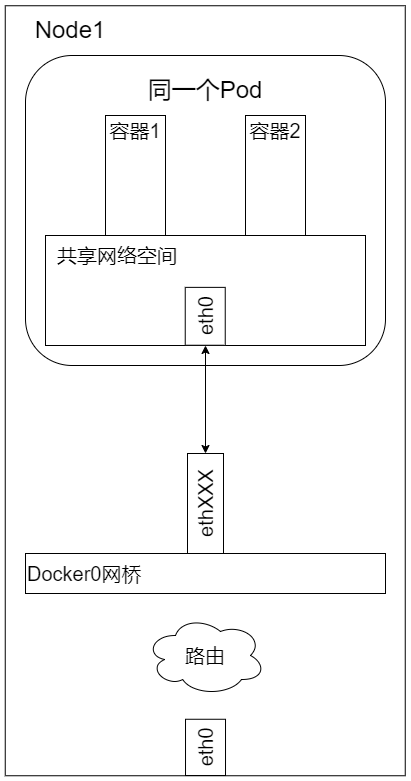
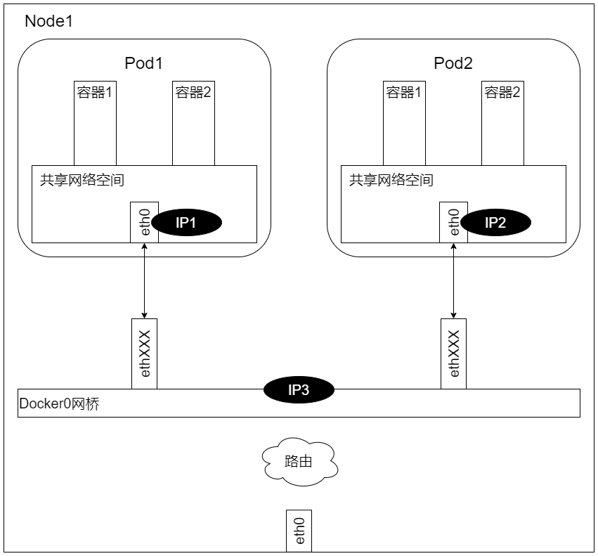
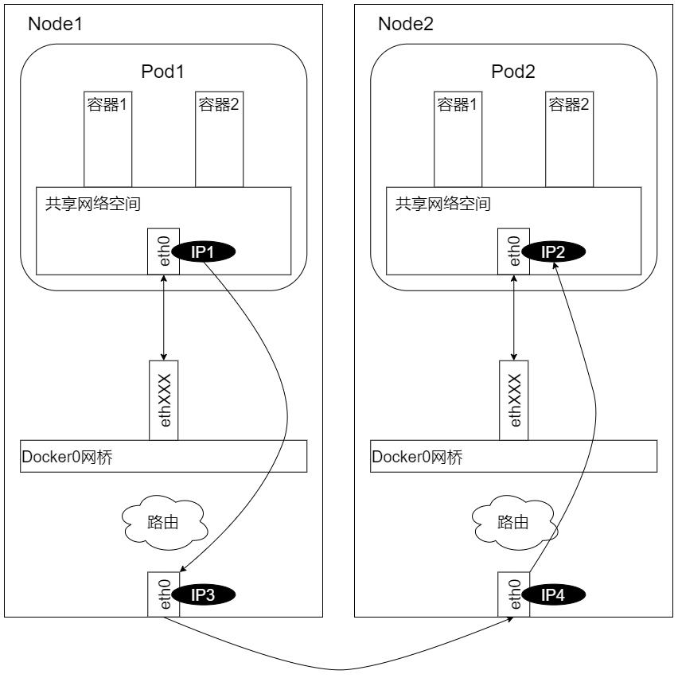

## Kubernetes Network Achievement
Kubernetes网络的设计主要致力于解决一下问题
1. 容器到容器之间的直接通信
1. 抽象的Pod到Pod之间的通信
1. Pod到Service之间的通信
1. 集群内部与外部组件之间的通信

### 容器到容器的通信
- localhost

### Pod之间的通信
1. 同一个Node上Pod之间的通信
    - docker0网桥
    

1. 不同Node上Pod之间的通信
    - 综上所述，要想支持不同 Node 上 Pod 之间的通信，就要满足两个条件：
        1. 在整 Kubernetes 集群中对 Pod 的 IP 分配进行规划，不能有冲突
        1. 找到一种办法，将 Pod 的 IP 和所在 Node 的 IP 关联起来，通过这个关联让 Pod 可以相互访问
    - 根据条件1的要求，我们需要在部署 Kubernetes 时对 docker0 的 IP 地址进行规划，保证每个 Node 上的 docker0 地址都没有冲突。我们可以在规划后手工配置到每个 Node 上，或者做一个分配规则，由安装的程序自己去分配占用。例如，Kubernetes 的网络增强开源软件 Flannel 就能够管理资源池的分配。

    - 根据条件2要求，Pod 中的数据在发出时，需要有一个机制能够知道对方 Pod 的 IP 地址挂在哪个具体的 Node 上。也就是说，先要找到 Node 对应宿主机的 IP 地址，将数据发送到这个宿主机的网卡，然后在宿主机上将相应的数据转发到具体的 docker0 上。一旦数据到达宿主机 Node，那个 Node 内部的 docker0 便知道如何将数据发送到 Pod 了。如下图，IP1 对应的是 Pod1，IP2 对应的是 Pod2，Pod1 在访问 Pod2 时，首先要将数据从源 Node 的 eth0 发送出去，找到并到达 Node2 的 eth0，即先是从 IP3 到 IP4 的传送，之后才是从 IP3 到 IP4 的传送

    