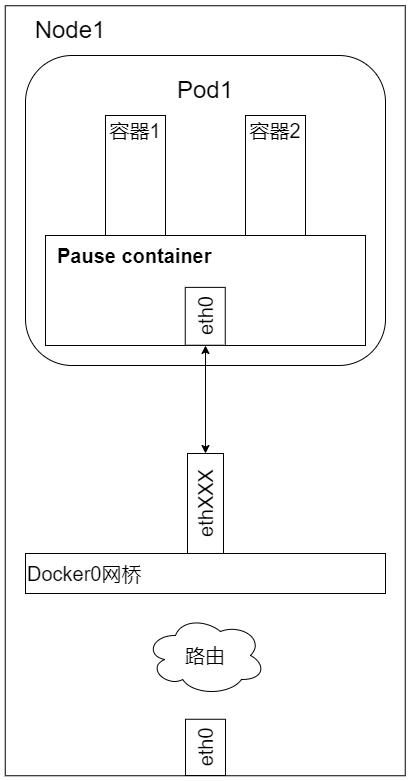
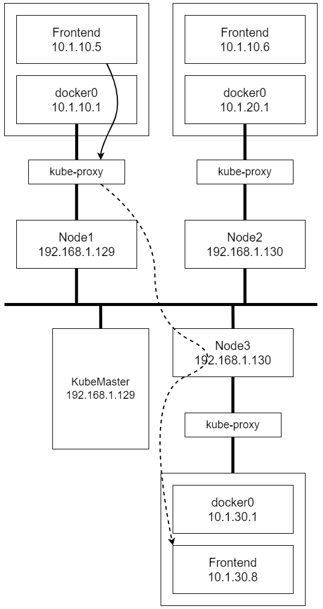
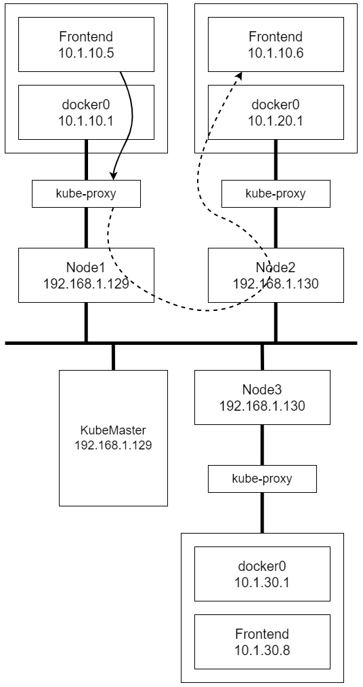

## Pod & Service Network Practise


### 部署一个RC/Pod
有趣的结果是，在查看完每个容器的网络模型后，我们都可以看到这样的配置：我们检查的第1个容器是运行了 ```k8s.gcr.io/pause:latest``` 镜像的容器，它使用了 Docker 默认的网络模型 bridge；而我们检查的第2个容器，也就是在 RC/Pod 中定义运行的  php-redis 容器，使用了非默认的网络配置和映射容器的模型，指定了映射目标容器为 k8s.gcr.io/pause:latest

为什么 Kubernetes 要这么做呢？

首先，一个 Pod 内的所有容器都需要共用同一个IP地址，这就意味着一定要使用网络的容器映射模式。然而，为什么不能只启动1个容器，而将第2个容器关联到第1个容器呢？我们认为 Kubernetes 是从两方面来考虑这个问题的：
1. 首先，如果在 Pod 内有多个容器，则可能很难连接这些容器；
1. 其次，后面的容器还要依赖第1个被关联的容器，如果第2个容器关联到第1个容器，且第1个容器死掉的话，那么第2个容器也将死掉。
启动一个基础容器，然后将 Pod 内的所有容器都连接到它上面会更容易一些。因为我们只需为基础的k8s.gcr.io/pause 容器执行端口映射规则，这也简化了端口映射的过程。



在这种情况下，实际 Pod 的 IP 数据流的网络目标都是这个 k8s.gcr.io/pause 容器。上图有点儿取巧地显示了 k8s.gcr.io/pause 容器将端口 80 的流量转发给了相关容器。而 Pause 容器只是看起来转发了网络流量，但它并没有真的这么做。实际上，应用容器直接监听了这些端口， 和 k8s.gcr.io/pause 容器共享同一个网络堆栈。这就是为什么实际容器
的端口映射在 Pod 内都显示到 k8s.gcr.io/pause 容器上了。可以通过 docker port 命令来检验

综上所述，k8s.gcr.io/pause 容器实际上只是负责接管这个 Pod 的 Endpoint，并没有做更多的事情。那么 Node 呢？它需要将数据流传给 k8s.gcr.io/pause 容器吗？

通过检验iptables的规则，发现并没有被应用到我们刚刚定义的 Pod 上。当然，Kubernetes 会给每一个 Kubernetes 节点都提供一些默认的服务，上面的规则就是 Kubernetes 默认的服务所需的。关键是，我们没有看到任何 IP 伪装的规则，并且没有任何指向 10.1.20.4 内的端口映射

### 发布一个服务
Service 允许我们在多个 Pod 之间抽象一些服务，而且服务可以通过提供同一个 Service 的多个 Pod 之间的负载均衡机制来支待水平扩展



注意，在上图中，虚线绕过了 Node3 的 kube-proxy，这么做是因为  Node3 上的 kube-proxy 没有参与这次网络交互。换句话说，Nodel1 的 kube-proxy 服务直接和负载均衡到的 Pod 进行网络交互

总而言之，Kubenetes 的 kube-proxy 作为一个全功能的代理服务器管理了两个独立的 TCP 连接：
1. 一个是从容器到 kube-proxy
1. 另一个是从 kube-proxy 到负载均衡的目标 Pod

