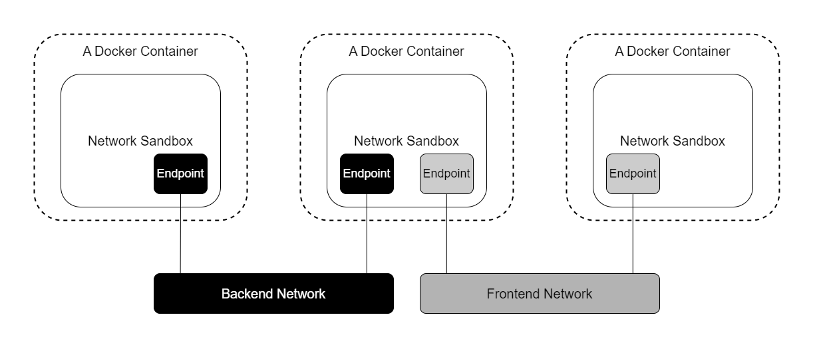
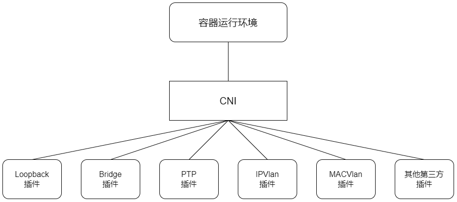

## CNI Network Model
随着容器技术在企业生产系统中的逐步落地，用户对容器云的网络特性要求也越来越高。跨主机容器间的网络互通已经成为基本要求，更高的要求包括容器固定 IP 地址 、一个容器多个 IP 地址、多个子网隔离、ACL 控制策略、与 SDN 集成等。目前主流的容器网络模型主要有 Docker 公司提出的 Container Network Model (CNM) 和 CoreOS 公司提出的
Container Network Interface（CNI）

### CNM网络模型简介
CNM 模型主要通过：
- Network Sandbox 
- Endpoint 
- Network 
3个组件进行实现

1. Network Sandbox：容器内部的网络栈，包括网络接口、路由表、DNS 等配置的管理。Sandbox 可通 Linux 网络命名空间、FreeBSD Jail 等机制进行实现。一个 Sandbox 可以包含多个 Endpoint

1. Endpoint: 用于将容器内的 Sandbox 与外部网络相连的网络接口。可以使用 Veth 设备对、Open vSwitch 的内部 port 等技术进行实现。一个 Endpoint 仅能加入一个 Network

1. Network：可以直接互连的 Endpoint 的集合。可以通过 Linux 网桥、VLAN 等技术进行实现。一个 Network 包含多个 Endpoint

### CNI网络模型详解

CNI 定义了容器运行环境与网络插件之间的简单接口规范，通过一个 JSON Schema 定义 CNI 插件提供的输入和输出参数。一个容器可以通过绑定多个网络插件加入多个网络中。

1. CNI规范概述

在 CNI 模型中只涉及两个概念：容器和网络。
- 容器：是拥有独立 Linux 网络命名空间的环境，例如使用 Docker 或 rkt 创建的容器。关键之处是容器需要拥有自己的 Linux 网络命名空间，这是加入网络的必要条件。
- 网络：表示可以互连的一组实体，这些实体拥有各自独立、唯一的 IP 地址，可以是容器、物理机或者其他网络设备（比如路由器）等。可以将容器添加到一个或多个网络中，也可以从一个或多个网络中删除

对容器网络的设置和操作都通过插件 (Plugin) 进行具体实现，CNI 插件包括两种类型：CNI Plugin 和 IPAM（IP Address Management）Plugin。CNI Plugin 负责为容器配置网络资源，IPAM Plugin 负责对容器的 IP 地址进行分配和管理。IPAM Plugin 作为 CNI Plugin 的一部分，与 CNI Plugin 一起工作

1. 容器运行时与CNI插件的关系和工作机制

将容器添加到网络中或者删除某个网络是由容器运行时（runtime）CNI 插件完成的

1. CNI Plugin 详解

CNI Plugin 须是一个可执行程序，由容器管理系统（如 Kubernetes）调用

CNI Plugin 负责将网络接口（network interface）插入容器网络名称空间（例如 Veth 设备对的一端），并在主机上进行任意必要的更改（例如将 Veth 设备对的另一端连接到网桥），然后调用适当的 IPAM 插件，将 IP 地址分配给网络接口，并设置正确的路由规则

CNI Plugin 需要支持的操作包括 ADD（添加）、DELETE（删除）、CHECK（检查）和 VERSION（版本查询）。这些操作的具体实现均由 CNI Plugin 可执行程序完成

1. CNI网络配置详解
CNI 网络配置 (Network Configuration) 以 JSON 格式进行描述。这个配置可以以文件的形式保存在磁盘上，或者由容器运行时自动生成

1. CNI网络配置列表
CNI 网络配置列表（Network Configuration List）通过将多个网络配置按顺序配置，为容器提供连接到多个网络的机制。每个 CNI Plugin 执行后的结果将作为下一个插件的输入信息。网络配置列表也以 JSON 格式进行描述，内容由多个网络配置组成

1. IP地址分配和IPAM Plugin详解
为了减轻 CNI Plugin 在 IP 地址管理方面的负担，CNI 规范设置了一个独立的插件 IPAM Plugin 来专门管理容器的 IP 地址。CNI Plugin 应负责在运行时调用 IPAM Plugin 完成容器 IP 地址的管理操作。IPAM Plugin 负责为容器分配 IP 地址、网关、路由和 DNS，并负责将 IP 地址操作结果返回给主 CNI Plugin，典型实现包括 host-local 插件和 dhcp 插件。

与 CNI Plug 类似，IPAM Plugin 也以在 CNI_PATH 路径中可执行程序的形式完成具体操作。IPAM 可执行程序也处理传递给 CNI 插件的环境变星和通过标准输入传入的网络配置参数。

IPAM Plugin 操作的返回码在成功时应被设置为0, 在失败时应被设置为非0

1. 错误返回码说明

### 在Kubernetes中使用网络插件
Kubernetes 目前支持两种网络插件的实现：
- CNI 插件：根据 CNI 规范实现其接口，以与插件提供者进行对接
- kubenet 插件：使用 bridge 和 host-local CNI 插件实现一个基本 cbr0