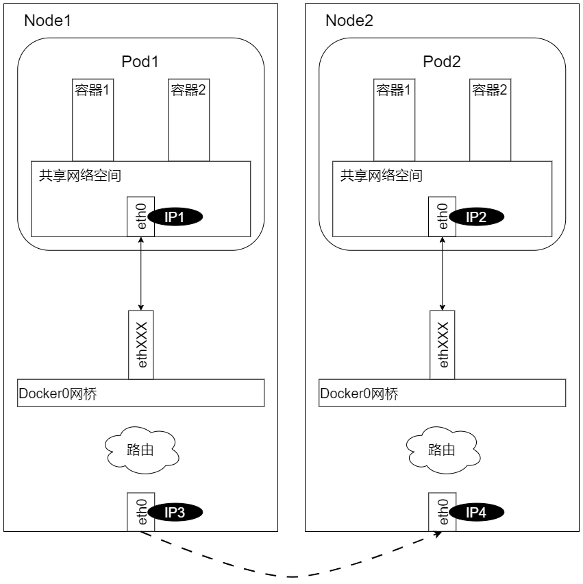

## Open Source Network Programme
Kubernetes 的网络模型假定了所有 Pod 都在一个可以直接连通的扁平网络空间中。这 GCE 里面是现成的网络模型，Kubernetes 假定这个网络已经存在。而在私有云里搭建 Kubernetes 集群，就不能假定这种网络已经存在了。我们需要自己实现这个网络假设，将跨主机容器网络部署完成，再运行容器应用

### Flannel插件的原理和部署示例
Flannel 之所以可以搭建 Kubernetes 依赖的底层网络，是因为它能实现以下两点：
1. 它能协助 Kubernetes，给每 Node 上的 Docker 容器都分配互不冲突的 IP 地址
1. 它能在这些 IP 地址之间建立一个覆盖网络（Overlay Network），通过这个覆盖网络，将数据包原封不动地传递到目标容器内

可以看到，Flannel 首先创建了一个名为 flannel0 的网桥，而且这个网桥的一端连接 docker0 网桥，另一端连接一个叫作 flanneld 的服务进程

flanneld 进程并不简单，它上连 etcd，利用 etcd 来管理可分配的 IP 地址段资源，同时监控 etcd 中每个 Pod 的实际地址，并在内存中建立了一个 Pod 节点路由表；它下连 docker0 和物理网络，使用内存中 Pod 节点路由表，将 docker0 发给它的数据包包装起来，利用物理
网络的连接将数据包投递到目标 flanneld 上，从而完成 Pod 到 Pod 之间的直接地址通信

Flannel 之间底层通信协议的可选技术包括 UDP、VxLan、AWS VPC 等多种方式。通过源 flanneld 封包、目标 flanneld 解包，docker0 最终收到的就是原始数据，对容器应用来说是透明的，应感觉不到中间  Flannel 的存在

我们看一下 Flannel 是如何做到为不同 Node 上的 Pod 分配的 IP 不产生冲突的。其实想到 Flannel 使用了集中的 etcd 存储就很容易理解了。它每次分配的地址段都在同一个公共区域获取，这样大家自然能够相互协调，不产生冲突了。而且在 Flannel 分配好地址段后，后面的事情是由 Docker 完成的，Flannel 通过修改 Docker 的启动参数将分配给它的地址段传递进去

### Open vSwitch插件的原理和部署示例
Open vSwitch 是个开源的虚拟交换机软件，有点儿像 Linux 中的 bridge，但是功能要复杂得多。Open vSwitch 的网桥可以直接建立多种通信通道（隧道）

### 直接路由的原理和部署示例
我们知道，docker0 网桥上的 IP 地址在 Node 网络上是看不到的。从一个 Node 到一个 Node 内的 docker0 是不通的，因为它不知道某个 IP 地址在哪里。如果能够让这些机器知道对端 docker0 地址在哪里，就可以让这些 docker0 相互通信了。这样，在所有 Node 上运行的 Pod 就都可以相互通信了。

我们可以通过部署 MultiLayer Switch（MLS）实现这一点，在 MLS 中配置每个 docker0 子网地址到 Node 地址的路由项，通过 MLS 将 docker0 的 IP 寻址定向到对应的 Node 上

另外，我们可以将这些 docker0 和 Node 的匹配关系配置在 Linux 操作系统的路由项中，这样通信发起的 Node 就能够根据这些路由信息直接找到目标 Pod 所在的 Node，将数据传输过去了，如下图所示

我们在每个 Node 的路由表中增加对方所有 docker0 的路由项

### Calico插件的原理和部署示例
1. Calico简介
    
1. 部署Calico应用
1. 跨主机Pod网络连通性验证