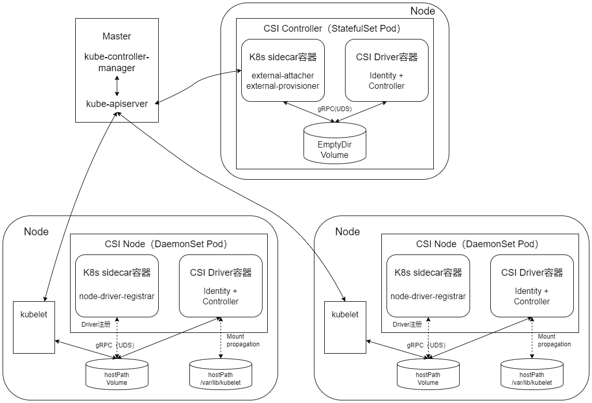

## CSI Storage Mechanism
Kubernetes 1.9 版本开始引入容器存储接口 Container Storage Interface（CSI）机制，用于在 Kubernetes 和外部存储系统之间建立一套标准的存储管理接口，通过该接口为容器提供存储服务。CSI Kubernetes 1.10 版本时升级为 Beta 版本，到 Kubernetes 1.13 版本时升级为稳定版本，已逐渐成熟

### CSI的设计背景
Kubernetes 通过 PV、PVC、StorageClass 已经提供了一种强大的基于插件的存储管理机制，但是各种存储插件提供的存储服务都是基于一种被称为 "in-tree" （树内）的方式提供的，这要求存储插件的代码必须被放进 Kubernetes 的主干代码库中才能被 Kubernetes 调用，属于紧耦合的开发模式。这种 "in tree" 方式会带来一些问题：
- 存储插件的代码需要与 Kubernetes 的代码放在同一代码库中，并与 Kubernetes 的二进制文件共同发布；
- 存储插件代码的开发者必须遵循 Kubernetes 的代码开发规范；
- 存储插件代码的开发者必须遵循 Kubernetes 的发布流程，包括添加对 Kubernetes 存储系统的支持和错误修复；
- Kubernetes 社区需要对存储插件的代码进行维护，包括审核、测试等；
- 存储插件代码中的问题可能会影响 Kubernetes 组件的运行运 ，并且很难排查问题；
- 存储插件代码与 Kubernetes 的核心组件（kubelet 和 kube-controller-manager）享有相同的系统特权权限，可能存在可靠性和安全性问题；
- 存储插件代码与 Kubernetes 代码一样被强制要求开源、公开

Kubernetes 已有的 Flex Volume 插件机制试图通过为外部存储暴露一个基于可执行程序（exec）的 API 来解决这些问题。尽管它允许第三方存储提供商在 Kubernetes 核心代码之外开发存储驱动，但仍然有两个问题没有得到很好的解决：
- 部署第三方驱动的可执行文件仍然需要宿主机的 root 权限，存在安全隐患；
- 存储插件在执行 mount、attach 这些操作时，通常需要在宿主机上安装一些第三方工具包和依赖库，使得部署过程更加复杂，例如部署 Ceph 时需要安装 rbd 库，部署 GlusterFS 时需要安装 mount.glusterfs 库，等等

基于以上这些问题和考虑，Kubernetes 逐步推出与容器对接的存储接口标准，存储提供方只需基于标准接口进行存储插件的实现，就能使用 Kubernetes 的原生存储机制为容器提供存储服务了。这套标准被称为 CSI（容器存储接口）。在 CSI 成为 Kubernetes 的存储供应标准之后，存储提供方的代码就能与 Kubernetes 代码彻底解耦，部署也与 Kubernetes 核心组件分离。显然，存储插件的开发由提供方自行维护，就能为 Kubernetes 用户提供更多的存储功能，也更加安全可靠。基于 CSI 的存储插件机制也被称为 "out-of-tree"（树外）的服务提供方式，是未来 Kubernetes 第三方存储插件的标准方案。可以到 CSI 项目官网获取更多信息

### CSI的核心组件和部署架构

1. CSI Controller
1. CSI Node

### CSI存储插件应用实战
1. 设置 Kubernetes 服务启动参数。为 kube-apiserver、kube-controller-manager 和 kubelet 服务的启动参数添加内容
1. 创建 CSINodeInfo 和 CSIDriverRegistry CRD 资源对象
1. 创建 csi-hostpath 存储插件相关组件，包括 csi-hostpath-attacher、csi-hostpath-provisioner 和 csi-hostpathplugin（其中包含 csi-node-driver-registrar 和 hostpathplugin）。其中为每个组件都配置了相应的 RBAC 权限控制规则，对于安全访问 Kubernetes 资源对象非常重要
1. 应用容器使 CSI 存储。应用程序如果希望使用 CSI 存储插件提供的存储服务，则仍然使用 kubernetes 动态存储管理机制。首先通过创建 StorageClass 和 PVC 为应用容器准备存储资源，然后容器就可以挂载 PVC 到容器内的目录下进行使用了

### CSI存储快照管理
Kubernetes 从 1.12 版本开始引入存储卷快照（Volume Snapshot）功能，到 1.17 版本时达到 Beta 阶段。为此，Kubernetes 引入了3个主要的资源对象 VolumeSnapshotContent、VolumeSnapshot 和 VolumeSnapshotClass 进行管理，它们均为 CRD 自定义资源对象。
- VolumeSnapshotContent：基于某个 PV 创建的快照，类似于 PV 的“资源”概念
- VolumeSnapshot：需要使用某个快照的申请，类似于 PVC 的 “申请” 概念
- VolumeSnapshotClass：设置快照的特性，屏蔽  VolumeSnapshotContent 的细节，为 VolumeSnapshot 绑定提供动态管理，类似于 StorageClass 的“类型”概念

为了提供对存储快照的管理，还需在 Kubernetes 中部署快照控制器（Snapshot Controller），并且为 CSI 驱动部署一个  csi-snapshotter 辅助工具 sidecar。Snapshot Controller 
持续监控 VolumeSnapshot 和 VolumeSnapshotContent 资源对象的创建，并且在动态供应模式下自动创建 VolumeSnapshotContent 资源对象。csi-snapshotter 辅助工具 sidecar 则持续监控 
VolumeSnapshotContent 资源对象的创建，一旦出现新的 VolumeSnapshotContent 或者被删除，就自动调用针对 CSI endpoint 的 CreateSnapshot 或 DeleteSnapshot 方法，完成快照
的创建或删除

1. VolumeSnapshot 和 VolumeSnapshotContent 的生命周期
    1. 资源供应
    1. 资源绑定
    1. 对使用中 PVC 的保护机制
    1. 资源删除
1. VolumeSnapshot、VolumeSnapshotContent 和 VolumeSnapshotClass 示例
    1. VolumeSnapshot （快照申请）示例
        1. 申请动态存储快照 VolumeSnapshot
        1. 申请静态存储快照 VolumeSnapshot
    1. VolumeSnapshotContent（快照）示例
        1. 在动态供应模式下，系统自动创建的 VolumeSnapshotContent 内容
        1. 在静态供应模式下需要用户手工创建存储快照 VolumeSnapshotContent
    1. VolumeSnapshotClass（快照类别）示例
1. 基于存储快照 (Snapshot) 创建新的 PVC 存储卷
1. PVC存储卷克隆

### CSI的发展
1. CSI对裸块设备（Raw Block Volume）的支持
1. CSI对临时存储卷（CSI Ephemeral Volume）
1. 通用临时存储卷（Generic Ephemeral Volume）和CSI存储容量跟踪特性
1. 将in-tree插件迁移到CSI驱动（CSI Volume Migration）

