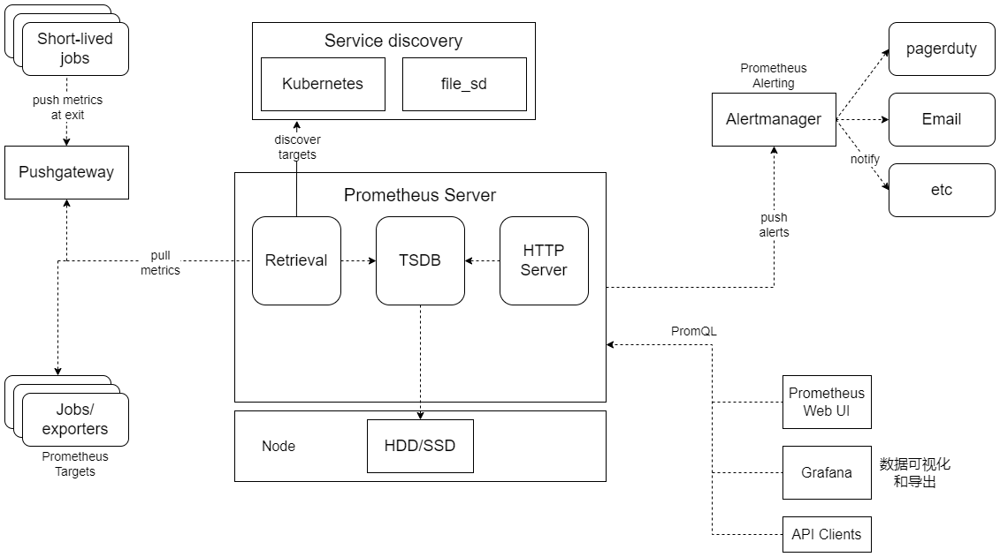

## Kubernetes Cluster Monitor
Kubernetes 的早期版本依靠 Heapster 来实现完整的性能数据采集和监控功能，Kubernetes 从 1.8 版本开始，性能数据开始以 Metrics API 方式提供标准化接口，并且从 1.10 版本开始将 Heapster 替换为 Metrics Server。在 Kubernetes 新的监控体系中，Metrics Server 用于提供核心指标（Core Metrics），包括 Node、Pod 的 CPU 和内存使用指标。对其他自定义指标（Custom Metrics）的监控则由 Prometheus 等组件来完成

### 使用 Metrics Server 监控 Node 和 Pod 的 CPU 和内存使用数据
Metrics Server 的 YAML 配置主要包括以下内容：
1. Deployment Service 的定义及相 RBAC 策略
1. API Service 资源及相关 RBAC 策略

### Prometheus + Grafana集群性能监控平台搭建
Prometheus 的核心组件 Prometheus Server 的主要功能包括：从 Kubernetes Master 中获取需要监控的资源或服务信息；从各种 Exporter 中抓取（Pull）指标数据，然后将指标数据保存在时序数据库（TSDB）中；向其他系统提供 HTTP API 进行查询；提供基于 PromQL 语言的数据查询；可以将告警数据推送（Push）给 AlertManager，等等。

1. 部署 Prometheus 服务
1. 部署node_exporter 服务
1. 部署 Grafana 服务
