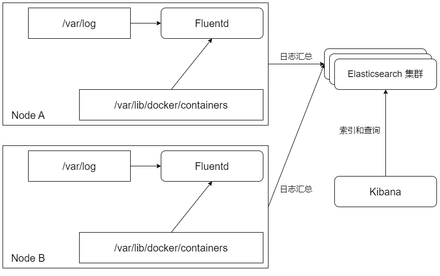

## Kubernetes Cluster Log Management
日志对于业务分析和系统分析是非常重要的数据。在一个 kubernetes 集群中，大量容器应用运行在众多 Node 上，各容器和 Node 的系统组件都会生成许多日志文件。但是容器具有不稳定性，在发生故障时可能被 Kubernetes 重新调度，Node 也可能由于故障无法使用，造成日志丢失，这就要求管理员对容器和系统组件生成的日志进行统一规划和管理

### 容器应用和系统组件输出日志的各种场景
1. 容器应用输出日志的场景
    - 容器应用可以选择将日志输出到不同的目标位置：
        - 输出到标准输出和标准错误输出；
        - 输出到某个日志文件；
        - 输出到某个外部系统。
1. 系统组件输入日志的场景
    - Kubernetes 的系统组件主要包括在 Master 上运行的管理组件（kube-apiserver、kube-controller-manager 和 kube-scheduler），以及在每个 Node 上运行的管理组件（kubelet 和 kube-proxy）。这些系统组件生成的日志对于 Kubernetes 集群的正常运行和故障排查都非常重要。
    - 系统组件的日志可以通过 --log-dir 参数保存到指定的目录下（例如 /var/log），或者通过 ---logtostderr 参数输出到标准错误输出中（stderr）。如果系统管理员将这些服务配置为 systemd 的系统服务，日志则会被 journald 系统保存。
    - Kubernetes 从 1.19 版本开始，开始引入对结构化日志的支持，使日志格式统一，便于日志中字段的提取、保存和后续处理。结构化日志以 JSON 格式保存。目前  kube-apiserver、kube-controller-manager、kube-scheduler 和 kubelet 这 4 个服务都支持通过启动参数 --logging-format=json 设置 JSON 格式的日志，需要注意的是，JSON 格式的日志在启用 systemd 的系统中将被保存到 journald 中，在未使用 systemd 的系统中将在/var/log 目录下生成 *.log 文件，不能再通过 --log-dir 参数指定保存目录
    - Kubernetes 应用程序在生成 JSON 格式日志时，可以设置的字段如下：
        1. ts：UNIX 格式的浮点数类型的时间戳（必填项）
        1. v：日志级别，默认为0（必填项）
        1. msg：日志信息（必填项）
        1. err：错误信息，字符串类型（可选项）
1. 审计日志

### Fluentd + Elasticsearch + Kibana日志系统部署

1. 部署 Elasticsearch 服务
1. 在每个 Node 上都部署 Fluentd
1. 部署 Kibana 服务

### 部署日志采集 sidecar 工具采集容器日志
对于容器应用输出到容器目录下的日志，可以为业务应用容器配置一个日志采集 sidecar 容器，对业务容器生成的日志进行采集并汇总到某个日志中心，供业务运维人员查询和分析，这通常用于业务日志的采集和汇总。后端的日志存储可以使用 Elasticsearch，也可以使用其他类型的数据库（如 MongoDB），或者通过消息队列进行转发（如 Kafka），需要根据业务应用的具体需求进行合理选择