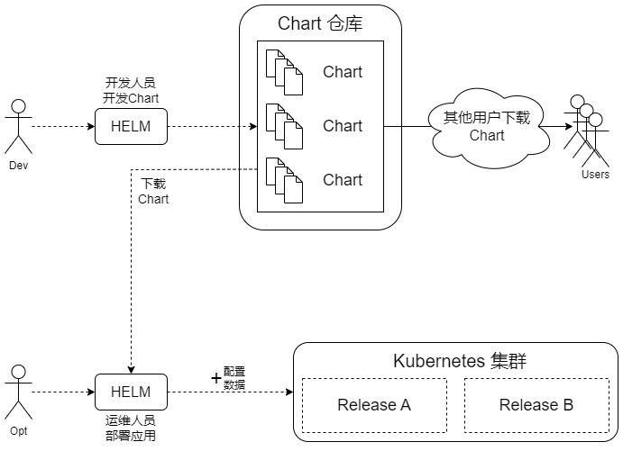

## Helm：Kubernetes 应用包管理工具
随着容器技术和微服务架构逐渐被企业接受，在 Kubernetes 上已经能便捷地部署简单的应用了。但对于复杂的应用或者中间件系统，在 Kubernetes 上进行容器化部署并非易事，通常需要研究 Docker 镜像的运行需求、环境变量等内容，为容器配置依赖的存储、网络等资源，并设计和编写 Deployment、ConfigMap、Service、Volume、Ingress 等 YAML 文件，再将其依次提交给 Kubernetes 部署。总之，微服务架构和容器化给复杂应用的部署和管理都带来了很大的挑战。

Helm 由 Deis 公司（已被微软收购）发起，用于对需要在 Kubernetes 上部署的复杂应用进行定义、安装和更新，是 CNCF 基金会的毕业项目，由 Helm 社区维护。Helm 将 Kubernetes 的资源如 Deployment、Service、ConfigMap、Ingress 等，打包到一个 Chart（图表）中，而 Chart 被保存到 Chart 仓库，由 Chart 仓库存储、分发和共享。Helm 支持应用 Chart 的版本管理，简化了 Kubernetes 应用部署的应用定义、打包、部署、更新、删除和回滚等操作。

简单来说，Helm 通过将各种 Kubernetes 资源打包，类似于 Linux 的 apt-get 或 yum 工具，来完成复杂软件的安装和部署，并且支持部署实例的版本管理等，大大简化了在 Kubernetes 上部署和管理应用的复杂度。

### Helm整体架构

Helm 主要包括以下组件：
- Chart：Helm 软件包，包含一个应用所需资源对象的 YAML 文件，通常以 .tgz 压缩包形式提供，也可以是文件夹形式
- Repository（仓库）：用于存放和共享 Chart 的仓库
- Config（配置数据）：部署时设置到 Chart 中的配置数据
- Release：基于 Chart 和 Config 部署到 Kubernetes 集群中运行的一个实例。一个Chart 可以被部署多次，每次的 Release 都不相同

基于 Helm 的工作流程如下：
1. 开发人员将开发好的 Chart 上传到 Chart 仓库
1. 运维人员基于 Chart 的定义，设置必要的配置数据（Config），使用 Helm 命令行工具将应用一键部署到 Kubernetes 集群中，以 Release 概念管理后续的更新、回滚等
1. Chart 仓库中的 Chart 可以用于共享和分发

### Helm版本说明

### Helm的使用
1. Chart仓库的使用
1. helm install：部署应用
1. helm upgrade 和 helm rollback：应用的更新或回滚
1. helm uninstall：卸载一个Release
1. 自定义应用Chart

### Chart说明
1. Chart目录结构
1. Chart.yaml文件说明

### 搭建私有Chart仓库
1. Chart仓库的结构
1. index.yaml文件说明
1. 使用普通的Web服务搭建Chart仓库