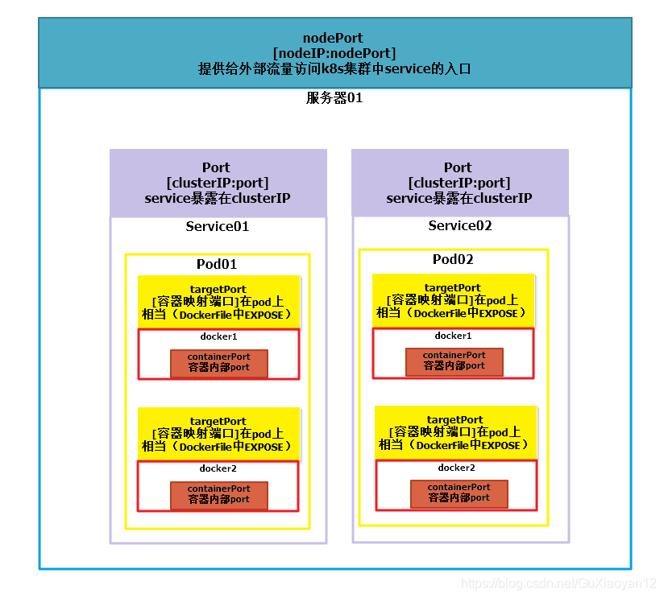

# Q & A

## 目录
- [Pod IP、CLuster IP、Node IP、Ingress 和 Load Balancer 的区别](#pod-ipcluster-ipnode-ipingress-和-load-balancer-的区别)
- [为什么 K8s service IP 不能 ping 呢？](#为什么-k8s-service-ip-不能-ping-呢)
- [Container Port、Target Pod、Host Port、Port 和 Node Port 都是什么？](#container-porttarget-podhost-portport-和-node-port-都是什么)

## Pod IP、CLuster IP、Node IP、Ingress 和 Load Balancer 的区别

- [Pod IP](#pod-ip)
- [Cluster IP（Service）](#cluster-ipservice)
- [Node IP](#node-ip)
- [Ingress](#ingress)
- [Load Balancer](#load-balancer)
- [外部访问](#外部访问)

### Pod IP
1. 虚拟 IP
1. 每个 Pod 一个
1. 跟随 Pod 的生命周期
1. 只能在集群中使用

### Cluster IP（Service）
- 是 iptable 负责管理的虚拟 4 层 LB
1. 虚拟 IP
1. 每个 Service 一个
1. 跟随 Service 的生命周期
1. 只能在集群中使用

### Node IP
1. 物理 IP
1. 跟随 物理机 / 虚拟机

### Ingress
- 解决了需要暴露多个端口不好管控的问题
- 是 7 层 LB
1. 具备 路由 和 过滤 功能
1. 可以接受多种协议 HTTP/HTTPS/gRPC
1. 不同协议只需要一个 Ingress（但是需要对不同协议制定不同域名）
1. 支持映射多台机器 

### Load Balancer
- 解决了客户端到服务器网络或者机房的不可靠问题（贴近于物理网卡）
1. 不具备 路由 和 过滤 功能
1. 可以接受多种协议（L3）
1. 不同协议需要不同的 LB（高于 L3）
1. 支持映射多台机器

### 外部访问
1. Service 的 4 层负载均衡
   1. 客户端首先需要访问 Node IP
   1. 然后利用 kube-proxy 配置的规则找到 Cluster IP
   1. 再转发到 Pod IP
   > 任何一个 Node 内部的 IP Packet 通过路由表转发

1. LB 和 Ingress Controller 的 7 层负载均衡
   1. 客户端首先访问 LB
   1. LB 引导至对应的 Node Port
   1. Node Port 上的 Ingress 进行路由
   1. 绕过 kube-proxy 通过 Service 的 Cluster IP 直达 Pod IP
   > 这里的 Service 无负载均衡作用，只起到 Cluster IP 具备的 “静态 IP” 的作用


## 为什么 K8s service IP 不能 ping 呢？
1. service IP 是怎么来的？

service IP 是 service Controller 生成的，参数 --service-cluster-ip-range string 会配置在 controller-manager 上，service Controller 会在这个参数指定的 cidr 范围内取一个 IP

1. 为什么不能ping？

service IP 是虚拟的地址，没有分配给任何网络接口，当数据包传输时不会把这个IP作为数据包的源IP或目的IP。

kube-proxy 在 iptables 模式下，service IP 没有被设置在任何的网络设备上，ping service IP 的时候，没有任何的网络协议栈会回应这个ping请求。

   - 在 iptables 模式下，cluster IP 会在 iptables 的 PREROUTING 链里面用于 NAT 转换规则中
   - 在 ipvs 模式下，cluster IP 会在 ipvs 模块的 ipvs 规则转换中
   - 在 ipvs 模式下，所有的 clusterIP 会被设置在 node 上的 kube-ipvs0 的虚拟网卡上，这个时候去 ping 是可以通的。


## Container Port、Target Pod、Host Port、Port 和 Node Port 都是什么？



- [Container Port](#container-port)
- [Target Pod](#target-pod)
- [Host Port](#host-port)
- [Port](#port)
- [Node Port](#node-port)

### Container Port

***Pod 对象中的字段***

containerPort是pod内部容器的端口，targetPort映射到containerPort

```yaml
apiVersion: v1
kind: Pod
metadata:
  name: influxdb
spec:
  containers:
    - name: influxdb
      image: influxdb
      ports:
        - containerPort: 8086
          hostPort: 8086
```

### Target Pod

***Service 对象中的字段***
容器的端口（最终的流量端口）。targetPort 是 pod 上的端口，从 port 和 nodePort 上来的流量，经过 kube-proxy 流入到后端 pod 的 targetPort 上，最后进入容器。制作容器时暴露的端口一致（使用DockerFile中的EXPOSE），例如官方的nginx（参考DockerFile）暴露80端口。

```yaml
apiVersion: v1
kind: Service
metadata:
 name: nginx-service
spec:
 type: NodePort         // 有配置NodePort，外部流量可访问k8s中的服务
 ports:
 - port: 30080          // 服务访问端口
   targetPort: 80       // 容器端口
   nodePort: 30001      // NodePort
 selector:
  name: nginx-pod

```

### Host Port

***Pod 对象中的字段***

这是一种直接定义Pod网络的方式。hostPort是直接将容器的端口与所调度的节点上的端口路由，这样用户就可以通过宿主机的IP加上来访问Pod了

```yaml
apiVersion: v1
kind: Pod
metadata:
  name: influxdb
spec:
  containers:
    - name: influxdb
      image: influxdb
      ports:
        - containerPort: 8086
          hostPort: 8086
```

### Port

***Service 对象中的字段***

k8s集群内部服务之间访问service的入口。即clusterIP:port是service暴露在clusterIP上的端口。mysql容器暴露了3306端口，集群内其他容器通过33306端口访问mysql服务，但是外部流量不能访问mysql服务，因为mysql服务没有配置NodePort。

```yaml
apiVersion: v1
kind: Service
metadata:
 name: mysql-service
spec:
 ports:
 - port: 33306
   targetPort: 3306
 selector:
  name: mysql-pod
```


### Node Port

***Service 对象中的字段***

外部流量访问k8s集群中service入口的一种方式（另一种方式是LoadBalancer），即nodeIP:nodePort是提供给外部流量访问k8s集群中service的入口。比如外部用户要访问k8s集群中的一个Web应用，那么我们可以配置对应service的type=NodePort，nodePort=30001。其他用户就可以通过浏览器http://node:30001访问到该web服务。而数据库等服务可能不需要被外界访问，只需被内部服务访问即可，那么我们就不必设置service的NodePort。

```yaml
apiVersion: v1
kind: Service
metadata:
 name: nginx-service
spec:
 type: NodePort         // 有配置NodePort，外部流量可访问k8s中的服务
 ports:
 - port: 30080          // 服务访问端口
   targetPort: 80       // 容器端口
   nodePort: 30001      // NodePort
 selector:
  name: nginx-pod

```